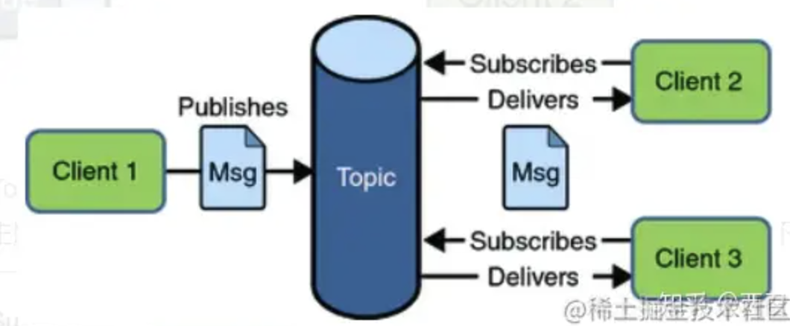
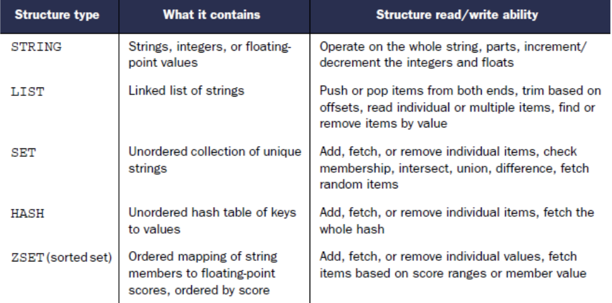
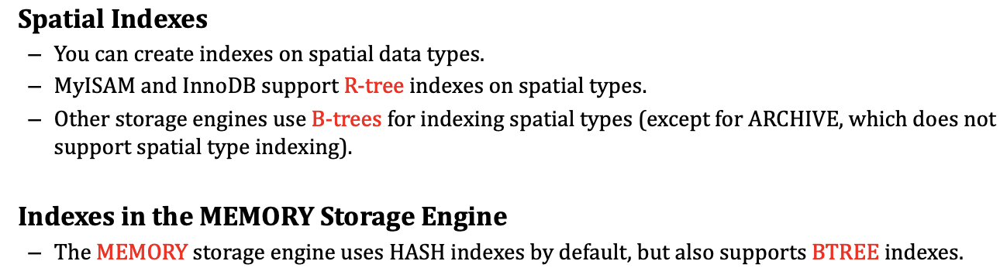
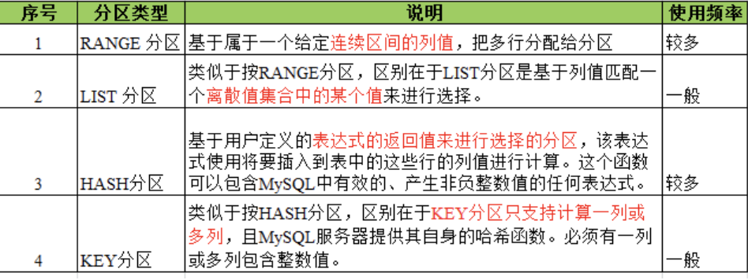
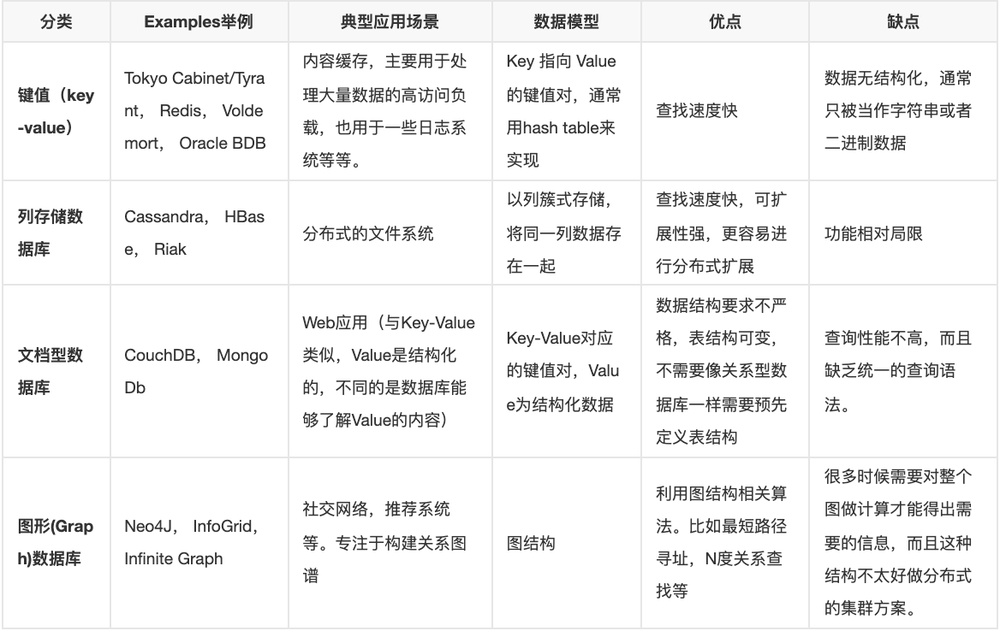
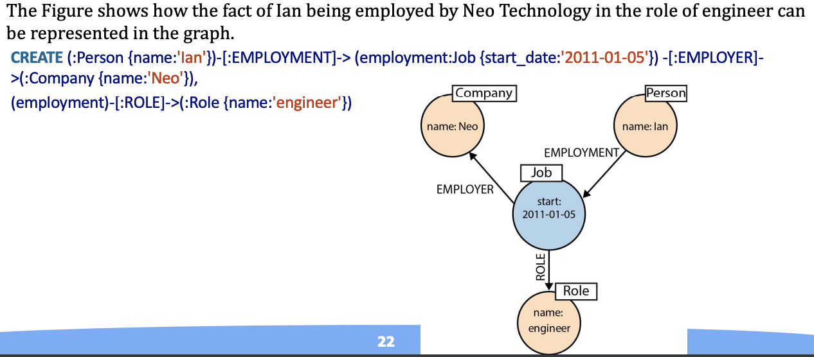

# 应用系统体系架构期末复习

## Content

## 企业应用架构概述

> 1. 企业级应用系统特征
> 2. 企业级应用系统体系架构演化
> 3. 有状态服务与无状态服务的组合内容

### 企业级 Java 网页应用系统

**系统**

相互关联的元素或部分组合在一起构成的整体。

**体系**

高层次的系统，是系统的系统，由多个在功能上相对独立的系统构成，通过一定方式的协调组合，共同实现单个系统不具备且多个系统简单叠加也无法实现的综合能力和整体效果。

**架构**

经过系统地思考，权衡利弊之后在现有资源约束下的最合理决策，最终明确的系统骨架。架构包括子系统、模块、组件以及他们之间协作关系、约束规范和指导原则。

**体系架构**

别称 **体系结构**，是系统各组分的结构、它们之间的关系以及指导其设计和随时间演化的原则与指南。体系架构表现了体系组成及其相互关系，明确了系统之间的边界、接口和约束关系，科学地勾画了体系的建设蓝图。利用体系架构可以指导体系的顶层规划、设计、论证和实现，实现各种系统的综合集成，提高系统间的互操作，同时也可以指导体系的运行。

#### 现代企业级应用体系架构


#### 特点

- 数据持久化。数据的寿命比创造他们的硬件系统，操作系统和编译器还要长，因此必须持久保存而且通常要保存很多年。
- 海量数据存储。现代的系统经常使用数据库，大多数是关系型数据库，来保存海量的数据。
- 数据并发访问。多用户并发地存取数据是企业级应用的常见情况。
- 大量的用户图形界面。为了应付日益庞大的数据量，大量的 $UI$ 界面被投入使用。
- 需要和其他应用集成。经常需要和遍布在企业角落的其他企业级应用集成在一起，而这些系统通常是在不同时期采用不同技术建成的，甚至协作机制也各不相同。
- 数据概念不统一。在每个领域单个概念都可能有截然不同的意思。
- 复杂的业务逻辑。业务逻辑是由企业根据自身的需要制定的业务规则决定的。有时候规则会很随意，看上去似乎没有任何的逻辑。企业往往有自己特定的需求，特殊的情况。这些层出不穷的特例导致了业务的复杂性，无逻辑性，使得商业软件的开发十分困难。

#### 发展历史

1. 单体架构

把所有的功能模块都打包在一个（jar、war）里，并且部署在一个 web 容器下，比如 tomcat 中运行。

**集群部署方式**

把多台独立的服务器通过网络连接进行组合，对外形成一个整体提供服务，这样可以提升业务系统的并行处理能力，降低单机系统负载，以便支撑更多的用户访问操作。

2. 垂直架构

按照系统的业务功能拆分出多个业务模块，比如电商网站可以拆分成首页、用户、搜索、订单、支付、商品等子系统，每个子系统由不同的业务团队负责，这样可以降低业务的耦合性，提升系统的容错性。

3. 分布式架构

把一些通用的、会被多个上层服务调用的模块独立拆分出来，形成一些共享的基础服务。

**SOA（面向服务架构）**

从语义上说，它与面向过程、面向对象、面向组件一样，是一种软件组建及开发的方式，所以在 SOA 中，服务是最核心的抽象手段，业务被划分为一些列粗粒度的业务服务和业务流程。

**分布式与集群**

分布式服务的每个节点都可以部署成单机或者集群，这样可以缩短单个任务的执行时间来提升效率，而集群则是通过提高单位时间内执行的任务数来提升效率。

4. 微服务架构

面向服务的架构模型，更强调服务的力度，也就是服务的职责更加单一更加精炼。

### 有状态服务和无状态服务

#### 从数据层面看状态

数据的状态往往受 2 个纬度有关，一是与时间相关或者顺序相关的，不同的操作顺序可能导致同一个时间点上的数据状态 > 1 个，二是与数据的副本状态相关的，数据落在多个副本上，可能出现多种数据状态的组合。**

**时间状态：操作顺序有一点限制，同一个状态的数据不能出现在 2 个时间点（重复请求）。**

- 如有某个数据新增、更新、删除这 3 个顺序请求，在下游业务也需要同样的顺序操作。
- 对于单状态的数据，如计数器，不能出现重复添加，也就是这个数据只有第一次出现的时间状态是对的，后来的数据在时间状态上是不允许的。

**位置状态：数据落地点的状态**
	
- 数据拆分后的应用，同一个数据就有了状态，它只能落在指定的结点上。
- 对于复制集架构，数据是存在多个副本的，也就是说数据落在的位置在集群上需要有一定的数量保证，以满足一定的共识基础，比如要写半数以上节点，也就是说这个数据是存在 2 个状态的，对于已经写成功的节点是成功状态，对于未写成功的节点是未成功/处理中的状态。如何协调这些状态，往往要引入一些共识协议（Paxos，Raft）。

#### 从服务层面看状态

服务层面的状态取决于实例是单独维护数据还是共享数据，或者说是否存在多个数据闭环让数据的流向产生了多条路径。有状态的服务往往比较难进行水平拓展，在现在容器盛行的环境，把服务设计成无状态的更加高效，即便是有状态的服务，也要将状态内敛在系统的某个范围，比如分布式的存储，对于业务服务，我不需要关系数据在多个副本的状态，数据的状态由分布式存储这个服务本身解决。

**有状态服务**

- 服务本身依赖或者存在局部的状态数据，这些数据需要自身持久化或者可以通过其他节点恢复。
- 一个请求只能被某个节点（或者同等状态下的节点）处理。
- 存储状态数据，实例的拓展需要整个系统参与状态的迁移。
- 在一个封闭的系统中，存在多个数据闭环，需要考虑这些闭环的数据一致性问题。
- 通常存在于分布式架构中。

**无状态服务**

- 服务不依赖自身的状态，实例的状态数据可以维护在内存中。
- 任何一个请求都可以被任意一个实例处理。
- 不存储状态数据，实例可以水平拓展，通过负载均衡将请求分发到各个节点。
- 在一个封闭的系统中，只存在一个数据闭环。
- 通常存在于单体架构的集群中。

#### 服务状态差异

1. 无状态（Stateless）服务要求：
客户端每次请求时均需具备自描述信息，服务器端通过这些信息来识别客户端身份，服务器端不保存任何客户端请求者信息。落实到代码即只有单个实例。
2. 无状态服务特点：
客户端请求不依赖服务器端信息，所以任何多次请求不需要访问到同一台服务。且服务器集群和状态可以对客户端透明，便于服务器端迁移和伸缩，同时有效减少服务器端存储压力。
3. 有状态（Stateful）服务要求：
服务器端需要记录每次会话的客户端信息，从而识别客户端身份，根据用户信息进行请求处理。落实到代码即可以有多个实例。
4. 有状态服务特点：
有更广阔的应用范围，可以通过服务器端存储的信息来重现部分上下文关系。但由于服务器端保存大量数据会增加服务器端压力，且不利于业务进行水平拓展，因此在分布式
系统中我们希望进行无状态化处理。

#### 服务状态转换

1. 采用复制或者集中式消除数据状态。

- 对于 Web 服务，如果数据存在session中，那么这个服务就有了状态。
- 一种是对 session 进行复制，同步复制还是异步复制，取决于你对数据一致性的敏感程度。
- 也可以将 session 集中式管理，如用 redis ，出现性能或者容量的瓶颈，再换分布式的缓存，把状态交于缓存服务维护。
- 我们可以看出，有状态的服务，它的数据是存在多个闭环的，比如 Web01-session-01-> DB 和 Web02-session -> DB 。通过复制，将 session-01 和 02 等同于同一个。
- 或者我们可以将数据进行分区，让负载均衡器通过hash算法将请求落在固定的处理节点上。

2. 采用控制节点来保证集中式存储的高可用和一致性。

- 在高可用的架构下，数据往往得存在多副本。
- CAP 理论中，C 和 A 不可能同时满足，多副本的存在让 A 可在有限时间内恢复，而 C 可用采用 Quorum 机制来控制多个副本节点的数据一致性问题，保证半数以上的节点的写成功。

#### Spring Bean Scopes


## 消息机制

> 1. 消息通信机制与消息中间件
> 2. JMS 与消息编程
> 3. Kafka 消息中间件

### 消息中间件

属于分布式系统中的一个子系统，关注于数据的发送和接收，利用高效可靠的异步消息传递机制对分布式系统中的其余各个子系统进行集成。

#### 组成

1. Broker：消息服务器，作为 server 提供消息核心服务。
2. Producer：消息生产者，业务的发起方，负责生产消息传输给 Broker。
3. Consumer：消息消费者，业务的处理方，负责从 Broker 获取消息并进行业务逻辑处理。
4. Topic：主题，发布订阅模式下的消息统一汇聚地，不同生产者向 Topic 发送消息，由 MQ 服务器分发到不同的订阅者，实现消息的广播。
5. Queue：队列，P2P 模式下，特定生产者向特定 Queue 发送消息，消费者订阅特定的 Queue 完成指定消息的接收。
6. Message：消息体，根据不同通信协议定义的固定格式进行编码的数据包，来封装业务数据，实现消息的传输。

#### 特点

- **高效**：对于消息的处理，处理速度快。
- **可靠**：一般消息中间件都会有消息持久化机制和其他的机制确保消息不丢失。
- **异步**：指发完一个请求，不需要等待返回，随时可以再发送下一个请求，即不需要等待。

#### 优缺点

**优点**

- **低耦合**：不管是程序还是模块之间，使用消息中间件进行间接通信，为分布式系统中其他子系统提供了松耦合的架构。
- **异步通信能力**：使得子系统之间得以充分执行自己的程序逻辑而无需等待，提高系统性能。
- **缓冲能力**：将高峰期大量的请求存储下来慢慢交给后台进行处理，对于秒杀业务尤其重要。
- **伸缩性**：对拓展开放，对修改关闭。

**缺点**

- **系统可用性降低**：比如要考虑消息丢失、消息中间件宕机等问题。
- **系统复杂度提高**：加入 MQ 之后，需要保证消息没有被重复消费、处理消息丢失的情况、保证消息传递的顺序性等。
- **一致性问题**：消费者没有正确消费可能会引入一致性问题。

#### 应用场景

- **异步处理**。
- **应用解耦**。降低工程间的强依赖程度，针对异构系统进行适配。
- **冗余**：规避数据丢失风险。
- **流量削峰**。
- **数据流处理**。针对诸如业务日志、监控数据、用户行为等数据流进行实时或批量采集汇总。
- **消息通讯**。

#### 常见消息中间件比较


### Java 消息服务  Java Message Service (JMS)

**消息**

消息机制是一种在软件组件和软件应用之间进行通信的一种方法。一个消息系统是对等的，一个消息客户端可以 从 / 给 任何消息客户端 接收 / 发送 任何消息。每个消息客户端连接到一个消息代理端，消息代理端会提供 制造 / 发送 / 接收 / 读取 消息的便利。

#### 什么是 JMS

Java 消息服务是一种 Java API，允许应用程序创建、发送、接收、并阅读消息。


#### JMS 特点

- **应用程序客户端、Enterprise JavaBeans (EJB) 组件和 Web 组件可以发送或同步接收  JMS 消息。**应用程序客户端还可以设置消息侦听器，允许 JMS 消息通过在消息可用时得到通知而异步传递给它。
- **消息驱动 bean** 是一种企业 bean，它支持 EJB 容器中消息的异步消化。 应用程序服务器通常汇集消息驱动的 bean 以实现消息的并发处理。
- **消息发送和接收操作**可以参与 Java Transaction API (JTA) 事务，这允许 JMS 操作和数据库访问在单个事务中进行。

#### 消息构成

- header: Clients can not extend the fields.
	- JMSDestination (S)
	- JMSDeliveryMode (S)
	- JMSMessagID (S)
	- JMSTimestamp (S)
	- JMSCorrelationID (C)
	- JMSReplyTo (C) 
	- JMSRedelivered (P)
	- JMSType (C)
	- JMSExpiration (S)
	- JMSPriority (S)
	- pre-defined fields: Clients can extend the fields
		- JMSXUserID (S)
		- JMSXAppID (S)
		- JMSXDeliveryCount (S)
		- JMSXGroupID (C)
		- JMSXGroupSeq (C)
		- JMSXProducerTXID (S)
		- JMSXConsumerTXID (S)
		- JMSXRcvTimestamp (S)
		- JMSXState (P)
- Body


### 消息风格

#### 点对点 P2P

点对点 (PTP) 产品或应用程序建立在消息队列、发送者和接收者的概念之上。P2P 使用队列（Queue）作为消息通信载体；满足生产者与消费者模式，一条消息只能被一个消费者使用，未被消费的消息在队列中保留直到被消费或超时。


#### 发布订阅 Pub / Sub

发布订阅模型（Pub / Sub） 使用主题（Topic）作为消息通信载体，类似于广播模式。

发布者发布一条消息以后，该消息通过主题传递给所有的订阅者。在一条消息广播之后再订阅的用户则是收不到该条消息的。



### 卡夫卡

Kafka 是一个分布式、高吞吐量、高扩展性的消息队列系统。

#### 架构


- Prodecer：生产者。
- Topic：主题。类似于传统数据库中的表名。
- Partition：分区。就是想把数据分成好多块，以便实现负载均衡，合理的将消息分布在不同的分区上，分区是被分在不同的 Broker 也就是服务器上。每个 Topic 可以指定多个分区，但是至少指定一个分区。
- Replica：副本。分区中数据的备份，是 Kafka 为了防止数据丢失或者服务器宕机采取的保护数据完整性的措施。
- Broker：实例或节点。即 Kafka 实例，启动一个 Kafka 就是一个 Broker，多个 Broker 就构成一个 Kafka 集群，这就是分布式的体现。
- Consumer Group 和 Consumer：消费者组 和 消费者。

#### 设计

一般的来说，一个 Kafka 集群包含一个或多个的 Producer ，一个或多个的 Broker ，一个或多个的 Consumer Group ，和一个 Zookeeper 集群。Kafka 通过 Zookeeper 管理集群配置，管理集群在运行过程中负责均衡、故障转移和恢复什么的。Producer 使用 Push（推送）的方式将消息发布到 Broker ，Consumer 使用 Pull（拉取）的方式从 Broker 获取消息，两者都是主动操作的。

#### 优缺点

**优点**

- 分布式高可扩展。Kafka 集群可以透明地扩增，增加新的服务器进集群。
- 高性能。Kafka 的性能大大超过传统的 ActiveMQ、RabbitMQ 等 MQ 实现，且还支持 batch 操作。
- 容错：Kafka 每个 Partition 的数据都会复制到几台服务器上。当某个 Broker 故障失效时，ZooKeeper 服务将通知生产者和消费者，生产者和消费者转而使用其它 Broker 。

**缺点**

- 重复消息。Kafka 只保证每个消息至少会送达一次，虽然几率很小，但一条消息有可能会被送达多次。
- 消息乱序。虽然一个 Partition 内部的消息是保证有序的。但是如果一个 Topic 有多个 Partition，Partition之间的消息送到不保证有序。
- 复杂性。Kafka 需要 Zookeeper 集群的支持，Topic 通常需要人工来创建、部署和维护，相较一般消息队列成本更高。


## WebSocket

> 能够根据系统需求，分析前后端之间适用于异步通信机制的业务场景，设计并实现基于 WebSocket 的实现方案。

WebSocket 是一种网络通讯协议，一个 TCP 连接的两端，可以同时给对方发送消息，即支持全双工通信。相对于轮询，WebSocket 减少了宽带资源浪费，实时性更强。

### 握手

WebSocket 是独立的、创建在 TCP 上的协议。

WebSocket 通过 HTTP/1.1 协议的 101 状态码进行握手。

为了创建 WebSocket 连接，需要通过浏览器发出请求，之后服务器进行回应，这个过程通常称为 **握手**。

#### 例子

**客户端请求**

```HTTP
GET /chat HTTP/1.1
Host: server.example.com
Upgrade: websocket
Connection: Upgrade
Sec-WebSocket-Key: dGhlIHNhbXBsZSBub25jZQ==
Origin: http://example.com
Sec-WebSocket-Protocol: chat, superchat
Sec-WebSocket-Version: 13
```

**服务器回应**

```C++
HTTP/1.1 101 Switching Protocols
Upgrade: websocket
Connection: Upgrade
Sec-WebSocket-Accept: s3pPLMBiTxaQ9kYGzzhZRbK+xOo=
Sec-WebSocket-Protocol: chat
```

- Connection 必须设置 Upgrade ，表示客户端希望连接升级。
- Upgrade 字段必须设置 Websocket ，表示希望升级到 Websocket 协议。
- Sec-WebSocket-Key 是随机的字符串，服务器端会用这些数据来构造出一个 SHA-1 的信息摘要。把 Sec-WebSocket-Key 加上一个特殊字符串 258EAFA5-E914-47DA-95CA-C5AB0DC85B11 ，然后计算 SHA-1 摘要，之后进行 Base64 编码，将结果做为 Sec-WebSocket-Accept 头的值，返回给客户端。如此操作，可以尽量避免普通 HTTP 请求被误认为 Websocket 协议。
- Sec-WebSocket-Version 表示支持的Websocket版本。RFC6455 要求使用的版本是 13 ，之前草案的版本均应当弃用。
- Origin 字段是必须的。如果缺少 origin 字段，WebSocket 服务器需要回复 HTTP 403 状态码（禁止访问）。
- 其他一些定义在 HTTP 协议中的字段，如 Cookie 等，也可以在 Websocket 中使用。

### 特点

- **全双工通信**。服务器可以主动向客户端推送消息，客户端也可以主动向服务器发送消息，是真正的双向平等对话，属于服务器推送技术的一种。
- **建立在 TCP 协议上**。服务器端实现比较简单。
- **与 HTTP 协议有良好的兼容性**。默认端口是 80 和 443，并且握手阶段采用 HTTP 协议，因此握手时不容易屏蔽，能通过各种 HTTP 代理服务器。
- **数据格式轻量。性能开销小，通信高效**。
- **可以发送文本或二进制数据**。
- **没有同源限制**，客户端可以与任意服务器通信。
- **协议标识符是 ws（如果加密，则为 wss）**。服务器网址就是 URL。`ws://example.com:80/some/path`。

### 优缺点

**优点**

- **较少的控制开销**。在连接创建后，服务器和客户端之间交换数据时，用于协议控制的数据包头部相对较小。在不包含扩展的情况下，对于服务器到客户端的内容，此头部大小只有 2 至 10 字节（和数据包长度有关）；对于客户端到服务器的内容，此头部还需要加上额外的 4 字节的掩码。相对于 HTTP 请求每次都要携带完整的头部，此项开销显著减少了。
- **更强的实时性**。由于协议是全双工的，所以服务器可以随时主动给客户端下发数据。相对于HTTP请求需要等待客户端发起请求服务端才能响应，延迟明显更少；即使是和 Comet 等类似的长轮询比较，其也能在短时间内更多次地传递数据。
- **保持连接状态**。与 HTTP 不同的是，Websocket 需要先创建连接，这就使得其成为一种有状态的协议，之后通信时可以省略部分状态信息。而 HTTP 请求可能需要在每个请求都携带状态信息（如身份认证等）。
- **更好的二进制支持**。Websocket 定义了二进制帧，相对 HTTP ，可以更轻松地处理二进制内容。
- **可以支持扩展**。Websocket 定义了扩展，用户可以扩展协议、实现部分自定义的子协议。如部分浏览器支持压缩等。
- **更好的压缩效果**。相对于 HTTP 压缩，Websocket 在适当的扩展支持下，可以沿用之前内容的上下文，在传递类似的数据时，可以显著地提高压缩率。

### 引用场景

- 弹幕
- 媒体聊天
- 协同办公 / 编辑
- 基于位置的引用
- 体育实况更新
- 股票基金报价实时

### 其他通信方式

1. 短轮询（traditional Polling）
   短轮询是指客户端每隔一段时间就询问一次服务器是否有新的消息，如果有就接收消息。

* 优点：短连接，服务器处理简单，支持跨域、浏览器兼容性较好。
* 缺陷：有一定延迟，服务器压力较大，浪费带宽流量，大部分是无效请求。

2. 长轮询（Long Polling）
   长轮询是短轮询的改进，客户端执行 HTTP 请求发送消息到服务器后，等待服务器回应，如果没有新的消息就一直等待，知道服务器有新消息传回或者超时。

* 优点：减少轮询次数，低延迟，浏览器兼容性较好。
* 缺陷：服务器需要保持大量连接。

3. 服务器发送事件（Server-Sent Event）
   服务器发送事件是一种服务器向浏览器客户端发起数据传输的技术。一旦创建了初始连接，事件流将保持打开状态，直到客户端关闭。

* 优点：适用于更新频繁、低延迟并且数据都是从服务端发送到客户端。
* 缺陷：浏览器兼容难度高。

### 比较


## 事务管理 Transaction Management

> 1. 事务属性
> 2. 事务隔离级别和分布式事务

### 什么是事务

在 Java 企业版中，一个事务就是一系列操作，且这些操作要么全部执行成功要么全部执行失败。事务总是以提交或撤回所有操作为终止。

- 原子性（Atomicity）：事务要么全部完成，要么全部取消。如果事务崩溃，状态回到事务之前（事务回滚）。
- 隔离性（Isolation）：如果 2 个事务 T1 和 T2 同时运行，事务 T1 和 T2 最终的结果是相同的，不管 T1 和 T2 谁先结束。
- 持久性（Durability）：一旦事务提交，不管发生什么（崩溃或者出错），数据都要保存在数据库中。
- 一致性（Consistency）：只有合法的数据（依照关系约束和函数约束）才能写入数据库。

### 事务传播行为

* **Required**: 函数必须在一个事务中执行，如果上文环境中已经有一个事务则加入，否则就开启一个新的事务。
* **RequiresNew**: 函数总会开启一个新的事务执行，原有的事务暂时挂起。
* **Mandatory**: 函数必须在一个事务中执行，如果上文环境中已经有一个事务则加入，否则就抛出异常。
* **NotSupported**: 函数不支持在事务中执行，如果上文环境已经有一个事务则暂停该事务直到函数执行完毕，否则函数正常执行。
* **Support"**: 函数支持在事务中执行，如果上文环境已经有一个事务则加入该事务，否则函数正常执行。
* **Never**: 函数必须不在一个事务中执行，如果上文环境已经有一个事务则抛出异常，否则函数正常执行。


### 事务隔离级别


- 串行化：SQLite 默认模式，最高级别的隔离，两个同时发生的事务 100 % 隔离，没给事务将串行执行。
- 可重复读：MySQL 默认模式，隔离新增的数据，不隔离已经存在的（或许修改过）的数据（**幻读**）。
- 读取已提交：Oracle、PostgreSQL、SQL Server 默认模式）：不隔离新增的数据，也不隔离已经存在的数据。
- 读取未提交：不隔离新增的数据，也不隔离已经存在的数据，甚至其他事务修改了但未提交的数据也不隔离。如果读取某个值 A 后，某修改过 A 的事务进行了回滚，那么这次 A 的读取毫无意义，这叫 **脏读**。

### 读写锁

* **Read locks**: Read locks prevent other transactions from **changing data read during a transaction until the transaction ends**, thus preventing **nonrepeatable** reads. Other transactions can read the data but not write to it. The current transaction is **also** prohibited from making changes.
* **Write locks**: Write locks are used for updates. A write lock prevents other transactions from **changing the data until the current transaction is complete but allows dirty reads by other transactions and by the current transaction itself**. In other words, the transaction can read its own **uncommited** changes.
* **Exclusive write locks**: Exclusive write locks are used for updates. An exclusive write lock prevents other transactions from **reading or changing the data until the current transaction is comlete**. It also prevents dirty reads by other transactions.
* **Snapshots**: A snapshot is a frozen view of the data that is taken when a transaction begins. Som databases get around locking by providing every transaction with its own snapshot. **Snapshots can prevent dirty reads, nonrepeatable reads and phantom reads**.
* **Read Uncommitted**: The transaction can read uncommitted data, so dirty reads, nonrepeatable reads and phantom reads can occur.
* **Read Committed**: The transaction cannot read uncommitted data, data that is being changed by a different transaction cannot be read. Dirty reads are prevented, but nonrepeatable reads and phantom reads can occur.
* **Repeatable Read**: The transaction cannot change data that is being read by a different transaction. Dirty reads and nonrepeatable reads are prevented, phantom reads can occur.
* **Serializable**: The transaction has exclusive read and update privileges, different transactions can neither read nor write to the same data. Dirty reads, nonrepeatable reads and phantom reads are prevented.


## 多线程 Multithreading

> 1. 线程
> 2. Java 中的多线程

### 基本概念

#### 进程

进程是对运行时程序的封装，是**系统进行资源调度和分配的基本单位，实现了操作系统的并发**。

#### 线程

线程是进程的子任务，是**CPU 调度和分派的基本单位，用于保证程序的实时性，实现进程内部的并发。线程是操作系统可识别的最小执行单位和调度单位**。每个线程都独自占用一个**虚拟处理器**：独自的**寄存器组，指令计数器和处理器状态**。每个线程完成不同的任务，但是**共享同一地址空间**（也就是同样的**动态内存，映射文件，目标代码等**，**打开的文件队列和其他内核资源**。

#### 进程和线程区别

- 一个线程只能属于一个进程，而一个进程可以有多个线程。

但至少有一个线程。线程依赖于进程而存在。

- 进程在执行过程中拥有独立的内存单元，而多个线程共享进程的内存。

资源分配给进程，同一进程的所有线程共享该进程的所有资源。同一进程中的多个线程共享代码段（代码和常量），数据段（全局变量和静态变量），扩展段（堆存储）。但是每个线程拥有自己的栈段，栈段又叫运行时段，用来存放所有局部变量和临时变量。

- 进程是资源分配的最小单位，线程是 CPU 调度的最小单位。
- 进程切换的开销远远大于线程切换的开销。

在进行进程切换时，涉及到整个当前进程CPU环境的保存以及新被调度运行的进程的 CPU 环境的设置。而线程切换只须保存和设置少量寄存器的内容，并不涉及存储器管理方面的操作。

- 进程间通信 IPC，线程间可以直接读写进程数据段（如全局变量）来进行通信，但需要进程同步和互斥手段的辅助，以保证数据的一致性。
- 进程编程调试简单可靠性高，但是创建销毁开销大。线程开销小，切换速度快，但是编程调试较为复杂。
- 进程间不会互相影响，但一个线程挂掉将导致整个进程挂掉。
- 进程适应于多核、多机分布，线程适用于多核。

#### 访问量

1. 定义

访问量即 Page View，简称 PV 。 即页面浏览量，用户每1次对网站中的每个网页访问均被记录1次。用户对同一页面的多次访问，访问量累计。

2. 衡量标准

网站访问量的衡量标准一个是独立 IP ，另一个是 PV ，常以日为标准，即日独立 IP 和日 PV 来计算。一台电脑上网即为一个独立 IP 。 PV 即 Page View 的缩写，即页面浏览量，一个独立IP可以产生多个 PV ，所以 PV 个数 $\geq$ 独立 IP 个数。网站每日访问量 IP 越多，PV 越多，即访问量越大。

#### AOP

1. 定义

AOP 是 Aspect Oriented Programming 的缩写，即面向切面编程。

2. 原理

可以通过预编译方式和运行期动态代理实现在不修改源代码的情况下给程序动态统一添加功能的一种技术

3. 作用

- 统计接口访问次数
- 增强功能：在不改动代码的情况下，为接口增加一些额外的功能

#### AtomicCounter

* Atomic Counter是一个缓存对象，存储着一个或者多个unsigned int的变量值。在GLSL着色器有着特定的原子操作（单一的，不可再分的操作）。
* Atomic Counter可以用来控制片元的执行，避免对同一块内存区域同时操作。原子计数器表明当前片元在执行任务时，不能被其他任务打断，保证内存中数据修改的正确性。

### Java 线程的生命周期


- 新建状态

使用 `new` 关键字和 `Thread` 类或子类建立一个线程对象后，该线程对象就处于新建状态，它保持这个状态直到程序 `start` 这个线程。

- 就绪状态

当线程对象调用了 `start` 方法之后，该线程就进入就绪状态。就绪状态的线程处于就绪队列中，要等待 JVM 里线程调度器的调度。

- 运行状态

如果就绪状态的线程获取 CPU 资源，就可以执行 `run` ，此时线程处于运行状态。处于运行状态的线程最为复杂，它可以变为阻塞状态、就绪状态和死亡状态。

- 阻塞状态
	- 等待阻塞：运行状态中的线程执行 `wait` 方法，使线程进入到等待阻塞状态。
	- 同步阻塞：线程在获取 `synchronized` 同步锁失败（因为同步锁被其他线程占用）。
	- 其他阻塞：通过调用线程的 `sleep` 或 `join` 发出了 I / O 请求。

如果一个线程执行了 `sleep` 或 `suspend` 等方法，失去所占用资源之后，该线程就从运行状态进入了阻塞状态。在睡眠时间已到或获得设备资源后可以重新进入就绪状态。

- 死亡状态

一个运行状态的线程完成任务或者其他终止条件发生时，该线程就切换到终止状态。

### 内置锁 Intrinsic Lock

**线程安全**

在多线程的执行过程中访问修改某个共享数据时，线程安全的代码会在同步机制的保证下各个线程正常且正确的运行，数据按照程序既定的逻辑正确输出结果，不会出现数据污染等意外情况。

**同步锁**

同步锁是为了保证每个线程都能正常执行原子不可更改操作，同步监听对象/同步锁/同步监听器/互斥锁的一个标记锁.

**内置锁**

Java 提供了一种内置的锁机制来支持原子性：同步代码块（Synchronized Block），同步代码块包括两部分：一部分作为锁的对象引用，一个作为由这个锁所保护的代码块，以关键字 `syschronized` 来修饰的方法就是一种横跨整个方法体的同步代码块。

每个 Java 对象都可以用作一个实现同步的锁，即内置锁（Intrinsic Lock）或监视器锁（Monitor Lock）。线程在进入同步代码块之前会自动获得锁，并且在退出同步代码块时自动释放锁（无论是正常退出还是异常退出）。获得内置锁的唯一途径就是进入由这个锁保护的同步代码块或方法。


## 缓存 Memory Caching

> 1. MemCached
> 2. Redis
> 3. Caching Samples in Spring WEb Applications

### MemCached

一个自由、开源、高性能、分布式的分布式内存对象缓存系统，用于动态 Web 应用以及减轻数据库的负载。

它通过在内存中缓存数据和对象来减少读取数据库的次数，从而提高了网站访问的速度。MemCaChe 是一个存储键值对的 HashMap ，在内存中对任意的数据（比如字符串、对象等）所使用的 key-value 存储，数据可以来自数据库调用、API调用，或者页面渲染的结果。

MemCache 设计理念就是小而强大，它简单的设计促进了快速部署、易于开发并解决面对大规模的数据缓存的许多难题，而所开放的 API 使得 MemCache 能用于 Java 、 C/C++/C# 、Perl、Python、PHP、Ruby 等大部分流行的程序语言。

#### 特点

- 协议简单
- 基于 libevent 的事件处理
- 内置内存存储方式
- MemCached 不互相通信的分布式

#### 工作流程


1. 客户端请求数据。
2. 检查 MemCached 中是否有对应数据。
3. 有的话直接返回，结束。
4. 没有的话，去数据库里请求数据。
5. 将数据写入 MemCached，供下次请求时使用。
6. 返回数据，结束。

#### 工作原理

MemCached 采用 C / S 架构，在 Server 端启动后，以守护程序的方式，监听客户端的请求。启动时可以指定监听的 IP、端口号和使用的内存大小等关键参数。一旦启动，服务会一直处于可用状态。

为了提高性能，MemCached 缓存的数据全部存储在 MemCached 管理的内存中，所以重启服务器会清空缓存数据，不支持持久化。

#### 适用场景

**适用范围**

- 访问频繁的数据库数据（身份 token、首页动态）。
- 访问频繁的查询条件和结果。
- 作为 Session 的存储方式（提升 Session 存取性能）。
- 页面缓存。
- 更新频繁的非重要数据（访客量、点击次数）。
- 大量的 hot 数据。

**不适用范围**

- 缓存对象大小大于 1 MB。MemCached 本身就不是为了处理庞大的多媒体和巨大的二进制块而设计的。
- key 的长度大于 250 字符（硬性要求）。
- 环境不允许运行 MemCached 服务，如虚拟主机。
- 应用运行在不安全的环境中，MemCached 未提供任何安全策略。
- 业务需要持久化数据存储。

### Redis

完全开源，遵守 BSD 协议，高性能的 key-value 数据库。

- 支持数据的持久化，可以将内存中的数据保存在硬盘中，重启的时候可以再次加载进行使用。
- 不仅仅支持简单的 key-value 类型的数据，同时还提供 `list`，`set`，`zset`，`hash` 等数据结构的存储。
- 支持数据的备份，即 `master-slave` 模式的数据备份。

#### 类型结构



**String**


**List**


**Set**


**Hash**


**Sorted Set**


#### 优缺点

**优点**

- 高性能。Redis 能读的速度是 110000 次 / s，写的速度是 81000 次 / s。
- 持久化。Redis 支持仅附加文件（AOF）持久化模式。
- 丰富的数据类型和数据结构。
- 原子操作。Redis 的所有操作都是原子性的，多个操作也支持事务。
- 支持语言多样。Redis 支持许多语言，如 `C`，`C++`，`Go`，`Java` 等。
- 主从复制。
- 分片。与其他键值存储一样，跨多个 Redis 实例分发数据集非常容易。
- 丰富的特性。Redis 还支持 `Pub / Sub` ，通知，key 过期等特性。

#### 与 其他数据库 对比


#### 与 MemCached 对比

Redis 和 MemCached 都支持集群。

- 数据类型：Redis 支持的类型多于 MemCached。
- 持久性：Redis 支持持久化存储，而 MemCached 不支持。
- 分布式存储：Redis 支持 `master-slave` 复制模式，MemCached 可以使用一致性哈希做分布式。
- value 大小：MemCached 是一个内存缓存，key 长度小于 250 字符，单个 item 长度小于 1M，不适合虚拟机使用。
- 数据一致性：Redis 只使用单核，而 MemCached 可以使用多核，所以平均每一个核上 Redis 在存储小数据时比 MemCached 性能更高，而在 100k 以上的数据中，MemCached 性能要高于 Redis。Redis 使用单线程模型，保证了数据按顺序提交。而 MemCached 需要使用 CAS（版本号，乐观锁） 保证数据一致性。
- CPU 利用：Redis 单线程模型只使用一个 CPU，可以开启多个 Redis 进程。


## 全文搜索 Full-text Searching

> 1. Lucene
> 2. Solr
> 3. Elasticsearch

### 索引 Index

**结构化数据**

指具有固定格式或有限长度的数据，如数据库、元数据等。

**非结构化数据**

指不定长或无固定格式的数据，如邮件、word 文档等。也叫**全文数据**。

#### 创建索引

1. 将原文档传给分词组件（Tokenizer）。

- 分词组件会将文档分成一个个单独的单词
- 去除标点符号。
- 去除停词（一些没有意义的词如 the）。


经过分词后得到的结果称为词元（Token）。

2. 将得到的词元传给语言处理组件（Linguistic Processor）。

- 语言处理组件会将词元变为小写。
- 将单词缩减为词根形式，如 “cars” 变化成 “car”。
- 将单词转变为词根形式，如 “drove” 变化到 “drive”。

语言处理组件得到的结果称为词（Term）。

3. 将得到的词传给索引组件（Indexer）。

- 利用得到的词创建一个字典。
- 对字典按字母顺序进行排序。
- 合并相同的词成为文档倒排（Posting List）链表。
- 将索引写入磁盘

#### 使用索引进行搜索

1. 用户输入查询语句。
2. 对查询语句进行词法分析，语法分析及语言处理。

- 词法分析主要用来识别单词和关键词。
- 语法分析主要是根据查询语句的语法规则来形成一棵语法树。
- 语言处理同索引过程中的语言处理几乎相同。

3. 通过索引存储将索引读入到内存。

4. 利用查询树搜索索引，从而得到每个词 (Term) 的文档链表，对文档链表进行交，差，并得到结果文档。

- 在反相索引表中，分别找出包含目标单词的文档链表。
- 对包含目标单词的链表进行合并操作，得到同时包含多个目标单词的文档链表。
- 将此链表与其他目标非单词进行差操作，即去除其他目标费单词的文档，则得到对应想要的文档链表。

5. 将搜索到的结果文档对查询的相关性进行排序。
6. 返回查询结果给用户。 

### Lucene 简介

Lucene 是一个开源的、成熟的全文索引与信息检索（IR）库，采用 Java 实现。信息检索指文档搜索、文档内信息搜索或者文档相关的元数据搜索等操作。Lucene 可以为 web 程序添加索引和搜索能力，使得可以转换成文本格式的任何数据能够被搜索。


- 索引创建：将现实世界中所有的结构化和非结构化数据提取信息，创建索引的过程。
- 搜索索引：就是得到用户的查询请求，搜索创建的索引，然后返回结果的过程。

### Lucene 原理

主要分为**索引组件**和**搜索组件**两个步骤。

1. 索引组件

为了快速搜索大量文本，必须将文本内容转换成能够进行快速搜索的格式，从而消除慢速顺序扫描处理所带来的影响，得到检索位置，这个位置记录检索词出现的文件路径或者某个关键词。Lucene 采用**反向索引**机制，即维护一个词/短语表。整个索引过程包括：

* 获取内容
* 建立文档
* 文档分析
* 文档索引

2. 搜索组件

搜索是在一个索引中查找单词来找出它们所出现的文档的过程。搜索质量主要由**查准率**和**查全率**来衡量。查准率用来衡量搜索系统查找相关文档的能力，而查准率用来衡量搜索系统过滤相关文档的能力。

### Lucene 概念

1. Analyzer

分析器，将字符串按照某种规则划分成一个个词语，并去除其中的无效词语，例如英文中的 "of"，中文中的"的"等词语，这些词语在文章中大量出现，但是本身不包含什么关键信息，去掉有利于缩小索引文件、提高效率和提高命中率。

2. Document

用户提供的源是一条条记录，它们可以是文本文件、字符串或者数据库表的一条记录等等。一条记录经过索引之后，就是以一个 Document 形式存储在索引文件中。用户进行搜索，也是以 Document 列表的形式返回。

3. Field

一个 Document 可以包含多个信息域，例如一篇文章可以包含"标题"、"正文"、"最后修改时间"等信息域，这些信息域就是通过 Field 在 Document 中存储的。

4. Term

搜索的最小单位，表示文档的一个词语。

5. Tocken

term 的一次出现，包含 term 文本和相应的起止偏移，以及一个类型字符串。一句话中可以出现多次相同的词语，它们都用同一个 term 表示，但是用不同的 tocken，每个 tocken 标记该词语出现的地方。

6. Segment

添加索引时并不是每个 document 都马上添加到同一个索引文件，它们首先被写入到不同的小文件，然后再合并成一个大索引文件，这里每个小文件都是一个 segment。

#### 评分

$$
\sum_{t in q} tf(t in d) \cdot idf(t) \cdot boost(t.field in d) \cdot lengthNorm(t.field in d)
$$


#### Lucene 优缺点

**优点**

- 索引文件格式独立于应用平台。Lucene 定义了一套以 8 位字节为基础的索引文件格式，使得兼容系统或者不同平台的应用能够共享建立的索引文件。
- 在传统全文检索引擎的倒排索引的基础上，实现了分块索引，能够针对新的文件建立小文件索引，提升索引速度。然后通过与原有索引的合并，达到优化的目的。
- 优秀的面向对象的系统架构，使得对于 Lucene 扩展的学习难度降低，方便扩充新功能。 
- 设计了独立于语言和文件格式的文本分析接口，索引器通过接受 Token 流完成索引文件的创立，用户扩展新的语言和文件格式，只需要实现文本分析的接口。
- 已经默认实现了一套强大的查询引擎，用户无需自己编写代码即使系统可获得强大的查询能力，Lucene 的查询实现中默认实现了布尔操作、模糊查询（Fuzzy Search）、分组查询等等。
- 成熟的解决方案，有很多的成功案例。apache 顶级项目，正在持续快速的进步。庞大而活跃的开发社区，大量的开发人员。它只是一个类库，有足够的定制和优化空间：经过简单定制，就可以满足绝大部分常见的需求；经过优化，可以支持 10 亿+ 量级的搜索。

**缺点**

- 需要额外的开发工作。所有的扩展，分布式，可靠性等都需要自己实现；非实时，从建索引到可以搜索中间有一个时间延迟，而当前的 “近实时” (Lucene Near Real Time search) 搜索方案的可扩展性有待进一步完善。

### Solr

高性能，基于 Lucene 的全文搜索服务器，提供了比 Lucene 更为丰富的查询语言，同时实现了可配置、可扩展，并对查询性能进行了优化，提供了一个完善的功能管理界面。

#### 优缺点

**优点**

- 有更大、更成熟的用户、开发和贡献者社区。
- 支持添加多种格式的索引，如 `HTML`，`PDF`等。
- Solr 比较成熟，稳定。
- 不考虑建索引的同时进行搜索，速度更快。

**缺点**

- 建立索引时，搜索效率下降，实时索引搜索效率不高。

### Elasticsearch

基于 Lucene构建的开源，分布式，RESTFUL 搜搜引擎。设计用于云计算中，能够达到实时搜索，稳定，可靠，快速，安装使用方便。支持通过 `HTTP` 使用 `JSON` 进行数据索引。

#### 优缺点

**优点**

- 分布式，且不需要其他组件，分发是实时的。
- 完全支持 Apache Lucene 的接近实时的搜索。
- 处理多租户不需要特殊配置，而 Solr 则需要更多的高级设置。
- 采用 Gateway 的概念，使得完整备份更加简单。
- 各节点组成对等的网络结构，某些节点出现故障时会自动分配其他节点代替其进行工作。

**缺点**

还不够自动。


## 网络服务 Web Service

> 1. Web 服务架构
> 2. SOAP Web 服务
> 3. RESTful Web 服务

### 基本概念

**Web 服务**

提供跨硬件、操作系统、编程语言和应用程序的真正互操作性的机会。

**Web**

使用网络协议访问。

**服务**

独立于实现。

**三要素**

- SOAP（Simple Object Access Protocol）：简单对象访问协议。一个基于 XML 的可扩展消息信封格式，用来描述传递信息的格式规范。需同时绑定一个网络传输协议。这个协议通常是 HTTP 或 HTTPS ，但也可能是 SMTP 或 XMPP 。
- WSDL（Web Services Description Language）：网络服务描述语言。一个 XML 格式文档，用以描述服务端口访问方式和使用协议的细节。通常用来辅助生成服务器和客户端代码及配置信息。
- UDDI（Universal Description Discovery and Integration）：一个用来发布和搜素 WEB 服务的协议（非必须）。应用程序可借由此协议在设计或运行时找到目标 WEB 服务。

### SOAP 网络服务


#### SOAP 优缺点

**优点**

* Ws Security：SOAP 使用 WS Security 作为其安全的标准，安全性较高。
* 语言与平台独立：可以使用多种语言来实现 SOAP web 服务，且可以运行在多种平台上。

**缺点**

* 速度较慢：SOAP 使用 XML 作为数据传输的格式，web 服务每次读取数据时都需要对 XML 进行解析，速度较慢。另外，SOAP 规定了 web 服务需要遵循的许多规范，这导致在传输过程中消耗较多的网络带宽。
* 依赖于 WDSL：除了使用 WSDL外，SOAP 并不提供其他的机制来让其他应用程序发现服务。
* 紧耦合：与消息格式耦合，与 WS 编码耦合。
* 较为复杂：需要话费大量时间来完成 SOAP。

### Restful 网络服务

**Resources**

资源，就是网络上的一个实体，或者说是网络上的一个具体信息。可以是一段文本，一张图片，一首歌曲，一种服务，总之就是一个具体的实在。可以用一个 URI 指向它，每种资源对应一个特定的 URI。要获取这个资源，访问它的 URI 就可以，因此 URI 就是每个资源的地址或独一无二的识别符。

**RE**presentational **S**tate **T**ransfer

**Representation 表现层**

我们把 "资源" 具体呈现出来的形式，叫做它的 "表现层"（Representation）。

比如，文本可以用txt格式表现，也可以用HTML格式、XML格式、JSON格式表现，甚至可以采用二进制格式；图片可以用JPG格式表现，也可以用PNG格式表现。

**State Transfer 状态转换**

如果客户端想要操作服务器，必须通过某种手段，让服务器端发生 "状态转化"（State Transfer）。而这种转化是建立在表现层之上的，所以就是 "表现层状态转化" 。

客户端用到的手段，只能是 HTTP 协议。具体来说，就是 HTTP 协议里面，四个表示操作方式的动词：`GET`、`POST`、`PUT`、`DELETE`。它们分别对应四种基本操作： `GET` 用来获取资源，`POST` 用来新建资源（也可以用于更新资源），`PUT` 用来更新资源，`DELETE` 用来删除资源。 

#### 设计原则

- 网络上的任何东西都被抽象为资源。
- 任何资源都有唯一的资源标识符。
- 通过通用连接器接口访问资源。
- 对资源的任何操作都不会改变资源标识符。
- 所有操作都是无状态的。


### 优缺点

**优点**

- 跨平台适用的。基于 XML，且独立于供应商。
- 自述型的。
- 模块化：封装组件。
- 跨越防火墙：如 HTTP。

**缺点**

- 降低生产力。不适合独立应用。
- 低性能。
- 安全性低。需要依赖其他机制来提供安全性，如 `HTTP + SSL`。

### 适用场景

**适用**

- 支持跨越防火墙的通信。
- 支持应用间交互。
- 支持 B2B 交互。
- 鼓励重用软件。

**不适用**

- 独立应用程序。如 `MS office`。
- 局域网中的同构应用。如在 `COM+s` 和 `EJBs` 间提供通信。


## 微服务 Microservices & Serverless

> 1. 微服务
> 2. 路由和过滤
> 3. 无状态
> 4. 功能服务

### 微服务

微服务架构（Microservice Architecture）是一种架构概念，旨在通过将功能分解到各个离散的服务中以实现对解决方案的解耦。

#### 特性

* 每个服务为独立的业务开发，单独部署，跑在自己的进程中。
* 自动化测试、部署和运维（DevOps）。
* 快速演化、快速迭代。
* 整个业务由一系列的独立的服务共同组成系统。
* 高度容错性、高可用、高并发。

#### 能力

* 注册中心：应用启动自动注册，调用方自动发现上线应用。服务异常自动隔离。
* 配置中心：多环境配置管理，支持在线管理配置信息，客户端实时生效。支持版本管理，快速回滚。
* 消息中心：服务间异步通信的总线。
* 负载均衡：服务调用服务会采用一定的分发策略，一般是客户端分发策略。
* 服务间通信：使用 http 或 rpc 协议进行服务调用，REST、gRPC、Thrift、hession等。
* 服务降级、熔断、重试：降级，服务或依赖服务异常时，返回保底数据。熔断，若依赖服务多次失效，则断开，不再尝试调用，直接返回降级值。重试，熔断后，定期探测依赖服务可用性，若恢复则恢复调用。
* 服务发布与回滚：红绿部署、灰度、AB Test等发布策略，可快速回滚应用。
* 服务动态伸缩、容器化：根据服务负载情况，可快速手动或自动进行节点增加和减少。
* 服务监控与告警：服务定期健康检察、指标统计、异常告警通知运维。
* 请求缓存与合并：服务间调用相同请求缓存，类似请求合并成批量请求，减少服务间通信，提高性能。
* 服务网关：用户请求过载时进行限流、排队，过载保护，黑白名单、异常用户过滤拦截等。
* 服务依赖、文档、Mock Server、版本管理：自动生成接口文档，接口版本化管理，Mock接口等。
* 日志收集、追踪、分析：集中收集各服务日志汇总，方便排障、问题调查、应用日志分析等。
* 性能监测APM：对各服务性能进行监测与分析，为服务优化提供数据支持。

#### 优缺点

**优点**

- 更好的开发规模。
- 更快的开发速度。
- 支持迭代开发或现代化增量开发。
- 充分利用现代软件开发生态系统的优势（云、容器、DevOps、Serveless）。
- 支持水平缩放和细粒度缩放。
- 小体量，降低了开发人员的认知复杂性。

**缺点**

- 更高数量级的活动组件（服务、数据库、进程、容器、框架）。
- 复杂性从代码转移到基础设施。
- RPC 调用和网络通信的大量增加。
- 整个系统的安全性管理更具有挑战性。
- 整个系统的设计变得更加困难。
- 引入了分布式系统的复杂性。

#### 适用场景

- 大规模 Web 应用开发。
- 跨团队企业级应用协作开发。
- 长期收益优先于短期收益。
- 团队拥有能够设计微服务架构的软件架构师或高级工程师。

### Zuul

Zuul 是所有从设备和 web 站点到 Netflix 流媒体应用程序后端请求的前门。作为一个边缘服务应用程序，Zuul 被构建来支持动态路由、监视、弹性和安全性。它还可以根据需要将请求路由到多个 Amazon 自动伸缩组。

#### 功能

* 身份验证和安全性：识别每个资源的身份验证需求，并拒绝不满足它们的请求。
* 监控：在边缘跟踪有意义的数据和统计数据，以便给我们一个准确的生产视图。
* 动态路由：动态路由请求到不同的后端集群。
* 压力测试：逐渐增加集群的流量，以评估性能。
* 限流：为每种请求类型分配容量，以丢弃超过限制的请求。
* 静态响应处理：直接在边缘构件一些响应，而不是将它们转发到内部集群。

### Eureka

Eureka 是 Netflix 开发的服务发现框架，本身是一个基于 REST 的服务，主要用于定位运行在 AWS 域中的中间层服务，以达到负载均衡和中间层服务故障转移的目的。Eureka 采用 CS 的设计架构，Eureka 作为服务注册功能的服务器，是服务注册中心。而系统中的其他微服务，使用 Eureka 的客户端（Client）连接到 Eureka Server 并维持心跳连接。


**Eureka Server**

提供服务注册服务，各个微服务节点通过配置启动后，会在 Eureka Server 中进行注册。这样 Eureka Server 中的服务注册表中将存储所有可用服务节点的信息，服务节点的信息可以在界面中直观看到。

**Eureka Client**

通过注册中心进行访问，用于简化 Eureka Server 的交互，客户端同时也具备一个内置的、使用轮询负载算法的负载均衡器。在应用启动后，将会向 Eureka Server 发送心跳（默认周期 30 s）。如果Eureka Server在多个心跳周期内没有接收到某个节点的心跳，Eureka Server将会从服务注册表中把这个服务节点移除（默认90秒）

**Register 服务注册**

当 Eureka Client 向 Eureka Service 注册时，Eureka Client 提供自身的元数据，比如 IP 地址、端口、运行状态指标的 URL、主页地址等信息。

**Renew 服务续约**

Eureka Client 在默认的情况下会每隔30s发送一次心跳来进行服务续约。通过服务续约来告知 Eureka Service 该 Eureka Client 仍然可用，没有出现故障。正常情况下，如果 Eureka Service 在 90s 内没有收到 Eureka Client 的心跳，Eureka Service 会将 Eureka Client 实例从注册列表中删除。

**Fetch Registers 获取服务注册列表信息**

Eureka Client 从 Eureka Service 获取服务注册信息，并将其缓存在本地。Eureka Client 会使用服务注册列表信息查找其它服务信息，从而进行远程调用。该注册列表信息定时（每 30s ）更新一次，每次返回注册列表信息可能与 Eureka Client 的缓存信息不同，Eureka Client 会自己处理这些信息。如果由于某种原因导致注册列表信息不能及时匹配，Eureka Client 会重新获取整个注册表信息。Eureka Service 缓存了所有的服务注册列表信息，并将整个注册列表以及每个应用程序的信息进行压缩，压缩内容和没有压缩的内容完全相同。Eureka Client 和 Eureka Service 可以使用 JSON 和 XML 数据格式进行通信。在默认的情况下，Eureka Client 使用 JSON 格式的方式来获取服务注册列表的信息。

**Cancel 服务下线**

Eureka Client 在程序关闭时可以向 Eureka Service 发送下线请求。发送请求后，该客户端的示例信息将从 Eureka Service 的服务注册列表中删除。

**Eviction 服务剔除**

在默认情况下，当 Eureka Client 连续 90s 没有向 Eureka Service 发送服务续约（即心跳）时，Eureka Service 会将该服务实例从服务注册列表中删除，即服务剔除。


## 安全性 Security

> 数字签名，代码签名，加密
> 单点登录，Kerberos
> 安全设计策略。

## 数字签名 Digital Signature

又称公钥数字签名，是一种功能类似写在纸上的普通签名、但是使用了公钥加密领域的技术，以用于鉴别数字信息的方法。

### 使用

每个人都有一对 “钥匙”（数字身份），其中一个只有本人知道（私钥），另一个是公开的（公钥）。签名的时候用私钥，验证签名的时候用公钥。

又因为任何人都可以落款声称他就是使用者本人，因此公钥必须向接收者信任的人（身份认证机构）来注册。注册后身份认证机构给使用者发一数字证书。

对文件签名后，使用者把数字证书连同文件及签名一起发给接收者，接收者向身份认证机构求证是否真的是使用者的密钥签发的文件。

### 原理

A：将明文进行摘要运算后得到摘要（消息完整性），再将摘要用 A 的私钥加密（身份认证），得到数字签名，将密文和数字签名一块发给 B 。

B：收到 A 的消息后，先将密文用自己的私钥解密，得到明文。将数字签名用 A 的公钥进行解密后，得到正确的摘要（解密成功说明 A 的身份被认证了）。

**需要使用到非对称加密，效率较低**。


**相信第三方 CA，仅需要对称加密，效率高**


### 代码签名 Code Signing

对可执行文件或脚本进行数字签名以确认软件作者及保证软件在签名后未被修改或损坏的措施，此措施用加密散列来验证正确性和完整性。

#### 原理

代码签名的基础是 PKI 安全体系。代码签名证书由签名证书私钥和公钥证书两部分组成。私钥用于代码的签发，公钥用于私钥签名的验证和证书持有者的身份识别。

1. 发布者从 CA 机构申请数字证书。
2. 发布者开发出代码：借助代码签名工具，发布者将使用 MD5 或 SHA 算法产生代码的哈希值，然后用代码签名证书私钥对该哈希值签名，从而产生一个包含代码签名和软件发布者的签名证书和软件包。
3. 用户的运行环境访问到该软件包，并检验软件发布者的代码签名数字证书的有效性。
4. 用户的运行环境使用代码签名数字证书中含有的公钥解密被签名的哈希值。
5. 用户的运行环境使用同样的算法新产生一个原代码的哈希值。
6. 用户的运行环境比较两个哈希值，如果相同，将发出通知声明代码已检验通过，所以用户可以相信该代码确实由证书拥有者发布，并且未经篡改。

#### 特点

- 代码签名证书可消除 Internet Explorer 以及 Windows 操作系统中弹出的 不明发行商。
- 完整的时间戳服务包括免费在你的代码上盖上时间戳以保证签名不会过期。
- 短时间之内快速反馈。
- 自证书审核完毕之日起，7 天内无条件退款。
- 一般都会有风险担保。
- 完善的在线服务电话和电子邮件技术支持。
- 免费证书安装状态检查。

#### 作用

1. 保护软件开发者的安全。

通过对可执行脚本、软件代码和内容进行数字签名来标识软件来源以及软件开发者的真实身份，可保证开发者的身份和代码在签名之后不被非法篡改。

2. 防止用户下载有害文件，保护用户安全

用户下载已经签名的代码，计算机会自动验证该代码的可信性，并提示用户可以放心下载和使用。如果未签名或被篡改过的代码，则会弹出不安全警告提示。

3. 保护软件品牌形象和声誉

假如用户在下载某一个软件或者程序时，弹出一个“未知发布者”的警告，那么会大大降低对该软件品牌的信任。相反，签名后的代码，在安装时能够显示经过验证的企业信息，同时也会消除安全警告，能够很好的提升软件的可信度。这一举措无疑是提升了企业品牌的形象和声誉，促使更多用户下载使用该软件代码。

### 加密

#### 对称加密

也叫传统密码加密，就是加密密钥能够从解密密钥中推算出来，同时解密密钥也可以从加密密钥中推算出来。在大多数的对称算法中，加密密钥和解密密钥是相同的，它要求发送方和接收方在安全通信之前商定一个密钥。

**优点**

- 算法公开
- 计算量小
- 加密速度快
- 加密效率高

**缺点**

- 密钥管理问题
- 不能提供信息完整性的鉴别，它无法验证发送者和接收者的身份。
- 密钥传输不安全。

**科克霍夫原则**

就算被所有人知道系统的运行步骤，密码系统仍然应该是安全的。

**对称加密算法**

- DES：以 64 比特的明文为一个单位来进行加密的。
- 3DES：将 DES 重复 3 次所得到的一种密码算法。
- AES：高级加密算法。

#### 非对称加密

非对称加密算法需要两个密钥：公开密钥和私有密钥。公钥与私钥是一对，如果用公钥对数据进行加密，只有用对应的私钥才能解密。因为加密和解密使用的是两个不同的密钥，所以这种算法叫作非对称加密算法。 非对称加密算法实现机密信息交换的基本过程是：甲方生成一对密钥并将公钥公开，需要向甲方发送信息的其他角色 (乙方) 使用该密钥 (甲方的公钥) 对机密信息进行加密后再发送给甲方；甲方再用自己私钥对加密后的信息进行解密。甲方想要回复乙方时正好相反，使用乙方的公钥对数据进行加密，同理，乙方使用自己的私钥来进行解密。

**优点**

- 安全性更高。

**缺点**

- 加密解密效率低，速度慢。
- 仅适合加密少量数据。

**非对称加密算法**

- RSA
- Elgamal

### SSL / TLS

不使用 SSL / TLS 的 HTTP 通信，就是不加密的通信。所有信息明文传播，有以下风险。

- **窃听风险**：第三方可以获知通信内容。
- **篡改风险**：第三方可以修改通信内容。
- **冒充风险**：第三方可以冒充他人身份参与通信。

SSL / TLS 协议就是为了解决这三大风险而设计的，希望达到

- 所有信息都是 **加密传播**，第三方无法窃听。
- 具有**校验机制**，一旦被篡改，通信双方会立刻发现。
- 配备**身份证书**，防止身份被冒充。

#### 运行过程

1. 客户端向服务器索要并验证公钥（握手阶段）。
2. 双方协商生成“对话密钥”（握手阶段）。
3. 双方采用“对话密钥”进行加密通信。

#### 握手阶段


1. 客户端发出请求（ClientHello）

首先，客户端（通常是浏览器）先向服务器发出加密通信的请求，这被叫做ClientHello请求。

在这一步，客户端主要向服务器提供以下信息。

- 支持的协议版本，比如TLS 1.0版。
- 一个客户端生成的随机数，稍后用于生成"对话密钥"。
- 支持的加密方法，比如RSA公钥加密。
- 支持的压缩方法。

2. 服务器回应（ServerHello）

服务器收到客户端请求后，向客户端发出回应，这叫做SeverHello。服务器的回应包含以下内容。

- 确认使用的加密通信协议版本，比如TLS 1.0版本。如果浏览器与服务器支持的版本不一致，服务器关闭加密通信。
- 一个服务器生成的随机数，稍后用于生成"对话密钥"。
- 确认使用的加密方法，比如RSA公钥加密。
- 服务器证书。

3. 客户端回应

客户端收到服务器回应以后，首先验证服务器证书。如果证书不是可信机构颁布、或者证书中的域名与实际域名不一致、或者证书已经过期，就会向访问者显示一个警告，由其选择是否还要继续通信。

如果证书没有问题，客户端就会从证书中取出服务器的公钥。然后，向服务器发送下面三项信息。

- 一个随机数。该随机数用服务器公钥加密，防止被窃听。
- 编码改变通知，表示随后的信息都将用双方商定的加密方法和密钥发送。
- 客户端握手结束通知，表示客户端的握手阶段已经结束。这一项同时也是前面发送的所有内容的hash值，用来供服务器校验。

4. 服务器最后回应

服务器收到客户端的第三个随机数pre-master key之后，计算生成本次会话所用的"会话密钥"。然后，向客户端最后发送下面信息。

- 编码改变通知，表示随后的信息都将用双方商定的加密方法和密钥发送。
- 服务器握手结束通知，表示服务器的握手阶段已经结束。这一项同时也是前面发送的所有内容的hash值，用来供客户端校验。

### 单点登录 Single Sign On (SSO)

允许用户仅使用一组登录数据（例如，一个用户名和密码）登录，从而可以安全地认证多个应用程序的系统。即在多个应用系统中，只需要登录一次，就可以访问其他相互信任的应用系统。

**优点**

- 降低访问第三方网站的风险（不存储用户密码，或在外部管理）。
- 减少因不同的用户名和密码组合而带来的密码疲劳。
- 减少为相同的身份重新输入密码所花费的时间。
- 因减少与密码相关的调用 IT 服务台的次数而降低 IT 成本。

**常见形式**


### Kerberos

是一种计算机网络身份验证协议，它基于 “票据” 工作，允许通过非安全网络进行通信的节点以安全的方式相互证明其身份。

**密钥分发中心**

分为 **AS（Authentication Server）** 和 **TGS（Ticket Granting Ticket）*两部分。

其中 AS 是认证服务器，专门用来认证客户端的身份并发放客户用于访问 TGS 的 TGT（票据授予票据）。TGS 是票据授予服务器，用来发放整个认证过程以及客户端访问服务端时所需的服务授予票据。

#### 流程


### 局限性

- 单点故障。
- Kerberos 有严格的时间要求，这意味着相关主机的时钟必须在配置的限制内同步。
- 管理协议未标准化，并且在服务器实现之间有所不同。
- 由于所有身份验证都由集中式 KDC 控制，因此该身份验证基础设施的破坏将允许攻击者冒充任何用户。
- 每个需要不同主机名的网络服务都需要自己的一组 Kerberos 密钥。 这使虚拟主机和集群变得复杂。

### CAS


### 安全特征

安全性可以被描述为一个提供不可否认性、机密性、完整性、保证、可用性和审计的系统。

**不可否认性**

交易（访问或修改数据或服务）不能被交易的任何一方拒绝。这意味着您不能否认您通过 Internet 订购了该商品，如果您确实这样做了。

**机密性**

保护数据或服务免受未经授权访问。这意味着黑客无法在政府计算机上访问您的所得税申报表。

**完整性**

是数据或服务按预期交付的属性。这意味着自您的老师分配以来您的成绩没有改变它。

**保证**

交易各方所声称。这意味着，当客户向互联网商家发送信用卡号时，商家就是客户认为的商家。

**可用性**

系统可以合法使用。这意味着拒绝服务攻击不会阻止您订购这本书。

**审计**

系统以足以重建它们的级别跟踪其中的活动。这意味着，如果您将资金从一个账户转移到另一个账户，在瑞士，系统将保留该转移的记录。

### 安全设计策略

- 抵抗攻击
	- 验证用户。
	- 授权用户。
	- 维护数据机密性。
		- 加密
		- 通讯链接
			- 虚拟专用网络 (VPN)
			- 安全套接层 (SSL)
	- 保持完整性。
		- 校验和
		- 哈希结果
	- 限制暴露
	- 限制访问
	- 防火墙

- 检测攻击：此类系统通过将网络流量模式与数据库进行比较来工作。
	- 在误用检测的情况下，将流量模式与已知攻击的历史模式进行比较。
	- 在异常检测的情况下，将流量模式与自身的历史基线进行比较。
	- 通常，必须过滤数据包才能进行比较。
	- 过滤可以基于协议、TCP 标志、有效负载大小、源或目标地址，或端口号。

入侵探测器必须有

- 某种检测攻击的传感器。
- 管理人员进行传感器融合。
- 用于存储事件以供以后分析的数据库。
- 离线报告和分析工具。
- 和一个控制台，以便分析人员可以修改入侵检测操作。

- 从攻击中恢复
	- 恢复状态
	- 攻击者识别


## MySQL 优化 1

> 1. 设计数据库结构。
> 2. 设计数据库索引。


### 索引 Index

* 对于常用于 _query_ 操作的列分别建立索引。
* 所有的 MySQL 数据类型都可以建立索引。
* 不必要的索引会浪费空间和时间（让 MySQL 去决定使用哪个索引消耗时间）。
* 索引会增加 _insert_ , _update_ , _delete_ 的时间开销。 
* 绝大多数 MySQL 索引都存储在 B-tree。例外：
	1. 空间数据的索引使用 _R-tree_。
	2. _Memory table_ 支持_哈希表_。
	3. _InnoDB_ 对 _FULLTEXT_ 的索引使用_反向链表_。
* 对于 _小表_ 或者 _每次查询大部分数据的大表_ ，索引不重要。

#### MySQL 应用 Index

- 快速找到匹配 WHERE 子句的行。
- 从考虑中消除行。
- 如果表有一个多列索引，优化器可以使用索引的任何最左边的前缀来查找行。
- 在执行连接时从其他表中检索行。
- 查找特定索引列 key_col 的 MIN() 或 MAX() 值。
- 如果排序或分组是在可用索引的最左前缀上完成的（例如 ORDER BY key_part1、key_part2），则对表进行排序或分组。
- 在某些情况下，可以优化查询以在不查阅数据行的情况下检索值。

**主键优化**


**空间索引优化**


**外键优化**


#### 列索引




**多列索引**


#### B 树索引和哈希索引比较

**B 树索引**

- B 树索引可用于使用 =、>、>=、<、<= 或 BETWEEN 运算符的表达式中的列比较。
- 如果 LIKE 的参数是不以通配符开头的常量字符串，则索引也可用于 LIKE 比较。

```SQL
/* Use indexes */
SELECT * FROM tbl_name WHERE key_col LIKE 'Patrick%';
SELECT * FROM tbl_name WHERE key_col LIKE 'Pat%_ck%';
/* do not use indexes */
SELECT * FROM tbl_name WHERE key_col LIKE '%Patrick%';
SELECT * FROM tbl_name WHERE key_col LIKE other_col;
```

```SQL
/* use indexes */
WHERE index_part1=1 AND index_part2=2 AND other_column=3
/* index = 1 OR index = 2 */
WHERE index=1 OR A=10 AND index=2
/* optimized like "index_part1='hello'" */
WHERE index_part1='hello' AND index_part3=5
/* Can use index on index1 but not on index2 or index3 */
WHERE index1=1 AND index2=2 OR index1=3 AND index3=3;

/* do not use indexes */
/* index_part1 is not used */
WHERE index_part2=1 AND index_part3=2
/* Index is not used in both parts of the WHERE clause */
WHERE index=1 OR A=10
/* No index spans all rows */
WHERE index_part1=1 OR index_part2=10
```

**哈希索引**

- 它们仅用于使用 = 或 <=> 运算符的相等比较（但速度非常快）。 它们不用于查找值范围的比较运算符，例如 < 。
- 依赖这种类型的单值查找的系统被称为“键值存储”。 要将 MySQL 用于此类应用程序，请尽可能使用哈希索引。
- 优化器不能使用哈希索引来加速 ORDER BY 操作。（这种类型的索引不能用于按顺序搜索下一个条目。）
- MySQL 无法确定两个值之间大约有多少行（范围优化器使用它来决定使用哪个索引）。
- 只能使用整个键来搜索行。


### 常用策略 

#### Optimizing Data Size

1. Table Columns
	* 使用更高效的（更小的）数据类型。$eg：INT \rightarrow MEDIUMINT$
	* 尽可能将 _Column_ 声明为 _NOT NULL_。
2. Row Format
	* 使用 _DYNAMIC_ 为默认。
	* 可以使用 _REDUNDANT_ ,  _COMPACT_ , _DYNAMIC_, _COMPARESSED_ 来减少使用空间。
3. Indexes
	* _primary index_ 应该尽可能短。可以仅索引不同部分，后缀相同的部分不需要，可以仅索引独一无二的前缀部分。
	* 只有需要频繁查询的地方才需要建立索引。频繁插入和更新的地方慎重使用。
4. Joins
	* 一个经常 _scan_ 的表格可以拆分成两个表。
	* 不同表格中相同信息的 _column_ 应该被声明为相同数据类型。
	* 保持 _column_ 名字简单，方便跨表格使用。（简单名字，尽量不超过 18 个字符）
5. Normalization
	* 保持所有信息非冗余。
	* 为了提高速度，可以适当放弃精简冗余信息。

#### Optimizing MySQL Data Types

- **Optimizing for Numeric Data**，尽可能选用 _numeric column_ 而不是 _string column_ 。不仅提高速度还节约空间。
- **Optimizing for Character and String Types** 
	- 使用 _binary collation order_ 在快速比较和排序的操作上。
	- 尽可能比较数据类型相同的列，减少类型转换。
	- 对于少于 8 KB的 _column_ 使用 _binary VARCHAR_ 而不是 _BLOB_。
	- 如果表包含字符串列，例如名称和地址，但许多查询不检索这些列
		- 考虑将字符串列拆分为单独的表，并在必要时使用带有外键的连接查询。
		- 当 MySQL 从行中检索任何值时，它会读取包含该行所有列的数据块（以及可能的其他相邻行）。 保持每行较小，只包含最常用的列，这样可以在每个数据块中容纳更多行。
		- 这种紧凑的表减少了常见查询的磁盘 I/O 和内存使用。
	- 当使用随机生成的值作为 InnoDB 表中的主键时，尽量在其前面加上一个升序值，例如当前日期和时间。 当连续的主值物理存储在彼此附近时，InnoDB 可以更快地插入和检索它们。
- **Optimizing for BLOB Types**
	- 先考虑压缩。
	- 对于具有多个列的表，为了减少不使用 BLOB 列的查询的内存需求，考虑将 BLOB 列拆分为单独的表，并在需要时使用连接查询引用它。 
	- 将  BLOB 特殊的表放在不同的存储设备甚至单独的数据库实例上。
	- 将列值的散列存储在单独的列中，索引该列，然后在查询中测试散列值，而不是针对非常长的文本字符串测试相等性。

#### Optimizing for Many Tables

**How MySQL Opens and Closes Tables**。

MySQL 是多线程的，因此可能有许多客户端对给定表发出查询。同时，为了最小化同一个表上具有不同状态的多个客户端会话的问题，该表由每个并发会话独立打开。这样做会使用额外的内存，但通常会提高性能。对于MyISAM 表，每个打开表的客户端的数据文件都需要一个额外的文件描述符。

`table_open_cache` 和 `max_connections` 系统变量影响服务器保持打开的最大文件数。

MySQL 关闭未使用的表并将其从表缓存中删除，有以下三种情况

- 当缓存已满且线程尝试打开不在缓存中的表时。
- 当缓存包含多个 table_open_cache 条目并且缓存中的表不再被任何线程使用时。
- 发生表刷新操作时。 当有人发出 FLUSH TABLES 语句或执行 mysqladmin flush-tables 或 mysqladmin refresh 命令时，就会发生这种情况。

当表缓存填满时，服务器使用以下过程来定位要使用的缓存条目：

- 当前未使用的表被释放，从最近最少使用的表开始。
- 如果必须打开一个新表，但缓存已满且无法释放任何表，则根据需要临时扩展缓存。
- 当缓存处于临时扩展状态并且表从使用状态变为未使用状态时，表将关闭并从缓存中释放。

**表太多的缺点**

- 如果在同一个数据库目录中有许多 MyISAM 表，打开、关闭和创建操作很慢。
- 如果在许多不同的表上执行 SELECT 语句，表缓存已满时会有一点开销，因为对于必须打开的每张表，必须关闭另一张表。可以通过增加表缓存中允许的条目数来减少此开销。

**内部临时表的创建瞬间**


### 限制

- **MySQL 对数据库的数量没有限制**。但底层的文件系统可能有限制。
- **MySQL 对表的数量没有限制**但底层的文件系统可能有限制。
- **MySQL 数据库的有效最大表大小，通常由操作系统对文件大小的限制决定，而不是由 MySQL 内部限制决定。**Windows 用户，请注意 FAT 和 VFAT (FAT32) 不适合与 MySQL 一起使用。请改用 NTFS。
- **遇到 `full-table error`** 可能是因为
	- 磁盘已经满了。
	- 使用 InnoDB 表并且 InnoDB 表空间文件中的空间不足。
	- 达到操作系统文件大小限制。
	- 使用 MyISAM 表，并且该表所需的空间超出了内部指针大小允许的范围。
- **MySQL 对每个表有 4096 列的硬性限制**。但对于给定的表，有效最大值可能会更少。 确切的列限制取决于几个因素
	- 表的最大行大小限制了列的数量（可能还有大小），因为所有列的总长度不能超过此大小。
	- 各个列的存储要求限制了适合给定最大行大小的列数。
	- 存储引擎可能会施加额外的限制来限制表列数。 例如，InnoDB 每个表有 1017 列的限制。
	- 功能键部分实现为隐藏的虚拟生成存储列，因此表索引中的每个功能键部分都计入表总列限制。
- **MySQL 给定表的最大行大小由几个因素决定**
	- MySQL 表的内部表示具有 65,535 字节的最大行大小限制，即使存储引擎能够支持更大的行。 BLOB 和 TEXT 列仅对行大小限制贡献 9 到 12 个字节，因为它们的内容与行的其余部分分开存储。
	- 对于 4KB、8KB、16KB 和 32KB innodb_page_size 设置，适用于本地存储在数据库页面中的数据的 InnoDB 表的最大行大小略小于半页。
	- 不同的存储格式使用不同数量的页眉和页尾数据，这会影响可用于行的存储量。

例子

```SQL
/* ERROR 1118 (42000)
 * 行超出大小，使用的表类型的最大行大小（不包括 BLOB）为 65535。必须将某些列更改为 TEXT 或 BLOB。
 */
mysql > CREATE TABLE t(a VARCHAR(10000), b VARCHAR(10000), c VARCHAR(10000), d VARCHAR(10000), e VARCHAR(10000), f VARCHAR(10000), g VARCHAR(6000)) ENGINE=InnoDB(/MyISAM) CHARACTER SET latin1;
```

若将上述例子中 `g VARCHAR(6000)` 换成 `BLOB` 或者 `TEXT` 则可以，因为这两个不算入行大小。

```SQL
/* Success 
 * 32765 + 2 + 32766 + 2 <= 65535
 * 正好成功，因为每一列需要分别多两位记录变量名和数据类型
 */
mysql > CREATE TABLE t1 (c1 VARCHAR(32765) NOT NULL, c2 VARCHAR(32766) NOT NULL)
```

```SQL
/* 不成功
 * 超出行大小限制，因为每一列都还需要多花一位来记录是否为空
 */
mysql > CREATE TABLE t3(c1 VARCHAR(32765) NULL, c2 VARCHAR(32766) NULL)
```

### 作业题

#### 1. E-Book 数据库应该建立什么样的索引？为什么？

1. 主键索引应该尽可能短。这使得每一行的识别和定位更加简便更加高效，而且如果有很多二级索引的话还能减少很多存储空间。
2. 仅在需要改善**查询**性能的地方建立索引。因为索引能提高查询操作的速度，但会降低插入和更新操作的速度。
3. 仅在字符串的不同前缀上建立索引而不是整个字符串上。因为短的索引可以节约空间，而且还能提高缓存命中率从而减少磁盘读写从而提高速度。
4. 选择唯一性索引。唯一性索引的值是惟一的，可以更快速的通过该索引来确定某条记录。
5. 为经常需要排序、分组和联合操作的字段建立索引。因为索引可以帮助上述操作避免排序操作，从而减少运行时间。
6. 如果有多个条件查询时可以建立复合索引。如果是复合索引，不可以有太多列且索引中包含的空值尽量少。
7. 数据表小或者每次都查询绝大部分值时没有必要建立索引。小表数据量少查询速度已经很快，大表如果每次都查绝大部分值，则顺序查找的效率可能更高。

#### 2. E-Book 数据库中每个表中的字段类型和长度是如何确定的？为什么？

有几点基本原则需要遵循：

* 能用数字存储表示的尽量不用字符串存储，因为数字存储的时间、空间效率都更高。
* 每个数据尽量定义为非空，不仅方便索引查找时提高效率，而且定义为非空比定义为空要节省一个字节，节约空间。
* 少量字符串时尽量用 char 或 varchar，超过 8 kb 的字符串才用 blob 或 text，这样可以提高读写效率。

我的 E-Book 中字段类型和长度设计 详见后面 " **数据库更新方案** " 。

#### 3. 如果每个用户的邮箱只有一个，是否有必要将邮箱专门存储在一张表中，然后通过外键关联？为什么？

我们要分类讨论，根据具体需求（包括使用频率、文本长度和用户邮箱数量）来确定。

* 当邮箱比较短时，而且作为用户的登录名使用时，因为使用频率较高，如果是一个用户一个邮箱的话，就可以直接在用户信息中添加邮箱字段存储，不需要外键关联。因为频繁使用 Join 操作会造成时间性能损失，而且新开一个表存邮箱还会造成存储空间的一定浪费。
* 特殊情况下，即用户邮箱使用频率低或邮箱长度过长或一个用户多个邮箱等，就需要新开一张表来存储用户邮箱并进行外键关联，这样才能满足需求并提升性能。

#### 4. 主键使用自增主键和 UUID 各自的优缺点是什么？

* 自增主键 优点：
	1. 字段长度小，能提高**读性能**。
	2. 新增的数据总在后面，大大提升**写性能**。
	3. 数据库自动编号，**速度快**，且按顺序存放，有利于**检索**。
	4. 数字型，**占用空间少**，**易排序**，程序间传递也较为方便。
	5. 通过非系统增加记录时，不用指定该字段，避免了**主键重复**的问题。
* 自增主键 缺点：
	1. 很容易被别人猜出，从而**被得知业务量和数据量**等，而且容易**被爬取数据**。
	2. **高并发时**，**竞争自增锁**会**降低数据库的吞吐能力**。
	3. **数据迁移时**，尤其是发生表格合并时，多个表容易**主键冲突**。

* UUID 优点：
	1. 保证**全局唯一性**，在数据拆分、合并存储时，绝对不会发生冲突。
	2. 相对安全，不能简单地从 uuid 中获取数量信息。
	3. 可以在应用层生成，提高数据库吞吐能力。
	4. String 类型，易于写代码。
* UUID 缺点：
	1. **插入速度**慢，且造成硬盘使用率低。
	2. 比较大小时困难，**降低查询速度**。
	3. **占空间大**，且建立的索引越多，影响越严重。
	4. 读取出来的数据没有规律，通常需要 _order by_，消耗较多数据库资源。


## MySQL 优化 2

> 对 `InnoDB` 、`MyISAM` 、`MEMORY` 的表进行优化。

### InnoDB 表格优化

#### InnoDB 存储布局 Storage Layout

- 一旦数据达到稳定大小，或者正在增长的表增加了数十或数百兆字节，请考虑使用 `OPTIMIZE TABLE` 语句重新组织表并压缩任何浪费的空间。`OPTIMIZE TABLE` 复制表的数据部分并重建索引。好处来自改进的索引内数据打包，以及减少表空间和磁盘上的碎片。
- 在 `InnoDB` 中，具有长 `PRIMARY KEY`（具有长值的单列，或形成长复合值的几列）会浪费大量磁盘空间。如果您的主键很长，则创建一个 `AUTO_INCREMENT` 列作为主键，或者索引一个长VARCHAR 列的前缀而不是整个列。
- 使用 `VARCHAR` 数据类型而不是 `CHAR` 来存储可变长度字符串或具有许多 `NULL` 值的列。
- 对于大表或包含大量重复文本或数字数据的表，请考虑使用 `COMPRESSED` 行格式。

#### InnoDB 事务管理 Transaction Management

- 默认的 MySQL 设置 `AUTOCOMMIT=1` 可以对繁忙的数据库服务器施加性能限制。在可行的情况下，通过发出 `SET AUTOCOMMIT=0` 或 `START TRANSACTION` 语句，将几个相关的数据更改操作包装到单个事务中，然后在进行所有更改后执行 `COMMIT` 语句。
- 对于仅包含单个 SELECT 语句的事务，打开 `AUTOCOMMIT` 有助于 `InnoDB` 识别只读事务并优化它们。
- 避免在插入、更新或删除大量行后执行回滚。如果一个大事务正在降低服务器性能，回滚它会使问题变得更糟，执行时间可能是原始数据更改操作的数倍。终止数据库进程无济于事，因为回滚会在服务器启动时再次开始。
	- 增加缓冲池的大小，以便可以缓存所有数据更改更改，而不是立即写入磁盘。
	- 设置 `innodb_change_buffering=all` 以便更新和删除操作除了插入之外也被缓冲。
	- 考虑在大数据更改操作期间定期发出 `COMMIT` 语句，可能将单个删除或更新分解为对较少行数进行操作的多个语句。
- 长时间运行的事务可以防止 `InnoDB` 清除由不同事务更改的数据。
	- 当在长时间运行的事务中修改或删除行时，如果其他使用 `READ COMMITTED` 和 `REPEATABLE READ` 隔离级别的事务读取相同的行，它们必须做更多的工作来重建旧数据。
	- 当长时间运行的事务修改表时，从其他事务对该表的查询不会使用覆盖索引技术。

#### InnoDB 只读事务 Read-Only Transactions

- `InnoDB` 可以避免与为已知为只读的事务设置事务 ID（TRX_ID 字段）相关的开销。
- InnoDB 在以下情况下检测只读事务：
	- 事务使用 `START TRANSACTION READ ONLY` 语句启动。
	- 启用自动提交设置，从而保证事务是单个语句，构成事务的单个语句是“非锁定”`SELECT` 语句。
	- 事务在没有 `READ ONLY` 选项的情况下启动，但尚未执行显式锁定行的更新或语句。
	- 对于报告生成器等读取密集型应用程序，可以调整 InnoDB 查询序列
		- 通过将它们分组到 `START TRANSACTION READ ONLY` 和 `COMMIT` 中，或者
		- 通过在运行 `SELECT` 语句之前打开自动提交设置，或者只需避免在查询中穿插任何数据更改语句。

#### InnoDB 重做日志 Redo Logging

- 让日志文件变大，甚至与缓冲池一样大。使用 `innodb_log_file_size` 和 `innodb_log_files_in_group` 配置选项配置重做日志文件的大小和数量。
- 考虑增加日志缓冲区的大小。使用 `innodb_log_buffer_size` 配置选项配置日志缓冲区大小，可以在 `MySQL 8.0` 中动态配置。
- 配置 `innodb_log_write_ahead_size` 配置选项以避免 “read-on-write” 。设置 `innodb_log_write_ahead_size` 以匹配操作系统或文件系统缓存块大小。`innodb_log_write_ahead_size` 的有效值是 InnoDB 日志文件块大小 (2n) 的倍数。
- `MySQL 8.0.11` 引入了专用的日志写入线程，用于将重做日志记录从日志缓冲区写入系统缓冲区并将系统缓冲区刷新到重做日志文件。从 `MySQL 8.0.22` 开始，可以使用 `innodb_log_writer_threads` 变量启用或禁用日志写入器线程。
- 优化等待刷新重做的用户线程对自旋延迟的使用。
	- `innodb_log_wait_for_flush_spin_hwm`: 定义用户线程在等待刷新重做时不再旋转的最大平均日志刷新时间。默认值为 400 微秒。
	- `innodb_log_spin_cpu_abs_lwm`: 定义用户线程在等待刷新重做时不再旋转的最小 CPU 使用量。该值表示为 CPU 内核使用率的总和。
	- `innodb_log_spin_cpu_pct_hwm`: 定义用户线程在等待刷新重做时不再旋转的最大 CPU 使用量。
	- `innodb_log_spin_cpu_pct_hwm`: 配置选项尊重处理器亲和性。例如，如果服务器有 48 个内核，但 mysqld 进程仅固定到 4 个 CPU 内核，则忽略其他 44 个 CPU 内核。

#### InnoDB 批量数据加载 Bulk Data Loading

- 将数据导入 `InnoDB` 时，关闭自动提交模式，因为它会为每次插入执行日志刷新到磁盘。 

```SQL
SET autocommit = 0;
	... SQL import statements ...
COMMIT
```

- 如果对辅助键有 `UNIQUE` 约束，您可以通过在导入会话期间临时关闭唯一性检查来加快表导入。

```SQL
SET unique_checks=0;
... SQL import statements ...
SET unique_checks=1;
```

对于大表，这样可以节省大量的磁盘 I/O，因为 `InnoDB` 可以使用它的更改缓冲区来批量写入二级索引记录。确保数据不包含重复键。

- 如果表中有 `FOREIGN KEY` 约束，可以关闭来加快表导入。导入会话期间的外键检查。

```SQL
SET foreign_key_checks=0;
... SQL import statements ...
SET foreign_key_checks=1;
```
对于大表，这可以节省大量的磁盘 I/O。

- 如果需要插入多行，请使用多行 `INSERT` 语法来减少客户端和服务器之间的通信开销。

```SQL
INSERT INTO youtable VALUES (1, 2), (5, 5), ...;
```
此技巧适用于插入任何表，而不仅仅是 `InnoDB` 表。

- 当对具有自动增量列的表进行批量插入时，将 `innodb_autoinc_lock_mode` 设置为 2（交错）而不是 1（连续）。

#### InnoDB 查询 Queries

- 因为每个 `InnoDB` 表都有一个主键（无论是否请求一个），请为每个表指定一组主键列，这些列用于最重要和时间关键的查询。
- 不要在主键中指定太多或太长的列，因为这些列值在每个二级索引中都是重复的。
- 不要为每一列创建单独的二级索引，因为每个查询只能使用一个索引。如果对同一个表有很多查询，测试不同的列组合，请尝试创建少量的连接索引，而不是大量的单列索引。
- 如果索引列不能包含任何 `NULL` 值，请在创建表时将其声明为 `NOT NULL`。
- 可以优化 `InnoDB` 表的单查询事务，优化 `InnoDB` 只读事务

#### InnoDB DDL 操作 DDL Operations

- 使用 `TRUNCATE TABLE` 清空表，而不是 `DELETE FROM tbl_name`。外键约束可以使 `TRUNCATE` 语句像常规 `DELETE` 语句一样工作，在这种情况下，`DROP TABLE` 和 `CREATE TABLE` 等命令序列可能是最快的。
- 主键对于每个 `InnoDB` 表的存储布局都是不可或缺的，
	- 更改主键的定义涉及重新组织整个表。
	- 始终将主键设置为 `CREATE TABLE` 语句的一部分。
	- 并提前计划，这样之后就不需要 `ALTER` 或 `DROP` 主键。

#### InnoDB 磁盘 I/O Disk I/O

- 增加缓冲池大小。当表数据缓存在 `InnoDB` 缓冲池中时，可以通过查询重复访问，而不需要任何磁盘 I/O。使用 `innodb_buffer_pool_size` 选项指定缓冲池的大小。
- 调整 `flush` 方法。如果数据库写入性能是个问题，请使用设置为 `O_DSYNC` 的 `innodb_flush_method` 参数进行基准测试。
- 配置 `fsync` 阈值。
	- 可以使用 `innodb_fsync_threshold` 变量来定义阈值，以字节为单位。
	- 在多个 `MySQL` 实例使用相同的存储设备的情况下，指定阈值以强制进行较小的定期刷新可能是有益的。
- 在 Linux 上使用带有本机 AIO 的 `noop` 或 `deadline I/O` 调度程序。`InnoDB` 使用 Linux 上的异步 I/O 子系统（本机 AIO ）来执行数据文件页面的预读和写请求。 此行为由默认启用的 `innodb_use_native_aio` 配置选项控制。
- 在 Solaris 10 上为 x86_64 架构使用直接 I/O。要将直接 I/O 仅应用于 InnoDB 文件操作而不是整个文件系统，请设置 `innodb_flush_method = O_DIRECT`。对 Solaris 2.6 或更高版本的数据和日志文件使用原始存储。Veritas 文件系统 VxFS 的用户应使用 `convosync=direct mount` 选项。
- 使用额外的存储设备。额外的存储设备可用于设置 RAID 配置。或者，`InnoDB` 表空间数据文件和日志文件可以放在不同的物理磁盘上。
- 考虑非旋转存储。
	- 非循环存储通常为随机 I/O 操作提供更好的性能；和用于顺序 I/O 操作的旋转存储。在旋转和非旋转存储设备上分发数据和日志文件时，请考虑主要在每个文件上执行的 I/O 操作的类型。
	- 面向随机 I/O 的文件通常包括每表文件和通用表空间数据文件、撤消表空间文件和临时表空间文件。
	- 面向顺序 I/O 的文件包括 InnoDB 系统表空间文件（由于 MySQL 8.0.20 之前的双写缓冲和更改缓冲）、MySQL 8.0.20 中引入的双写文件以及二进制日志文件和重做日志文件等日志文件.
- 增加 I/O 容量以避免积压
	- 如果吞吐量由于 InnoDB 检查点操作而周期性下降，请考虑增加 `innodb_io_capacity` 配置选项的值。
	- 较高的值会导致更频繁的刷新，从而避免可能导致吞吐量下降的工作积压。
- 如果刷新不落后，则降低 I/O 容量。在可以降低选项值的典型场景中，可能会在 `SHOW ENGINE INNODB STATUS` 的输出中看到这样的组合：
	– 历史列表长度低，低于几千。
	– 插入缓冲区合并接近插入的行。
	– 缓冲池中修改的页面始终低于缓冲池的 `innodb_max_dirty_pages_pct`。
	- 日志序列号 - 最后一个检查点小于 `InnoDB` 日志文件总大小的 7/8 或理想情况下小于 6/8。
- 在 `Fusion-io` 设备上存储系统表空间文件。通过将包含双写存储区域的文件存储在支持原子写入的 Fusion-io 设备上，您可以利用双写缓冲区相关的I/O 优化。
- 禁用压缩页面的日志记录。如果确定 zlib 版本不会更改，请禁用`innodb_log_compressed_pages` 以减少修改压缩数据的工作负载的重做日志生成。

#### InnoDB 配置变量 Configuration Variables

- 控制 `InnoDB` 缓存更改数据的数据更改操作类型，以避免频繁的小磁盘写入。
- 使用 `innodb_adaptive_hash_index` 选项打开和关闭自适应哈希索引功能。
- 如果上下文切换是瓶颈，则对 `InnoDB` 处理的并发线程数设置限制。
- 控制 `InnoDB` 通过其预读操作执行的预取量。
- 如果有一个默认值未充分利用的高端 I/O 子系统，则增加用于读取或写入操作的后台线程数。
- 控制 `InnoDB` 在后台执行多少 I/O。
- 控制确定 `InnoDB` 何时执行某些类型的后台写入的算法
- 利用多核处理器及其高速缓存配置，最大限度地减少上下文切换的延迟。
- 防止表扫描等一次性操作干扰存储在 `InnoDB` 缓冲区缓存中的频繁访问的数据。
- 将日志文件调整为对可靠性和崩溃恢复有意义的大小。
- 为 `InnoDB` 缓冲池配置实例的大小和数量，这对于具有数 GB 缓冲池的系统尤其重要。
- 增加并发事务的最大数量，这极大地提高了最繁忙数据库的可扩展性。
- 将清除操作（一种垃圾收集）移动到后台线程中。
- 减少 `InnoDB` 在并发线程之间的切换量，使繁忙的服务器上的 `SQL` 操作不会排队并形成 “堵车” 。

#### InnoDB 为具有许多表的系统优化 for Systems with Many Tables

- 如果配置了非持久优化器统计信息（非默认配置），
	- `InnoDB` 在启动后第一次访问该表时计算该表的索引基数值，而不是将这些值存储在表中。
	- 在将数据划分为多个表的系统上，此步骤可能会花费大量时间。
	- 由于此开销仅适用于初始表打开操作，因此要“预热”表以供以后使用，请在启动后立即通过发出诸如 `SELECT 1 FROM tbl_name LIMIT 1` 之类的语句来访问它。
- 优化器统计信息默认保存到磁盘，由 `innodb_stats_persistent` 配置选项启用。

### MyISAM 表优化

#### MyISAM 查询 Queries

- 为了帮助 MySQL 更好地优化查询，使用 `ANALYZE TABLE` 或在加载数据后对表运行 `myisamchk --analyze`。
- 要根据索引对索引和数据进行排序，请使用 `myisamchk --sort-index --sort-records=1`。
- 尽量避免对频繁更新的 MyISAM 表进行复杂的 `SELECT` 查询，避免由于读取器和写入器之间的争用而发生的表锁定问题。
- MyISAM 支持并发插入: 如果表在数据文件的中间没有空闲块，您可以在其他线程从表中读取的同时向其中插入新行。 如果能够做到这一点很重要，请考虑以避免删除行的方式使用表格。
- 对于频繁更改的 MyISAM 表，尽量避免使用所有可变长度列（`VARCHAR`、`BLOB` 和 `TEXT`）。如果该表甚至包含单个可变长度列，则该表使用动态行格式。
- 仅仅因为行变大而将表拆分为不同的表通常是没有用的。在访问一行时，最大的性能损失是查找行的第一个字节所需的磁盘寻道。找到数据后，大多数现代磁盘可以以足够快的速度读取整个行，以供大多数应用程序使用。
- 如果通常按 `expr1, expr2, ..., order` 检索行，请使用 `ALTER TABLE ... ORDER BY expr1, expr2, ...`。通过在对表进行大量更改后使用此选项，您可以获得更高的性能。
- 如果您经常需要根据大量行的信息计算计数等结果，则最好引入新表并实时更新计数器。以下形式的更新非常快。

```SQL
UPDATE tbl_name SET count_col=count_col+1 WHERE key_col=constant;
```

- 定期使用 `OPTIMIZE TABLE` 以避免动态格式的 MyISAM 表产生碎片。
- 使用 `DELAY_KEY_WRITE=1` 表选项声明 MyISAM 表会使索引更新更快，因为它们在表关闭之前不会刷新到磁盘。

#### MyISAM 批量数据加载 Bulk Data Loading

- 对于 MyISAM 表，如果数据文件中间没有删除的行，您可以在运行 `SELECT` 语句的同时使用并发插入来添加行。
- 通过一些额外的工作，当表有许多索引时，可以使 MyISAM 表的 `LOAD DATA` 运行得更快。使用以下过程：
	- 执行 `FLUSH TABLES` 语句或 `mysqladmin flush-tables` 命令。
	- 使用 `myisamchk --keys-used=0 -rq /path/to/db/tbl_name` 删除表的所有索引使用。
	- 使用 `LOAD DATA` 将数据插入表中。这不会更新任何索引，因此非常快。
	- 如果您以后只打算从表中读取，请使用 `myisampack` 对其进行压缩。
	- 使用 `myisamchk -rq /path/to/db/tbl_name` 重新创建索引。这会在将索引树写入磁盘之前在内存中创建索引树，这比在 `LOAD DATA` 期间更新索引要快得多，因为它避免了大量的磁盘寻道。生成的索引树也是完美平衡的。
	- 执行 `FLUSH TABLES` 语句或 `mysqladmin flush-tables` 命令。
- 如果插入数据的 MyISAM 表为空，`LOAD DATA` 会自动执行上述优化。
	- 自动优化和显式使用过程之间的主要区别在于，您可以让 `myisamchk` 为索引创建分配比您希望服务器在执行 `LOAD DATA` 语句时为重新创建索引分配更多的临时内存。
	- 还可以使用以下语句而不是 `myisamchk` 来禁用或启用 MyISAM 表的非唯一索引。 如果使用这些语句，则可以跳过 `FLUSH TABLES` 操作。

```SQL
ALTER TABLE tbl_name 禁用键;
ALTER TABLE tbl_name 启用键;
```

- 要加快对非事务性表使用多个语句执行的 INSERT 操作，请锁定您的表。

```SQL
LOCK TABLES a WRITE;
INSERT INTO a VALUES (1, 23), (2, 34), (4, 33);
INSERT INTO a VALUES (8, 26), (6, 29);
...
UNLOCK TABLES;
```

- 这有利于性能，因为索引缓冲区仅在所有 `INSERT` 语句完成后刷新到磁盘一次。
- 锁定还降低了多连接测试的总时间，尽管单个连接的最大等待时间可能会因为它们等待锁定而增加。
- 假设五个客户端尝试同时执行插入操作，如下所示：

```SQL
Connection 1 does 1000 inserts
Connections 2, 3, and 4 do 1 insert
Connection 5 does 100 inserts
```

- 如果不使用锁定，则连接 2、3 和 4 在 1 和 5 之前完成。
- 如果使用锁定，连接 2、3 和 4 可能不会在 1 或 5 之前完成，但总时间应该快 40% 左右。

#### MyIAM `REPAIR TABLE` 语句

- MyISAM 表的 `REPAIR TABLE` 类似于使用 `myisamchk` 进行修复操作。
- 假设使用以下选项完成 myisamchk 表修复操作来设置其内存分配变量：

```SQL
--key_buffer_size=128M --myisam_sort_buffer_size=256M
--read_buffer_size=64M --write_buffer_size=64M
```

- 其中一些 `myisamchk` 变量对应于服务器系统变量


### MEMORY 表优化

考虑使用 MEMORY 表来存储经常访问、只读或很少更新的非关键数据。为了获得 MEMORY 表的最佳性能，检查针对每个表的查询类型，并指定用于每个关联索引的类型，B 树索引或哈希索引。在 `CREATE INDEX` 语句中，使用子句 `USING BTREE` 或 `USING HASH`。对于通过 $>$ 或 `BETWEEN` 等运算符进行大于或小于比较的查询，B 树索引速度很快。散列索引仅适用于通过 $=$ 运算符查找单个值或通过 $IN$ 运算符查找一组受限值的查询。

### 缓冲和缓存 Buffering and Caching

### InnoDB 和 MyISAM 差异
| | MyISAM | InnoDB |
| :--: | :-- | :-- |
| 构成 | 每个 MyISQM 在磁盘上存储成 3 个文件。第一个文件的名字以表的名字开始，拓展名指出文件类型。.frm 文件存储表定义。.MYD 文件存储数据。.MYI 文件存储索引。| 基于磁盘的资源是 InnoDB 表空间数据文件和它的日志文件，InnoDB 表的大小只受限于操作系统文件的大小，一般为 2 GB。|
| 事务处理 | MyISAM 类型的表强调性能，其执行数度比 InnoDB 类型更快，但是不提供事务支持。 | InnoDB 提供事务支持事务，外键等高级数据库功能 |
| SELECT，UPDATE，INSERT 和 DELETE 操作 | 如果执行大量的 SELECT 操作，MyISAM 是更好的选择。 | 如果执行大量的 INSERT 或 UPDATE 操作，出于性能考虑应该选用 InnoDB 表。DELETE 操作时不会重新建立表，会一行一行的删除。LOAD 操作对 InnoDB 不起作用。|
| AUTO_INCREMENT | 每个表有一个 AUTO_INCREMENT 列的内部处理，对于 AUTO_INCREMENT 类型的字段可以和其他字段一起建立联合索引，能更好更快地处理 AUTO_INCREMENT。 | 自动增长计数器仅被储存在主内存中而不是磁盘中。|
| 表的具体行数 | `select count(*) from table`, MyISAM 只要简单的读出保存好的行数，注意的是，当 `count(*)` 语句包含 where 条件时，两种表的操作是一样的 |  InnoDB 中不保存表的具体行数，也就是说，执行 `select count(*) from table` 时，InnoDB 要扫描一遍整个表来计算有多少行 |
| 锁 | 表锁 | 提供行锁（locking on row level），提供与 Oracle 类型一致的不加锁读取(non-locking read in SELECTs)，另外，InnoDB 表的行锁也不是绝对的，如果在执行一个 SQL 语句时 MySQL 不能确定要扫描的范围，InnoDB 表同样会锁全表，例如 `update table set num=1 where name like "%aaa%"` 。|

## MySQL 备份和恢复 Backup & Recovery

> 1. 备份和恢复的类型。
> 2. 数据库备份方法。
> 3. 备份和恢复的策略和样例。
> 4. 增量恢复。
> 5. MyISAM 表维护和崩溃恢复。

### 备份方式

- 物理备份 VS 逻辑备份

**物理备份** 直接将用于存储的文件和文件夹复制，适用于大型的、重要的且需要迅速恢复的内容。

速度较快，备份粒度从整个文件结构到单个文件，可以备份 `log` 文件和 `configuration` 文件。

不可以用于在内存中还没写入文件的数据，可以在 `MySQL server` 离线时进行备份。

**逻辑备份** 将内容转换成数据库的逻辑结构的条目 `CREATE` `INSERT` 等，适用于小型的、可能运行在不同机器结构电脑上的内容。

速度较慢，备份粒度可以细到单个表，不可以备份 `log` 和 `configuration` 文件。

可以用于在内存中还没写入文件的数据，需要在 `MySQL server` 在线时进行备份。

- 在线备份 VS 离线备份

区别在于 `MySQL server` 是否运行。

在线备份对其他 `Client` 影响较小，需要对部分数据上锁。
离线备份需要将 `Server` 下线，对 `Client` 影响大，但操作简单不需要考虑锁。

- 本地备份 VS 远程备份

区别在于 `MySQL Server` 是否运行在同一 `host`。

- 快照备份
- 全量备份 VS 增量备份

全量备份包括 `MySQL server` 当前时间点的全部数据。

增量备份仅包括某一时间段所有的数据改动。可以通过开启 `Server` 的**二进制日志**来实现。

- 全量恢复 VS 时间点（增量）恢复

### 备份和恢复工具

* MySQL Enterprise Backup
* mysqldump
* Copying Table Files
* Delimited-Text File
* Enabling the Binary Log
* Replicas
* Recover Corrupt Tables
* File System Snapshot

### 作业

#### 详细描述如何通过全量备份和增量备份来实现系统状态恢复。

1. 全量备份

* 原理：指对某一个时间点上的所有数据或应用进行的一个完全拷贝。实际应用中就是用一盘磁带对整个系统进行全量备份，包括其中的系统和所有数据。
* 优点：备份与恢复操作简单方便。
* 缺点：数据存在大量的重复，会占用大量的备份空间，备份与恢复时间长。

2. 增量备份

* 原理：备份上一次备份后所有发生变化的文件，即增加或修改的文件。
* 优点：没有重复的备份数据，所以备份的数据量不大，备份所需的时间短。
* 缺点：必须拥有上一次全备份和所有增量备份磁带（一旦丢失或损坏其中一盘磁带，就会造成恢复的失败），并且他们必须沿着从全备份到依次增量备份的时间顺序逐个反推恢复，极大消耗恢复时间。

3. 系统恢复通过结合全量备份和增量备份来实现

a. 先还原全量备份。即找到全量备份 SQL 文件并用数据库 `source` 命令导入。
b. 从增量备份里找到数据被 `update` 和 `delete` 乱掉的时间节点。在服务器上找到增量备份文件，并找到数据乱掉的那天的增量备份文件，将这个时间点之前的文件全部按照时间顺序还原，这个时间点之后的增量备份文件不作处理。
c. 将增量备份文件转换成 SQL 文件，可以使用 MySQL 自带工具 $mysqlbinlog$ 将增量备份二进制文件转换成 SQL 文件。
d. 执行增量备份 SQL 文件。按照严格时间先后顺序使用 `source` 命令导入执行备份文件，这样我们就可以将系统恢复到之前某个时间点的状态。

4. 我的 E-Book 系统

可以进行定期（周期时间较长的）的全量备份，比如半个月进行一次，而每次更改数据并保存后可以进行一次（周期时间较短的）增量备份，比如一天一次（如果当天有修改数据库）。这样我如果在某天错误操作数据库导致数据污染时，可以先找到最近的全量备份导入数据库，并将这之后直到当天犯错误前的增量备份按照时间顺序导入数据库，这样就可以将我的数据库恢复到正常的状态。

#### 根据 MySQL 缓存的工作原理，描述预取机制的优点。

* MySQL 缓存工作原理

InnoDB 在 I/O 的优化上相对之前有着独特的预读机制，预读机制是指发起一个 I/O 请求，异步地在缓冲池中预先回迁若干页面，预计将会用到回迁的页面，这些请求在一个范围内引入所有页面。
具体方式就是数据库发起数据请求，请求被提交到文件读取系统，放入相关请求队列中。读取进程从请求队列中把请求去除，根据读取请求到相关的数据存储介质读取数据，返回数据，放入响应队列，最后数据库从响应队列中将数据取走，完成数据读取。
具体有**线性预读**算法和**随机预读**算法。线性预读方式使用一个很重要的变量控制是否将下一个 extent 预读到 buffer pool 中，通过使用配置参数 innodb_read_ahead_threshold 来控制触发 innodb 执行预读操作的时间。随机预读方式则表示当同一个 extent 中的一些 page 在 buffer pool 中发现时，InnoDB 会将该 extent 的剩余 page 一并读到 buffer pool。

* 预读机制优点

由于预读机制会将用户很有可能使用到的数据预先加载到 buffer pool 中，当用户使用到这个数据时，就不必再从磁盘上读入，减少磁盘的 IO 次数，从而提升了数据的读取性能。

## MySQL 分区

> 能够对分区数据进行有效管理和控制。

### 原理

分区表是由多个相关的底层表实现，这些底层表也是由句柄对象表示，所以我们也可以直接访问各个分区，存储引擎管理分区的各个底层表和管理普通表一样（所有的底层表都必须使用相同的存储引擎），分区表的索引只是在各个底层表上各自加上一个相同的索引，从存储引擎的角度来看，底层表和一个普通表没有任何不同，存储引擎也无须知道这是一个普通表还是一个分区表的一部分。

在分区表上的操作按照下面的操作逻辑进行

- `select` 查询：当查询一个分区表的时候，分区层先打开并锁住所有的底层表，优化器判断是否可以过滤部分分区，然后再调用对应的存储引擎接口访问各个分区的数据。
- `insert` 查询：当写入一条记录时，分区层打开并锁住所有的底层表，然后确定哪个分区接受这条记录，再将记录写入对应的底层表。
- `delete` 操作：当删除一条记录时，分区层先打开并锁住所有的底层表，然后确定数据对应的分区，最后对相应底层表进行删除操作。
- `update` 操作：当更新一条数据时，分区层先打开并锁住所有的底层表，mysql先确定需要更新的记录在哪个分区，然后取出数据并更新，再判断更新后的数据应该放在哪个分区，然后对底层表进行写入操作，并对原数据所在的底层表进行删除操作。

### 类型

- 水平分区

这种形式分区是对表的行进行分区，通过这样的方式不同分组里面的物理列分割的数据集得以组合，从而进行个体分割（单分区）或集体分割（1个或多个分区）。所有在表中定义的列在每个数据集中都能找到，所以表的特性依然得以保持。
举个简单例子：一个包含十年发票记录的表可以被分区为十个不同的分区，每个分区包含的是其中一年的记录。（朋奕注：这里具体使用的分区方式我们后面再说，可以先说一点，一定要通过某个属性列来分割，譬如这里使用的列就是年份）

- 垂直分区

这种分区方式一般来说是通过对表的垂直划分来减少目标表的宽度，使某些特定的列被划分到特定的分区，每个分区都包含了其中的列所对应的行。

举个简单例子：一个包含了大text和BLOB列的表，这些text和BLOB列又不经常被访问，这时候就要把这些不经常使用的text和BLOB了划分到另一个分区，在保证它们数据相关性的同时还能提高访问速度。



### 优缺点

**优点**

- 可以让单表存储更多的数据。
- 分区表的数据更容易维护，可以通过清除整个分区批量删除大量数据，也可以增加新的分区来支持新插入的数据。另外，还可以对一个独立分区进行优化，检查和修复等操作。
- 通过跨多个磁盘来分散数据查询，来获得更大的查询吞吐量。
- 分区表的数据还可以分布在不同的物理设备上，从而高效利用多个硬件设备。
- 可以使用分区表来避免某些特殊瓶颈，例如 InnoDB 单个索引的互斥访问、ext3 文件系统的 inode 锁竞争。
- 可以备份和恢复单个分区。

**缺点**

- 一个表最多只能有 1024 个分区。
- 如果分区字段中有主键或唯一索引的列，那么所有主键列和唯一索引列都必须包含进来。
- 分区表无法使用外键约束。
- `NULL` 值会使分区过滤无效。
- 所有分区必须使用相同的存储引擎。
- MySQL 数据仅支持水平分区，并不支持垂直分区。
- 目前 MySQL 不支持空间类型和临时表类型进行分区。不支持全文索引。


### 作业

#### 阐述 Partition 机制的好处。如果数据文件在一台机器上有足够的存储空间存储，是否还需要进行 Partition？

* Partition 机制的好处

1. 让我们在一个表中存储的数据可以比单个磁盘或文件系统分区上的数据多。
2. 我们可以将无用的数据通过删除分区表的方式简单移除，而通过添加一个或多个新分区来添加新数据。
3. 可以大大优化某些数据库查询操作，因为满足给定 WHERE 字句的数据只能存储在一个或多个分区上，这样就自动排除搜索中的任何剩余分区，提升了查询的时间性能。
4. 而且 MySQL 支持显式的分区选择查询操作。这样可以减小查询的表范围和数据量，从而提高查询的性能。
5. 涉及到例如 SUM 和 COUNT 这样聚合函数的查询，可以很容易进行并行处理。而通过跨多个磁盘来分散数据查询，可以获得更大的查询吞吐量。

* 如果数据文件在一台机器上有足够的存储空间存储，是否还需要进行 Partition？

**需要！**

因为分区的意义不仅限于拓展磁盘存储空间瓶颈问题和存储更多数据，分区对于数提升数据库性能和改善数据的运维管理都有很大的作用，如上述 Partition 机制的好处，因此当数据量足够大时是有必要进行 Partition 的，这和一台机器上的存储空间大小没有直接关系。


## NoSQL 和 MongoDB

> 1. NoSQL 在大数据下的应用。
> 2. MongoDB 和在 `Java` 中的应用。
> 3. 备份和分区。

### NoSQL

#### 数据库类型

- 文档数据库。将数据存储在类似于 JSON 对象的文档中，每个文档包含成对的字段和值，这些值通常可以是各种类型，包括字符串、数字、布尔值、数组或对象等，并且它们的结构通常与开发者在代码中使用的对象保持一致。
- 键值数据库。每个项目都包含键和值，通常只能通过引用键来检索值，因此学习如何查询特定键值对通常很简单。键值数据库非常适合需要存储大量数据但无需执行复杂查询来检索数据的使用案例。常见的使用案例包括存储用户首选项或缓存。Redis 和 DynanoDB 是流行的键值数据库。
- 宽列存储。将数据存储在表、行和动态列中。宽列存储提供了比关系型数据库更大的灵活性，因为不需要每一行都具有相同的列。许多人认为宽列存储是二维键值数据库。宽列存储非常适合需要存储大量数据并且可以预测查询模式的情况。宽列存储通常用于存储物联网数据和用户配置文件数据。Cassandra 和 HBase 是较受欢迎的两种宽列存储。
- 图形数据库。将数据存储在节点和边中。节点通常存储有关人物、地点和事物的信息，而边缘则存储有关节点之间的关系的信息。在需要遍历关系以查找模式（例如社交网络，欺诈检测和推荐引擎）的使用案例中，图形数据库非常出色。Neo4j 和 JanusGraph 是图形数据库的示例。



#### 优缺点

**优点**

- 容易扩展。

NoSQL 数据库种类繁多，但是一个共同的特点都是去掉关系数据库的关系型特性。数据之间无关系，这样就非常容易扩展。无形之间，在架构的层面上带来了可扩展的能力。

- 大数据量，高性能

NoSQL 数据库都具有非常高的读写性能，尤其在大数据量下，同样表现优秀。这得益于它的无关系性，数据库的结构简单。一般 MySQL 使用 Query Cache 。NoSQL 的 Cache 是记录级的，是一种细粒度的 Cache ，所以 NoSQL 在这个层面上来说性能就要高很多。

- 灵活的数据模型

NoSQL 无须事先为要存储的数据建立字段，随时可以存储自定义的数据格式。而在关系数据库里，增删字段是一件非常麻烦的事情。如果是非常大数据量的表，增加字段简直就是——个噩梦。这点在大数据量的 Web 2.0 时代尤其明显。

- 高可用

NoSQL 在不太影响性能的情况，就可以方便地实现高可用的架构。

**缺点**

- 没有标准化的规则。
- 查询功能有限。
- 不提供任何传统的数据库功能，例如同时执行多个事务时的一致性。
- 与关系数据配合使用效果不佳。

#### 适用场景

- 数据模型比较简单。
- 需要灵活性更强的 IT 系统。
- 对数据库性能要求较高。
- 不需要高度的数据一致性。
- 对于给定 key，比较容易映射复杂值的环境。

### MongoDB

MongoDB 是一款开源的文档类型数据库，使用 C++ 编写而成，是 NoSQL 类型数据库的典型。

#### MongoDB 特点

1. 面向文档进行存储。Document-Oriented Storage
2. 支持索引。Full Index Support
3. 可备份，高可用。Replication & High Availablity
4. 自动分区。Auto-Sharding
5. 支持条件查询。Querying
6. 快速原地更新。Fast In-Place Updates
7. 运用 Map/Reduce 加速。
8. GridFS
9. 商业版本。Commercial Support

#### MongoDB 操作**

1. `Create`：创建或插入操作会将新的 documents 添加到 collection 。如果该集合当前不存在，则插入操作将创建该集合。

```sql
db.collection.insertOne({key1: value1, key2: value2, ...})
db.collection.insertMany([{key1: value1, ...}, {key2: key2, ...}, ...])
```

2. `Read`：读取操作从 collection 检索 documents。即查询集合中的文档。

```sql
db.collection.find({ /* collection */
	{ age: { $gt: 18 } }, /* query criteria */
	{ name: 1, address: 1 } /* projection */
}).limit(5) /* cursor modifier */
```

3. `Update`：更新操作会修改 collection 中的现有 documents。

```sql
db.collection.updateOne(...)
db.collection.updateMany({ /* collection */
	{ age: { $lt: 18 } },	/* update filter */
	{ $set: { status: "reject" } } /* update action */
})
db.collection.replaceOne(...)
```

4. `Delete`：删除操作从集合中删除文档。

```sql
db.collection.deleteOne(...)
db.collection.deleteMant({ /* collection */
	{ status: "reject" } /* delete filter */
})
```

### 优缺点

**优点**

- 高性能。MongoDB 提供高性能的数据持久化。
- 丰富的查询语言。MongoDB 支持丰富的查询语言以支持读写操作。
- 高可用。MongoDB 的复制工具提供自动故障转移和数据冗余。
- 水平拓展。MongoDB 提供水平可伸缩性，使用分片将数据分布在一个集群的机器上。
- 支持多种存储引擎。MongoDB 支持诸如 WiredTiger 存储引擎和内存存储引擎等。

**缺点**

- 不支持事务。4.0 版本开始支持在副本集上的事务。
- 写入性能差，默认是安全写入，确保不丢失数据。
- 磁盘、内存消耗较大。
- 部署副本集，至少需要三个节点，其必须有个裁判节点。
- 使用分片时，单个分片必须有副本集，否则一旦分片损坏，会引起数据丢失。
- 国内生态不佳，熟悉者较少。

#### 适用场景

- 弱一致性场合。
- 读取频繁的场合。
- 数据量较大，必须分片的场合。
- 不规则数据，且频繁更新数据类型的场合。
- 需要可以动态追加数据字段或修改数据字段类型的场合。

### 分片 Sharding

分片是 MongoDB 的横向扩展方法。

- 分片允许您添加更多机器来处理不断增加的负载和数据大小，而不会影响应用程序。
- 手动分片效果很好，但在从集群中添加或删除节点时或面对不断变化的数据分布或负载模式时变得难以维护。
- MongoDB 支持自动分片，这消除了手动分片的一些管理难题。

**自动分区**

MongoDB分片背后的基本概念是将集合分解成小块。

- 我们不需要知道什么 `shard` 有什么数据，所以我们在应用程序前面运行一个路由器，它知道数据在哪里，所以应用程序可以连接到它并正常发出请求。
- 应用程序将连接到普通的 `mongod`，路由器知道哪些数据在哪个分片上，能够将请求转发到适当的分片。

**什么时候分片**

- 当前机器上的磁盘空间已用完。
- 希望以比单个 mongod 处理速度更快的速度写入数据。
- 希望在内存中保留更大比例的数据以提高性能。

**分片键 Shard Key**

设置分片时，从集合中选择一个键并使用该键的值来拆分数据。 这个键称为分片键。

例如，如果我们选择“name”作为分片键，一个分片可以保存 “name” 以 A-F 开头的文档，下一个分片可以保存 G-P 的名称，最后一个分片保存的名称来自 Q-Z 。当添加（或删除）分片时，MongoDB 将重新平衡这些数据，以便每个分片获得平衡的流量和合理的数据量。

**块 Chunk**

假设我们添加了一个新的分片。 一旦这个分片启动并运行，MongoDB 会将集合分成两部分，称为块。一个块包含分片键的一系列值的所有文档。

例如，如果我们使用 “timestamp” 作为分片键，那么一个块的时间戳值在 $-\infty$ 和 2003 年 6 月 26 日之间的文档，而另一个块的时间戳值在 2003 年 6 月 27 日和 2003 年 6 月 26 日之间 $\infty$ 。


## Neo4J 和图计算 Graph Computing

> 1. 图数据库和 Neo4J。
> 2. 图计算和应用。

### 图数据库

是一个使用图结构进行语义查询的数据库，它使用节点、边和属性来表示和存储数据。

图直接将存储中的数据项，与数据节点和节点间表示关系的边的集合相关联。这些关系允许直接将存储区重点数据链接在一起，并且在多数情况下都可以通过一个操作进行检索。

图数据库是一种非关系型数据库，以解决现有关系数据库的局限性。图模型明确地列出了数据节点之间的依赖关系，而关系模型和其他NoSQL数据库模型则通过隐式连接来链接数据。图数据库从设计上，就是可以简单快速地检索难以在关系系统中建模的复杂层次结构的。


### Neo4J

Neo4j 是一个高性能的 NoSQL 图形数据库，它将结构化数据存储在网络上而不是表中。它是一个嵌入式、基于磁盘的、具备完全的事务特性的 JAVA 持久化引擎。

Neo4j 也可以被看做是一个高性能的图引擎，该引擎具有成熟数据库的所有特性。程序员工作在一个面向对象的、灵活的网络结构下而不是严格的、静态的表中，但又可以享受到具备完全的事务特性。

#### 构成


**节点**

- 节点是主要的数据元素。
- 通过关系连接到其他节点。
- 可以具有一个或多个属性（即，存储为键值对的属性）。
- 有一个或多个标签，用于描述其在图表中的作用。

**关系**

- 关系连接两个节点。
- 关系是有方向的。
- 节点可以由多个甚至递归的关系。
- 关系可以有一个或多个属性（即存储为键值对的属性）。

**属性**

- 属性是命名值，其中名称（或键）是字符串。
- 属性可以被索引和约束。
- 可以从多个属性创建复合索引。

**标签**

- 标签用于将节点分组。
- 一个节点可以具有多个标签。
- 对标签进行索引以加速在图中查找节点。
- 本机标签索引针对速度进行了优化。

#### Cypher 图查询语言


```Cypher
MATCH (a:Person)-[:KNOWS]->(b)-[:KNOWS]->(c), (a)-[:KNOWS]->(c)
WHERE a.name = 'Jim'
RETURN b, c
```


**例子**


```Cypher
MATCH (:Reader {name:'Alice'})-[:LIKES]->(:Book {title:'Dune'}) <- [:LIKES]-(:Reader)-[:LIKES]->(books:Book)
RETURN books.title
```

#### 建造图数据库应用

使用节点来表示实体——即我们领域中我们感兴趣的、可以标记和分组的事物。

- 使用关系来表达实体之间的联系并为每个实体建立语义上下文，从而构建域。
- 使用关系方向进一步阐明关系语义。 许多关系是不对称的，这就是为什么属性图中的关系总是有向的。 对于双向关系，我们应该让我们的查询忽略方向，而不是使用两个关系。
- 使用节点属性来表示实体属性，以及任何必要的实体元数据，例如时间戳、版本号等。
- 使用关系属性来表达关系的强度、权重或质量，以及任何必要的关系元数据，例如时间戳、版本号等。




### 图计算


#### 边特征映射


#### 节点注意力模块


#### 注意力权重计算


#### 边注意力模块


#### 融合层


#### 稀疏矩阵表示


#### 总体流程与架构设计


#### 边属性合并


#### 图向量化


## 日志结构数据库 Log-Structured Database

> 1. KV 数据结构。
> 2. LSTM树和 SSTable。
> 3. 日志结构数据库：`LevelDB` 和 `RocksDB`。
> HTAP 混合存储。

### KV 数据结构

#### 基本操作：

* GET(K)：查找 key K 对应的 value。
* PUT(K, V)：插入键值对（K，V）。
* UPDATE(K, V)：查找 key K 对应的 value，将其更新为 V。 
* DELETE(K)：删除 key K 对应的条目。
* SCAN(K1, K2)：得到从 K1 到 K2 范围内的所有 key 和 value。

#### 常用数据结构

**B 树**

1. 查找：从根结点开始，在当前节点通过 **二分查找** 定位到一个最小且 >= key 的 key，若该 key 命中则直接返回，否则加载新的子节点继续查找。时间复杂度为 $O(logMlogN)$。
2. 更新：先查找，然后修改 value。
3. 插入：先查找定位再插入，可能导致节点递归分裂。
4. 删除：先查找再删除，可能导致节点递归替代或合并。

**B+ 树**

和 B 树类似，但只有叶子节点存储 key 和 value。优势是对 scan 操作较多和 value 较大的场景更快。缺点是插入操作慢，空间利用率不高，且会产生大量的随机 IO。

**LSTM 树**

* 优点：大幅提高插入（修改、删除）性能。空间放大率降低。访问新数据更快，适合时序、实时存储。数据热度分布和 level 相关。
* 缺点：牺牲了读性能（一次可能访问多个层）。读写放大率提升。

### 日志结构数据库

1. LevelDB
2. RocksDB

### HTAP 混合存储

- 解决写阻塞问题
	- 采用中心化设计：Master 采用主从备份，监控集群负载，调控负载均衡。
- 解决读放大问题
	- 在 RocksDB 中增加列式存储
	- 提出混合存储策略：常做事务的数据以行式存储，常做查询的数据以列式存储。
	- 以磁盘读写开销为格式转换的指标：以文件为格式调整粒度，额外记录每个文件的历史操作，计算每个文件在行式存储和列式存储下重做历史操作的磁盘读写次数。
	- 兼容原有的后台逻辑：
		- 新增主动的 conversion 后台过程中，监控所有文件，当满足【原格式读代价 > 新格式读代价 + 新格式写代价】条件，就触发原地格式转换。
		- 结合原有的 compaction 过程中，新文件产生时，根据祖先文件，选取读写代价总和最小的格式。

### 作业

#### 1. 阐述日志结构数据库适合什么样的应用场景。

日志结构化存储系统以日志为基本单位，即仅以 Append 模式附加数据项序列，每当有新数据要写入时，只需要将其添加到日志的末尾，而不需要在磁盘上找到它的位置，大大减少了随机的磁盘 IO 操作，因此大大提升了数据的写操作性能，但也牺牲了部分读性能，所以这种结构通常适用于**写多读少**的场景。

而且，使用日志结构存储，则预写日志就是数据库文件，因此只需要写入一次数据，在恢复情况下，我们只需打开数据库，从最后一个记录的索引头开始，线性地向前搜索，并在执行过程中从数据中重建任何丢失的索引更新，能够高效地保持事务的一致性。因此这种结构也很适用于**需要开启很多事务且需要高容错**的系统。

### 2. 阐述日志结构数据库中的读放大和写放大分别是什么意思。

读放大：由于不同层级存储着不同版本的数据，因此读取数据时可能需要访问所有可能的数据文件，因此需要逐层查找，增加了大量磁盘 IO 操作，尤其是范围查询操作影响很明显，限制了 AP 查询的性能。

写放大：即实际写入的物理资料量是写入资料量的多倍。例如 LSM-Tree 中当 L0 层满时将阻塞内存到磁盘的 Flush 的过程，因此 L0 层下沉 Compaction 过程无法多任务执行，尤其是异步写写放大严重，导致磁盘容易变成瓶颈，降低了 TP 事务的可用性。

### 3. 日志结构合并树中，WAL 的作用是什么。

Write Ahead Log 简称 WAL，意思是在将元数据的变更操作写入持久稳定的 DB 之前，先预先写入到一个 log 中，然后再由另外的操作将 log apply 到外部的持久 DB 里去。

1. WAL 能够减少每次的 DB 写入操作，尤其当系统要处理大量的 Transaction 操作的时候，WAL 的方式相比于实时同步更新 DB 的方式有着更高的效率。
2. WAL 可以在系统 crash 后 recovery 过程中起着恢复状态的作用，系统在 load 完元数据 DB 后，再检查 log 文件并逐条比较决定撤销已做操作还是继续完成已做操作还是保持原样，从而恢复到系统的正常状态。


## 时序数据库

> 主要了解 `InfluxDB` 的核心概念、内部组件和应用。

### InfluxDB

一款专门处理高写入和查询负载的时序数据库，用于存储大规模的时序数据并进行实时分析，包括来自 DevOps 监控、应用指标和 loT 传感器上的数据。

### 特点

- 专为时间序列数据量身打造的高性能数据存储。TSM 引擎提供数据高速读写和压缩等功能。
- 简单高效的 HTTP API 写入和查询接口。
- 针对时序数据，量身打造类似 `SQL` 的查询语言，轻松查询聚合数据。
- 允许对 tag 建立索引，实现快速有效的查询。
- 数据保留策略（Retention Policies）能够有效地使旧数据自动失效。

#### 核心概念 Concept

**时间戳 Timestamp**

- 所有存储在 InfluxDB 中的数据都有一个存储时间戳的 `_time` 列。
- 在磁盘上，时间戳以纪元纳秒格式存储。InfluxDB 格式的时间戳以 RFC3339 UTC 格式显示与数据相关的日期和时间。
- 写入数据时，时间戳精度很重要。

**测量 Measurement**

- `_measurement` 列显示测量普查的名称。
- 测量充当标签、字段和时间戳的容器。
- 使用描述数据的测量名称。
- 名称 census 告诉我们字段值记录了蜜蜂和蚂蚁的数量。

**字段 Fields**

字段包括存储在_field 列中的字段键和存储在_value 列中的字段值。

**字段键 Field Key**

字段键是表示字段名称的字符串。

**字段值 Field Value**

- 字段值表示关联字段的值。
- 字段值可以是字符串、浮点数、整数或布尔值。

**字段集 Field Set**

字段集是字段键值的集合。

**标签 Tags**

标签包括作为字符串和元数据存储的标签键和标签值。

**标签键 Tag key**

样本数据中的标签键是位置和科学家。

**标记值 Tag value**

标签键位置有两个标签值：klamath 和 portland。 标签键科学家也有两个标签值：anderson 和 mullen。

**标签集 Tag set**

标签键值对的集合构成一个标签集。 样本数据包括以下四个标签集：


**字段不是索引**

- InfluxDB 数据中需要字段且不是索引。
- 过滤字段值的查询必须扫描所有字段值以匹配查询条件。
- 因此，对标签的查询 > 比对字段的查询性能更高。
- 将常用查询的元数据存储在标签中。

**标签是被索引的**

- 标签是可选的。
- 数据结构中不需要标签，但包含标签通常是个好主意。
- 因为标签是索引的，所以对标签的查询比对字段的查询要快。
- 这使得标签非常适合存储经常查询的元数据。

**系列 Series**

系列键是共享测量值、标签集和字段键的点的集合。 例如，样本数据包括两个唯一的系列键。


系列包括给定系列键的时间戳和字段值。 从示例数据中，这里有一个系列键和相应的系列。


**点 Point**

一个点包括序列键、字段值和时间戳。 例如，从单个点示例数据如下所示。

```TXT
2019-08-18T00:00:00Z census ants 30 portland mullen
```

**桶 Bucket**

所有 InfluxDB 数据都存储在存储桶中。存储桶结合了数据库的概念和保留期（每个数据点保留的持续时间）。一个桶属于一个组织。

**组织 Organization**

InfluxDB 组织是一组用户的工作空间。 所有仪表板、任务、存储桶和用户都属于一个组织。

#### 基本操作

```SQL
/* 连接数据库 */
/* 使用 influx 命令连接数据库。*/
/* 创建数据库 */
CREATE DATABASE <name>
/* 删除数据库 */
DROP DATABASE <name>
/* 列出数据库 */
SHOW DATABASES
/* 选择数据库 */
USE <name>
/* 写入数据 */
<measurement>[,<tag-key>=<tag-value>...] <field-key>=<field-value>[,<field2-key>=<field2-value>...] [unix-nano-timestamp]
/* 查询数据 */
SELECT <field_key>[,<field_key>,<tag_key>] FROM <measurement_name>[,<measurement_name>]
/* 删除所有记录，并删除所有索引 */
DROP SERIES FROM <measurement> WHERE [condition]
/* 删除所有记录，但不会删除索引 */
DELETE FROM <measurement_name> WHERE [<tag_key>='<tag_value>'] | [<time interval>]~
```

#### 设计原则 Principle

- 时序数据。为了提高性能，数据按时间升序写入。
- 严格的更新和删除权限
	–	为了提高查询和写入性能，InfluxDB 严格限制更新和删除权限。
	– 时间序列数据主要是从未更新的新数据。
	– 删除通常只影响未写入的数据，并且永远不会发生有争议的更新。
- 先处理读写查询
	- InfluxDB 优先考虑读写请求而不是强一致性。
	- InfluxDB 在执行查询时返回结果。
	- 任何影响查询数据的事务都会进行后续处理，以确保数据最终一致。
	- 因此，如果摄取率很高（每毫秒多次写入），则查询结果可能不包括最新数据。
- 无模式设计
	- InfluxDB 使用无模式设计来更好地管理不连续的数据。
	- 时间序列数据通常是短暂的，这意味着数据会出现几个小时然后消失。例如，一个新主机启动并报告了一段时间然后被关闭。
- 单个点上的数据集。因为数据集比单个点更重要，InfluxDB 实现了强大的工具来聚合数据和处理大型数据集。点是通过时间戳和序列来区分的，所以没有传统意义上的 ID。
- 重复数据
	- 为了简化冲突解决和提高写入性能，InfluxDB 假设多次发送的数据是重复数据。 相同的点不会存储两次。
	- 如果为某个点提交了新的字段值，InfluxDB 会使用最新的字段值更新该点。 在极少数情况下，数据可能会被覆盖。

#### 存储引擎 Storage Engine

**Write Ahead LOG (WAL)**

当存储引擎重新启动时，预写日志 (WAL) 会保留 InfluxDB 数据。 WAL 确保数据在发生意外故障时是持久的。

当存储引擎收到写入请求时，会发生以下步骤：

- 写请求附加到 `WAL` 文件的末尾。
- 使用 `fsync()` 将数据写入磁盘。
- 内存缓存已更新。
- 当数据成功写入磁盘时，响应确认写入请求成功。

**Cache**

缓存是当前存储在 WAL 中的数据点的内存副本。

- 通过键（测量、标签集和唯一字段）组织点每个字段都存储在其自己的时间排序范围内。
- 存储未压缩的数据。
- 每次存储引擎重新启动时从 WAL 获取更新。 缓存在运行时被查询并与存储在 TSM 文件中的数据合并。

**Time-Structed Merge Tree (TSM)**

为了有效地压缩和存储数据，存储引擎按序列键对字段值进行分组，然后按时间对这些字段值进行排序。存储引擎使用时间结构合并树 (TSM) 数据格式。

TSM 文件以列格式存储压缩的系列数据。

- 为了提高效率，存储引擎只存储一系列值之间的差异（或增量）。
- 面向列的存储让引擎通过序列键读取并省略无关数据。

**Time Series Index (TSI)**

- 随着数据基数（系列数量）的增长，查询读取更多系列键并变得更慢。
- 时间序列索引确保查询在数据基数增长时保持快速。
- TSI 存储按测量、标签和字段分组的系列密钥。 这允许数据库很好地回答两个问题：
	- 存在哪些度量、标签、字段？（这发生在元查询中。）
	- 给定一个度量、标签和字段，存在哪些系列键？

### InfluxDB 文件系统布局 File System Layout


**分片 Shards**

- 分片包含分片组持续时间定义的给定时间范围内的编码和压缩时间序列数据。
- 在指定的分片组持续时间内，一个系列中的所有点都存储在同一个分片中。
- 单个 shard 包含多个系列，磁盘上的一个或多个 TSM 文件，并且属于一个 shard group。

**分片组 Shard Groups**

- 分片组属于 InfluxDB 存储桶，包含分片组持续时间定义的特定时间范围内的时间序列数据。
- 在 InfluxDB OSS 中，一个分片组通常只包含一个分片。
- 在 InfluxDB Enterprise 1.x 集群中，分片组包含分布在多个数据节点上的多个分片。

**分片组持续时间 Shard Group Duration**

分片组持续时间指定每个分片组的时间范围，并确定创建新分片组的频率。默认情况下，InfluxDB 根据存储桶的保留期限设置分片组时长。

**分片组图 Shard Group Diagram**

下图表示具有 4d 保留期和 1d 分片组持续时间的存储桶：


**分片预创建 Shard  precreation**

- InfluxDB 分片预创建服务根据分片组持续时间为每个分片组预先创建具有未来开始和结束时间的分片。
- precreator 服务不会为过去的时间范围预先创建分片。
- 在回填历史数据时，InfluxDB 会根据需要为过去的时间范围创建分片，导致暂时降低写入吞吐量

**分片写入 Shard Writes**

- InfluxDB 将时间序列数据写入未压缩或“热”的分片。当不再主动写入分片时，InfluxDB 会压缩分片数据，从而产生“冷”分片。
- 通常，InfluxDB 将数据写入最近的分片组，但在回填历史数据时，InfluxDB 写入必须首先解压缩的旧分片。回填完成后，InfluxDB 重新压缩旧分片。

**分片压缩 Shard Compaction**

- InfluxDB 定期压缩分片以压缩时间序列数据并优化磁盘用法。
- InfluxDB 使用以下四个压缩级别：
	- 级别 1 (L1)：InfluxDB 将保存在内存缓存中的所有新写入数据刷新到磁盘。
	- 级别 2 (L2)：InfluxDB 通过将包含相同系列的多个块组合成一个或多个新文件中的更少块，将多达 8 个 L1 压缩文件压缩成一个或多个 L2 文件。
	- 级别 3 (L3)：InfluxDB 迭代 L2 压缩文件块（超过一定大小）并将包含相同系列的多个块组合成一个新文件中的一个块。
	- 级别 4 (L4)：完全压缩——InfluxDB 迭代 L3 压缩文件块，并将包含相同系列的多个块组合成一个新文件中的一个块。

**分片删除 Shard Deletion**

- InfluxDB 保留强制服务会定期检查超过其存储桶保留期的分片组。
- 一旦分片组的开始时间超过存储桶的保留期，InfluxDB 将删除分片组和关联的分片和 TSM 文件。
- 在具有无限保留期的存储桶中，分片无限期地保留在磁盘上。


## 数据湖 Data Lake

> 1. PolarDB 的概念和运用。
> 2. MaxCompute。
> 3. 数据湖

### PolarDB

- 阿里巴巴自研的新一代云原生关系型数据库，存储与计算分离。
- 为用户提供具备极致弹性、高性能、海量存储、安全可靠的数据库服务
- 提供 100T 级别数据库容量，6 倍于 MySQL 性能，重新定义云数据库标准。


### MaxCompute

MaxCompute 内部产品名为ODPS，是一个高效能、低成本、完全托管的EB级大数据计算服务。

- 内部服务。对内承担阿里最大的存储和计算量，是阿里数据的汇合点。
- 对外服务。在公有云和专有云上对外部客户提供服务。
- 成熟的商用平台。经过双十一的考验，具有完善的开发、部署、运维、基线保障等能力。

**功能**

- 支持大规模计算存储。
- 数据分布式存储，多副本冗余，数据存储对外仅开放表的操作接口。
- 自研数据存储结构，表数据列式存储，默认高度压缩。
- 支持外表，将存储在OSS对象存储、OTS表格存储的数据映射为二维表。
- 支持Partition、Bucket的分区。
- 底层不是HDFS，是阿里自研的盘古文件系统。
- 存储与计算解耦，不需要仅仅为了存储扩大不必要的计算资源。

**多种计算模型**

- MaxCompute SQL。TPC-DS 100% 支持，同时语法高度兼容Hive。
- MapReduce。支持MapReduce编程接口。
- MaxCompute Graph。面向迭代的图计算处理框架，用于PageRank、单源最短距离。
- PyODPS。Python SDK。
- Spark。Spark on MaxCompute，使MaxCompute提供兼容开源的Spark计算服务。

### 数据湖 Data Lake

指使用大型二进制对象或文件这样的自然格式存储数据的系统，通常把所有的企业数据统一存储，既包括源系统中的原始副本，也包括转换后的数据。

是一种不断演进中、可扩展的大数据存储、处理、分析的基础设施。

以数据为导向，实现任意来源、速度、规模、类型数据的全声明周期管理。


## 聚类 Clustering

> 1. 聚类。
> 2. Nginx
> 3. MySQL 聚类

### RAS

大规模系统的要求 RAS，全称为 Reliability, Availability, Serviceability。

- Reliability（可靠性）：系统必须尽可能的可靠，不会意外的崩溃，重启甚⾄导致系统物理损坏，这意味着⼀个具有可靠性的系统必须能够对于某些⼩的错误能够做到⾃修复，对于⽆法⾃修复的错误也尽可能进⾏隔离，保障系统其余部分正常运转。
- Availability（可⽤性）：系统必须能够确保尽可能⻓时间⼯作⽽不下线，即使系统出现⼀些⼩的问题也不会影响整个系统的正常运⾏，在某些情况下甚⾄可以进⾏ Hot Plug 的操作，替换有问题的组件，从⽽严格的确保系统的宕机时间在⼀定范围内。
- Serviceability：系统能够提供便利的诊断功能，如系统⽇志，动态检测等⼿段⽅便管理⼈员进⾏系统诊断和维护操作，从⽽及早的发现错误并且修复错误。
- Scalability：使用标准硬件构建集群比依赖多处理器机器更便宜。通过添加额外的服务器来扩展集群可以在运行期间完成，因此比插入另一个 CPU 板的破坏性更小。

### Nginx 负载均衡

1. 正向代理
正向代理即客户端非常明确要访问的服务器地址，它代理客户端替客户端发出请求。一次正向代理过程即，客户端将请求发给代理服务器，由代理服务器代理它请求目标网址，最终再将响应返回给客户端，该过程中服务器并不知道真正发出请求的是谁。

2. 反向代理
反向代理隐藏了服务器的信息，它代理的是服务器端，代其接受请求，即客户端并不知道具体是哪台服务器处理了自己的请求，这样即提高了访问速度，又为安全性提供了保证。

3. Nginx
Nginx 作为一个基于 C 实现的高性能 Web 服务器，可以通过系列算法解决上述的负载均衡问题。并且由于它具有高并发、高可靠性、高拓展性和开源等特点，成为开发人员常用的反向代理工具。

#### 应用场景

- http 服务器。Nginx 是一个 http 服务可以独立提供 http 服务，可以做网页静态服务器。
- 虚拟主机。可以实现在一台服务器虚拟出多个网站，例如个人网站使用的虚拟机。
- 反向代理，负载均衡。当网站的访问量达到一定程度后，单台服务器不能满足用户的请求时，需要用多台服务器集群可以使用 Nginx 做反向代理。并且多台服务器可以平均分担负载，不会因为某台服务器负载高宕机而某台服务器闲置的情况。
- Nginx 中也可以配置安全管理，比如可以使用 Nginx 搭建 API 接口网关，对每个接口服务进行拦截。

#### 负载均衡常用算法

1. 轮询

轮询为负载均衡中较为基础也较为简单的算法，它不需要配置额外参数。假设配置文件中共有 $M$ 台服务器，该算法遍历服务器节点列表，并按节点次序每轮选择一台服务器处理请求。当所有节点均被调用过一次后，该算法将从第一个节点开始重新一轮遍历。

特点：由于该算法中每个请求按时间顺序逐一分配到不同的服务器处理，因此适用于服务器性能相近的集群情况，其中每个服务器承载相同的负载。但对于服务器性能不同的集群而言，该算法容易引发资源分配不合理等问题。

2. 加权轮询

为了避免普通轮询带来的弊端，加权轮询应运而生。在加权轮询中，每个服务器会有各自的 weight 。一般情况下，weight 的值越大意味着该服务器的性能越好，可以承载更多的请求。该算法中，客户端的请求按权值比例分配，当一个请求到达时，优先为其分配权值最大的服务器。

特点：加权轮询可以应用于服务器性能不等的集群中，使资源分配更加合理化。

3. 随机

随机把请求分配给后端服务器，请求分配的均匀程度依赖于随机算法。因为实现简单，常常用于配合处理一些极端的情况，如出现热点请求，这个时候就可以随机到任意一台后端，以分散热点。

4. IP 哈希

ip_hash 依据发出请求的客户端 IP 的 hash 值来分配服务器，该算法可以保证同 IP 发出的请求映射到同一服务器，或者具有相同 hash 值的不同 IP 映射到同一服务器。

特点：该算法在一定程度上解决了集群部署环境下 Session 不共享的问题。

5. fair（第三方）

按照后端服务器的响应时间来分配请求，响应时间短的优先分配。

6. URL 哈希（第三方）

按照访问 url 的 hash 结果来分配请求，使得每个 url 定向到同一个后端服务器，后端服务器为缓存时比较有效。

### 主从备份

默认刚开始的是 primary，后加入的是 secondary。

- cold 冷备份：secondary 一直是 secondary，由 primary 同步。
- warm 暖备份：每隔一段时间 secondary 和 primary 角色互换。
- hot 热备份：一个事务在 primary 和 secondary 都跑，如果返回两个返回值，丢弃一个即可。

cold -> warm -> hot : 可靠性+++ 耗电+++


## 虚拟化和容器 Virtualization & Container

> 1. 虚拟化
> 2. 容器，Docker。

### 虚拟化 Virtualization

指计算元件在虚拟的基础上而不是真实的基础上运行。即一分代码可以在多台机器上跑，虚拟机可以跑原机器不能提供的环境。

缺点： 和分层⼀样， 中间插⼊了很厚⼀层来描述运⾏环境。所以效率要低很多，以 ORM 映射为例，它要把对于对象的操作翻译成SQL语句并且通过JDBC发送过去。我们插了⼀个很⼤的虚拟机来描述不存在的环境，所以性能显然收到影响。


虚拟机需要跑⼀个完整的操作系统。Xen 和 K8S 有⼀种想法就是我们把依赖的Linux内核改掉，改成对Xen的hypervisor的访问。我们对Linux内核的重新编译，修改为对Xen的hypervisor的调⽤，然后hypervisor再和硬件去交互。好处就是性能⽐较⾼，缺点就是要重新编译Linux内核。这就是半虚拟化和超虚拟化的⽅式。


橙⾊的就是⼀个完整的操作系统，对上就可以跑各⾃的应⽤。这个原⽣的操作系统，内存和 CPU 的调⽤直接传给Hypervisor去调度。DOM0 可以认为是管理的虚拟机，IO 操作全部发送给 DOM0 ，然后转换为对真正物理机上的操作。还有⼀种⽤的是 qemu (Qemu-DM 帮助完全虚拟化客户机（Domain U HVM Guest）获取⽹络和磁盘的访问操作)，它是软件去模拟的虚拟，后⾯演化为全部使⽤ PV driver。


### 容器 Docker

默认东西都在 linux 上跑。Application 和依赖的环境打包。

docker 是⼀种容器，不是⼀个完整的应⽤，是把我们写的代码和我们需要依赖的所有东⻄打包在⼀起。构成这样⼀个软件单元，这样将来在跑的时候只需要创建⼀个容器跑起来即可。

注意！两个容器有重复的也会有复⽤。 依赖环境也是分层打包的，⽐如依赖是 mysql:5.7 如果本地已经有这个环境了，就不⽤拉了。

- 容器是软件的标准单元，它将代码及其所有依赖项打包，以便应⽤程序在⼀个计算环境到另⼀个计算环境之间快速可靠地运⾏。
- Docker 容器镜像是⼀个轻量级的、独⽴的、可执⾏的软件包，它包含运⾏应⽤程序所需的⼀切代码、运⾏时、系统⼯具、系统库和设置。
- 容器镜像在运⾏时变成容器，在Docker容器的情况下-镜像在 Docker 引擎上运⾏时变成容器。
- 容器将软件从它的环境中隔离出来，并确保它⼀致地⼯作，尽管在开发和登台之间存在差异。

**镜像**

docker 镜像使⽤ Dockerfile 脚本，将你的应⽤以及应⽤的依赖包构建⽽成的⼀个应⽤包，它通常带有该应⽤的启动命令。⽽这些命令会在容器启动时被执⾏，也就是说你的应⽤在启动容器时被启动。

**容器**

使⽤ `docker run --name` 容器名 镜像 命令创建的，独⽴于宿主机 (服务器) 的沙箱，也可以理解为⼀个带有特殊结构的盒⼦，它在创建时会⾃动执⾏镜像⾃带的⼀些指令，从⽽实现该应⽤的运⾏。

狭隘地讲，容器的主要作⽤就在于给镜像提供运⾏空间和环境，并执⾏镜像的指令。

**仓库**

⽤来存东⻄的，但不是存容器，⽽是存储 docker 镜像。你可以把你的 docker 镜像通过 push 命令推送到 docker 仓库，然后就可以在任何能使⽤ docker 命令的地⽅通过 pull 命令把这个镜像拉取下来。

#### 组成

1. DockerClient 客户端。
2. Docker Daemon 守护进程。
3. Docker Image 镜像。
4. DockerContainer 容器。

#### 开发流程

1. 寻找基础镜像。
2. 基于基础镜像编写 Dockerfile 脚本。
3. 根据 Dockerfile 脚本创建项目镜像。
4. 将创建的镜像推送到 docker 仓库。
5. 基于项目镜像创建并运行 docker 容器，实现最终部署。


#### 优缺点

**优点**

1. 敏捷环境。容器技术的最大优势是比创建 VM (虚拟机) 实例更快的速度。它们的轻量化在性能和占用空间方面的开销更小。
2. 提高生产力。容器通过消除跨服务依赖性和冲突来提高开发人员的生产力。每个容器都可以被看作是一个不同的微服务，因此可以独立升级，而不需要考虑它们的同步。
3. 版本控制。容器的每个镜像都可以进行版本控制，因此可以跟踪不同版本的容器，注意版本之间的差异等。
4. 计算环境可移植性。容器封装了运行应用程序所必需的所有相关细节，如应用程序依赖性和操作系统。这有助于简化容器镜像从一个环境到另一个环境的可移植性。例如，可以使用相同的镜像在Windows / Linux或dev（生产） / test（测试） / stage（阶段）环境中运行。
5. 标准化。大多数容器基于开放标准，可以运行在所有主要的Linux发行版，微软等。
6. 安全。容器将一个容器的进程与另一个容器以及底层基础架构隔离开来。因此，一个容器中的任何升级或更改都不会影响另一个容器。
7. 模块化。Docker 容器化方法非常注重在不停止整个应用的情况下，单独截取部分应用进行更新或修复的能力。
8. 回滚。

**缺点**

1. 复杂性增加：使用n个容器运行一个应用程序，复杂性因素也随之增加。在生产环境中管理这么多的容器将是一项具有挑战性的任务。像Kubernetes和Mesos这样的工具可以用来管理n个容器。

2. 本机 Linux 支持：大多数容器技术（如 Docker ）都基于Linux容器（LXC）。因此，与在Linux上原生地运行这些实例相比，在微软环境下运行这些容器就显得有点麻烦了，它们的日常使用会带来复杂的问题。

3. 不成熟：容器技术在市场上相对较新，因此上市时间较慢。开发人员可用资源的数量是有限的，如果遇到一些问题，可能需要一些时间才能找出解决方案。


## Kubernetes (K8S)

> 了解 K8S 的基本原理。

Kubernetes 是 Google 在 2014 年创建管理的开源的容器集群管理系统，可以实现容器集群的自动化部署、自动扩缩容和维度等功能。

**主机（Master）**

用于控制 Kubernetes 节点的计算机。所有任务分配都来自于此。

**节点（Node）**

负责执行请求和所分配任务的计算机。由 Kubernetes 主机负责对节点进行控制。

**容器集（Pod）**

被部署在单个节点上的，且包含一个或多个容器的容器组。同一容器集中的所有容器共享同一个 IP 地址、IPC、主机名称及其它资源。容器集会将网络和存储从底层容器中抽象出来。这样，您就能更加轻松地在集群中移动容器。

**复制控制器（Replication controller）**

用于控制应在集群某处运行的完全相同的容器集副本数量。

**服务（Service）**

将工作内容与容器集分离。Kubernetes 服务代理会自动将服务请求分发到正确的容器集——无论这个容器集会移到集群中的哪个位置，甚至可以被替换掉。

**Kubelet**

运行在节点上的服务，可读取容器清单（container manifest），确保指定的容器启动并运行。

**kubectl**

Kubernetes 的命令行配置工具。

### 原理


K8s 集群由两节点组成：Master 和 Node 。在v Master 上运行 etcd，Api Server，Controller Manager 和 Scheduler 四个组件。后三个组件构成了 K8s 的总控中心，负责对集群中所有资源进行管控和调度。在每个 node 上运行 kubectl，proxy 和 docker daemon 三个组件,负责对节点上的 Pod 的生命周期进行管理，以及实现服务代理的功能。另外所有节点上都可以运行 kubectl 命令行工具。

API Server 作为集群的核心，负责集群各功能模块之间的通信。集群内的功能模块通过ApI Server将信息存入到 etcd ,其他模块通过 Api Server 读取这些信息，从而实现模块之间的信息交互。

Node 节点上的 Kubelet 每隔一个时间周期，通过 ApI Server 报告自身状态，Api Server 接收到这些信息后，将节点信息保存到 etcd 中。

Controller Manager中 的 node controller 通过 ApI server 定期读取这些节点状态信息，并做响应处理。Scheduler 监听到某个 Pod 创建的信息后，检索所有符合该 pod 要求的节点列表，并将 pod 绑定到节点列表中最符合要求的节点上。

如果 scheduler 监听到某个 Pod 被删除，则调用 api server 删除该 Pod 资源对象。

kubelet 监听 pod 信息，如果监听到 pod 对象被删除，则删除本节点上的相应的 pod 实例，如果监听到修改 Pod 信息，则会相应地修改本节点的Pod实例。

- etcd 保存了整个集群的状态。
- apiserver 提供了资源操作的唯一入口，并提供认证、授权、访问控制、API注册和发现等机制。
- controller manager 负责维护集群的状态，比如故障检测、自动扩展、滚动更新等。
- scheduler 负责资源的调度，按照预定的调度策略将Pod调度到相应的机器上。
- kubelet 负责本 Node 节点上的Pod的创建、修改、监控、删除等生命周期管理，同时 Kubelet 定时“上报”本Node的状态信息到 ApI Server 里。
- Container runtime负责镜像管理以及Pod和容器的真正运行（CRI）。
- kube-proxy负责为Service提供cluster内部的服务发现和负载均衡。

### 功能

1. 服务发现和负载均衡，⼀样的道理，所有的容器都要在K8S这⾥注册⼀下，⽤的就是注册中⼼和gateway的⽅式。
2. 存储编排，把哪些卷怎么样挂接到container⾥去。除了卷，K8S⾥还允许卷来⾃于第三⽅，⽐如百度云。
3. 因为程序逻辑的问题，导致程序状态不对了。K8S可以把程序回滚，在另⼀个地⽅启动⼀个⼀模⼀样的容器把状态回滚到过去的某⼀个点上。
4. 背包问题，容器就是物品，物理机就是背包，怎么让每个包的负载都⼀致，没有⼀个特别满的包。
5. ⾃愈问题，软件导致容器不能正常运⾏了。管理的状态发⽣了变化。⽐如程序陷⼊了死循环或者抛出了异常，此时就会释放掉资源再起⼀个新的实例出来。
6. 安全和配置管理的问题，⽐如挂载的卷的信息的加密、权限管理等。

### 与 Docker 对比


## 云计算 Cloud Computing

> 了解云计算和相关技术，计算边界等。

分布式计算的一种，指通过网络 “云” 将巨大的数据计算处理程序分解成无数个小程序，然后，通过多台服务器组成的系统进行处理和分析这些小程序得到结果并返回给用户。

### 云计算平台
- 体系架构
  - 用户界面。主要用于云用户传递信息，是双方互动的界面。
  - 服务目录。顾名思义是提供用户选择的列表。
  - 管理系统。指的是主要对应用价值较高的资源进行管理。 
  - 部署工具。能够根据用户请求对资源进行有效地部署与匹配。 
  - 监控。主要对云系统上的资源进行管理与控制并制定措施。 
  - 服务器集群。服务器集群包括虚拟服务器与物理服务器，隶属管理系统。
- 资源监控
- 自动化部署

### 特点

1. **虚拟化技术**。虚拟化突破了时间、空间的界限，是云计算最为显著的特点，虚拟化技术包括应用虚拟和资源虚拟两种。众所周知，物理平台与应用部署的环境在空间上是没有任何联系的，正是通过虚拟平台对相应终端操作完成数据备份、迁移和扩展等。
2. **动态可扩展**。云计算具有高效的运算能力，在原有服务器基础上增加云计算功能能够使计算速度迅速提高，最终实现动态扩展虚拟化的层次达到对应用进行扩展的目的。
3. **按需部署**。计算机包含了许多应用、程序软件等，不同的应用对应的数据资源库不同，所以用户运行不同的应用需要较强的计算能力对资源进行部署，而云计算平台能够根据用户的需求快速配备计算能力及资源。
4. **灵活性高**。目前市场上大多数IT资源、软、硬件都支持虚拟化，比如存储网络、操作系统和开发软、硬件等。虚拟化要素统一放在云系统资源虚拟池当中进行管理，可见云计算的兼容性非常强，不仅可以兼容低配置机器、不同厂商的硬件产品，还能够外设获得更高性能计算。
5. **可靠性高**。倘若服务器故障也不影响计算与应用的正常运行。因为单点服务器出现故障可以通过虚拟化技术将分布在不同物理服务器上面的应用进行恢复或利用动态扩展功能部署新的服务器进行计算。
6. **性价比高**。将资源放在虚拟资源池中统一管理在一定程度上优化了物理资源，用户不再需要昂贵、存储空间大的主机，可以选择相对廉价的PC组成云，一方面减少费用，另一方面计算性能不逊于大型主机。
7. **可扩展性**。用户可以利用应用软件的快速部署条件来更为简单快捷的将自身所需的已有业务以及新业务进行扩展。如，计算机云计算系统中出现设备的故障，对于用户来说，无论是在计算机层面上，亦或是在具体运用上均不会受到阻碍，可以利用计算机云计算具有的动态扩展功能来对其他服务器开展有效扩展。这样一来就能够确保任务得以有序完成。在对虚拟化资源进行动态扩展的情况下，同时能够高效扩展应用，提高计算机云计算的操作水平。

**云服务的种类**


现实中需要考虑

- 不⽤的时候要节电。
- 服务检测它不⾏了，要迁移，怎么迁移，到哪⾥。
- server 挂了，分布式要保证客户端看不到，要容错。

### 机遇与挑战

**安全威胁**

- 云计算安全中隐私被窃取。
- 云计算中资源被冒用。
- 云计算中容易出现黑客的攻击。
- 云计算中容易出现病毒。

**应用**

- 存储云。
- 医疗云。
- 金融云。
- 教育云。

**发展问题**

- 访问权限越权问题。
- 技术保密性不足问题。
- 数据完整性受影响问题。
- 法律法规尚不完善。

### 边缘计算 Edge Computing

指在靠近物或数据源头的一侧，采用网络、计算、存储、应用核心能力为一体的开放平台，就近提供最近端服务。

**优点**

通过在数据源处或附近执行分析和知识生成，减少了传感器和中央数据中心之间所需的通信带宽。

**坏处**

这种方法需要利用可能无法持续连接到网络。

#### 与云计算的区别

从**原理**上来看：边缘计算是指在数据源头的附近，采⽤开放平台，就近直接提供最近端的服务。⽽云计算，则是指通过⽹络，把众多数据计算处理程序分解，通过服务器组成的系统，把这些分解的⼩程序再处理分析来得到结果。

从**特点**上来看：边缘计算的应⽤程序是在数据源头边缘侧发起的，减少了数据在⽹络上转移的过程，那么所产⽣的⽹络服务也会更快，在⼀些⾏业中的实时业务、应⽤智能、安全与隐私保护等⽅⾯应⽤都很不错。云计算则融⼊了分布式计算、效⽤计算、负载均衡、并⾏计算、⽹络存储、热备份冗杂和虚拟化等计算机技术，具有虚拟化技术、动态可扩展、按需部署、灵活性⾼、可靠性⾼、性价⽐⾼、可扩展性的优点。

举个例⼦就会好理解很多。⽐如某个程序，⽤户在使⽤时会同步搜集他的地理位置、搜索记录、不同⻚⾯的停留时间等，以便筛选出他对什么更感兴趣，进⽽更精准地为⽤户投放内容和⼴告。

如果使⽤云计算来完成这个操作，那么程序在搜集到信息后，会把所有的信息先上传到服务器中，然后由云服务器来完成算法，计算识别出⽤户的兴趣爱好、消费倾向等，服务器根据推算出的结果，再进⼀步为⽤户投放内容和⼴告。

如果使⽤边缘计算来完成这个操作，那么程序在搜集完信息后，直接⾃⼰计算和识别出⽤户的兴趣爱好，服务器只需要指定想给哪些⽤户投放内容和⼴告，程序就可以直接完成投放，在整个过程中，服务器没有参与搜集信息和计算，服务器只知道最后的结果，没有过程中的数据。


## Hadoop

> 了解 Hadoop 的基本概念和 MapReduce 的基本原理。


### Hadoop

Hadoop 是一个用 Java 编写的 Apache 开源框架，允许使用简单的编程模型跨计算机集群分布式处理大型数据集。Hadoop 框架工作的应用程序在跨计算机集群提供分布式存储和计算的环境中工作。Hadoop 旨在从单个服务器扩展到数千个机器，每个都提供本地计算和存储。

Hadoop 主要由 HDFS、MapReduce 和 YARN 三个部分组成。

**HDFS**

HDFS 全称 Hadoop Distributed File System ，即分布式文件系统。HDFS 具有高容错能力，可以部署到低成本的硬件上。它适用于大数据应用，对数据可以实现高吞吐量访问，并且可以实现流式的数据访问。


**MapReduce**

首先，对大数据采取分而治之的思想。对相互间不具有计算以来关系的大数据实现并行处理，最自然的办法就是采取分而治之的策略。其次，把分而治之的思想上升到抽象模型。为了克服 MPI 等并行计算方法缺少高层并行编程模型这一缺陷，MapReduce 借鉴了 Lisp 函数式语言中的思想，用 Map 和 Reduce 两个函数提供了高层的并行编程抽象模型。最后，把分而治之的思想上升到架构层面，统一架构为程序员隐藏系统层的实现细节。

**YARN**

YARN （Yet Another Resource Negotiator，另一种资源协调者）是一种新的 Hadoop 资源管理器，它是一个通用资源管理系统，可为上层应用提供统一的资源管理和调度，它的引入为集群在利用率、资源统一管理和数据共享等方面带来了巨大好处。


#### 基本架构

* Hadoop Common：其他 Hadoop 模块所需的 Java 库和实用程序。这些库提供文件系统和操作系统级抽象，并包含启动 Hadoop 所需的 Java 文件和脚本。
* Hadoop Yarn：用作作业调度和集群资源管理的框架。
* Hadoop Distributed File System（HDFS）：分布式文件系统，提供对应用程序数据的高吞吐量访问。
* Hadoop MapReduce：基于 Yarn 的用于并行处理大数据集的系统。

#### 工作方式

1. 用户/应用程序通过制定以下项目来向 Hadoop 提交作业以获取所需的进程：

* 分布式文件系统输入和输出文件的位置。
* Java 类以 Jar 文件的形式包含 map 和 reduce 函数的实现。
* 通过设置作业的不同参数来配置作业。

2. Hadoop 作业客户端将作业和配置提交给 JobTracker，JobTracker 然后承担将软件/配置分发给从属的责任，Hadoop 作业客户端然后将作业（jar/可执行文件等）和配置提交给 JobTracker，JobTracker 然后承担将软件/配置分发给从属的责任。

3. 不同节点上的 TaskTracker 根据 MapReduce 实现执行任务，reduce 函数的输出存储在文件系统上的输出文件中。

### 优缺点

**优点**

* Hadoop 框架允许用户快速编写和测试分布式系统。它是高效的，它自动分配数据和工作在整个机器，反过来，利用 CPU 核心的底层并行性。
* Hadoop 不依赖硬件来提供容错和高可用性（FTHA），相反 Hadoop 库本身设计用于检测和处理应用程序层的故障。
* 服务器可以动态添加或从集群中删除，Hadoop 继续运行而不中断。
* 开源且在所有平台上兼容。

**缺点**

- 不适用于低延迟数据访问。
- 不能高效存储大量小文件。
- 不支持多用户写入并任意修改文件。

## Spark

> 了解 Spark 的基本概念，部署等。

一种快速、通用、可扩展的大数据分析引擎。


## Storm

> 了解 Storm 的基本概念和相关使用方法。


## HDFS

> 了解 HDFS 的基本概念。


## HBase

> 了解 HBase 的基本概念和设计思想。


## hive

> 了解 hive 的基本思想。


