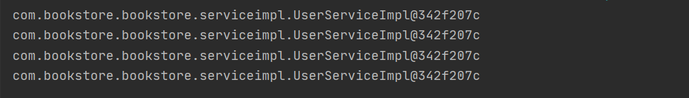
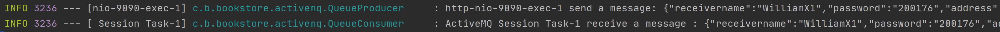

# hw1
#### id: 519021910861
#### name: 徐惠东
#### [项目 GitHub 网址](https://github.com/WilliamX1/bookstore.git/)
------
<font color="#dd0000"> 以下是 pdf-01 内容 </font>

### 要求
**优化服务器设计，确定有状态与无状态服务的运用方式，选择一个服务设计成有状态的和无状态的，观察差异，设计合理。**

### 设计原理
#### 服务状态差异
	1. 无状态（Stateless）服务要求：
		客户端每次请求时均需具备自描述信息，服务器端通过这些信息来识别客户端身份，服务器端不保存任何客户端请求者信息。落实到代码即只有单个实例。
	2. 无状态服务特点：
		客户端请求不依赖服务器端信息，所以任何多次请求不需要访问到同一台服务。且服务器集群和状态可以对客户端透明，便于服务器端迁移和伸缩，同时有效减少服务器端存储压力。
	3. 有状态（Stateful）服务要求：
		服务器端需要记录每次会话的客户端信息，从而识别客户端身份，根据用户信息进行请求处理。落实到代码即可以有多个实例。
	4. 有状态服务特点：
		有更广阔的应用范围，可以通过服务器端存储的信息来重现部分上下文关系。但由于服务器端保存大量数据会增加服务器端压力，且不利于业务进行水平拓展，因此在分布式系统中我们希望进行无状态化处理。

### 代码实现
```JAVA
	/* Controller */
	/* Stateless */
	@Autowired
    private UserService userService;
    User user = userService.XXX();
    ...
    /* Stateful */
	@Autowired
    WebApplicationContext webApplicationContext;
    UserService userService = webApplicationContext.getBean(UserService.class);
    User user = userService.XXX()
```

```JAVA
	/* Stateless */
	public class UserServiceImpl implements UserService {...}
	/* Stateful */
	@Scope("prototype")
	public class UserServiceImpl implements UserService {
```
### 代码运行结果
使用 Postman 发送四次请求
**Stateless**

**Stateful**


### 项目关联文件
[UserController.java](./UserController.java)
[UserService.java](./UserServiceImpl.java)

### 参考
[01-architecture & service component.pdf](./01-architecture & service component.pdf)

---------
<font color="#dd0000"> 以下是 pdf-02 的内容</font>
### 要求
**编写一个JMS程序，用来接收并异步地处理订单，具体功能与先用E-Book中的下订单相同，具体流程为：**
1) 用户通过Web前端下订单到服务器，你的服务器端程序A(Controller) 应该先反馈给用户订单已接收；
2) A 将订单数据发送到“Order”队列；
3) 服务器端另一个程序B(Service) 一直监听Order队列，一旦读到消息，就立刻进行处理，将数据写入数据库。

### 设计原理
**使用 activemq 实现下订单功能消息队列。当用户点击下订单时，后端 Controller 先使用生产者将用户请求转发给消费者，并迅速返回给用户该订单正在执行中。后端消费者将在空闲时期完成这笔交易。有效提高了下订单的效率和吞吐量**

### 代码实现
```properties
	/* activemq 配置 */
	# ActiveMQ 消息队列
    spring.activemq.pool.enabled = true
    # 最大连接数
	spring.activemq.pool.max-connections = 50
    # broker地址，默认端口是61616
    spring.activemq.broker-url = tcp://localhost:61616
    # 信任所有的包，这个配置是为了支持发送对象消息
    spring.activemq.packages.trust-all = true
    # ActiveMQ的用户名
    spring.activemq.user = root
    # ActiveMQ的密码
    spring.activemq.password = 200176
    # queue和topic不能同时使用，使用topic的时候，把下面这行解除注释
	spring.jms.pub-sub-domain = true
```
```JAVA
	/* OrderController */
	...(@RequestParam String username, ...) {
		/* 将前端参数打包成 JSON 格式 */
		JSONObject jsonObject = new JSONObject();
		jsonObject.put("username", username);
		...
		/* 使用生产者将请求转发给消费者 */
		QueueProducer orderProducer = new QueueProducer(OrderConstant.QUEUE_NAME);
		orderProducer.sendMsg(jsonObject);
		/* 迅速返回用户 */
		return new ResponseEntity<>(OrderConstant.ORDER_INPROCESSING, HttpStatus.OK);
	}
```
```JAVA
	/* QueueProducer 生产者 */
public class QueueProducer {
	private final Logger LOG = LoggerFactory.getLogger(QueueProducer.class);
	private Connection connection;
	private Session session;
	private MessageProducer producer;

	public QueueProducer(String queueName) {
	init(queueName);
	}

	/* 初始化 */
	public void init(String queueName) {
		try {
			ActiveMQConnectionFactory connectionFactory = new ActiveMQConnectionFactory(ActiveMqConfig.BROKEN_URL);
			connection = connectionFactory.createConnection();
			connection.start();
			session = connection.createSession(true, Session.AUTO_ACKNOWLEDGE);
			Queue queue = session.createQueue(queueName);
			producer = session.createProducer(queue);
		} catch (JMSException e) {
			LOG.error("" + e);
		}
	}

    /* 发送 JSONObject 消息 */
	public void sendMsg(JSONObject jsonObject) {
		try {
			ActiveMQObjectMessage msg = new ActiveMQObjectMessage();
			msg.setObject(jsonObject);
			producer.send(msg);
			session.commit();
			LOG.info(Thread.currentThread().getName() + " send a message: {}", msg.getObject());
		} catch (JMSException e) {
			LOG.error("" + e);
		}
	}
```

```JAVA
/* QueueConsumer 消费者 抽象 */
/* 方便复用 */
public class QueueConsumer {
    private final Logger LOG = LoggerFactory.getLogger(QueueConsumer.class);

    private Connection connection;
    private Session session;
    private MessageConsumer consumer;

    public QueueConsumer(String queueName) {
        init(queueName);
    }

    /* 初始化 */
    public void init(String queueName) {
        try {
            ActiveMQConnectionFactory connectionFactory = new ActiveMQConnectionFactory(ActiveMqConfig.BROKEN_URL);
            connectionFactory.setTrustAllPackages(true);
            connection = connectionFactory.createConnection();
            connection.start();
            session = connection.createSession(false, Session.AUTO_ACKNOWLEDGE);
            Queue queue = session.createQueue(queueName);
            consumer = session.createConsumer(queue);
        } catch (JMSException e) {
            LOG.error("" + e);
        }
    }

    /* 获取 consumer */
    public MessageConsumer getConsumer() {
        return consumer;
    }
    /* 获取 LOG */
    public Logger getLog() {
        return LOG;
    }
}
```

```JAVA
/* OrderConsumer 使用QueueConsumer */
@Component
public class OrderConsumer implements CommandLineRunner { 
// 随 SpringBoot 自启动

    private static QueueConsumer queueConsumer;

    @Autowired
    private UserService userService;

    @Autowired
    private BookService bookService;

    @Autowired
    private OrderService orderService;

    @Override
    public void run(String... args) {
        queueConsumer = new QueueConsumer(OrderConstant.QUEUE_NAME);
        Logger LOG = queueConsumer.getLog();
        MessageConsumer messageConsumer = queueConsumer.getConsumer();

        receiveAndExecuteMsg(LOG, messageConsumer);
    }

    private void receiveAndExecuteMsg(Logger LOG, MessageConsumer messageConsumer) {
        try {
            messageConsumer.setMessageListener(new MessageListener() {
                @Override
                public void onMessage(Message message) {
                    try {
                        ActiveMQObjectMessage activeMQObjectMessage = (ActiveMQObjectMessage) message;
                        JSONObject order = (JSONObject) activeMQObjectMessage.getObject();
                        LOG.info(Thread.currentThread().getName() + " receive a message : {}", activeMQObjectMessage.getObject());
                        execute(order);
                    } catch (JMSException e) {
                        LOG.error("" + e);
                    }
                }
            });
        } catch (JMSException e) {
            LOG.error("" + e);
        }
    }

    private ResponseEntity<Integer> execute(JSONObject order) {
		/* 下订单具体实现 */
		......
    }
}
```

### 代码运行结果


### 项目关联文件
[OrderController.java](./OrderController.java)
[ActiveMqConfig.java](./ActiveMqConfig.java)
[QueueProducer.java](./QueueProducer.java)
[QueueConsumer.java](./QueueConsumer.java)
[OrderConsumer.java](./OrderConsumer.java)
[application.properties](./application.properties)

### 参考
[02-messaging.pdf](./02-messaging.pdf)
https://www.hangge.com/blog/cache/detail_2688.html
https://blog.csdn.net/hbtj_1216/article/details/104051810
https://www.jianshu.com/p/8caa6d66b10d
https://juejin.cn/post/6882194277234032654

