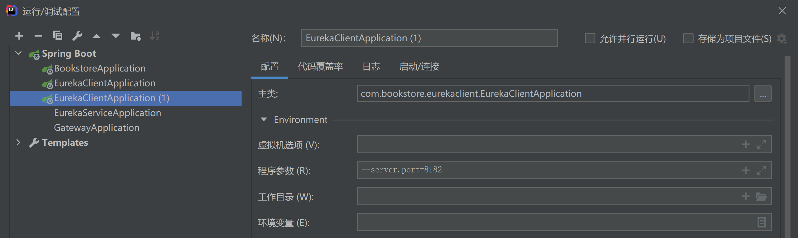
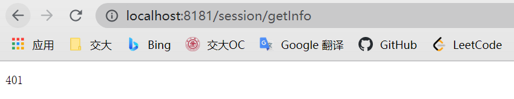
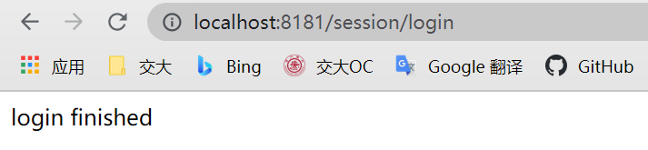
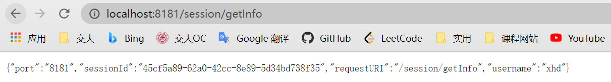
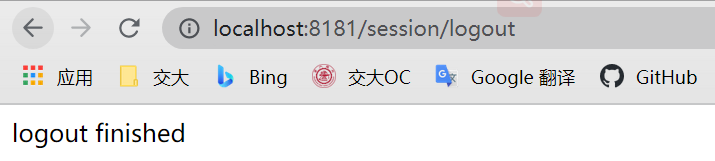
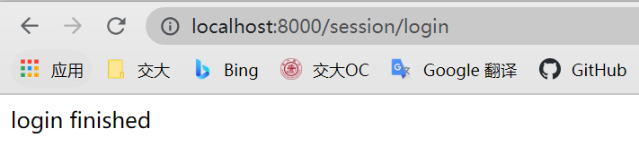
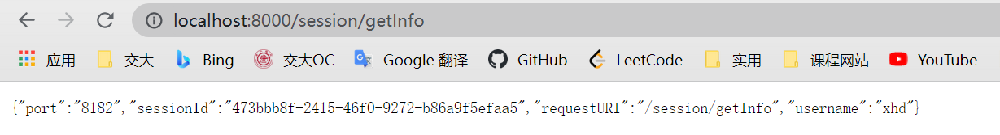
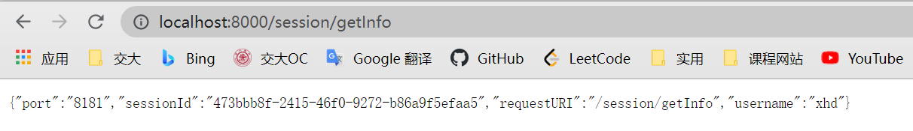
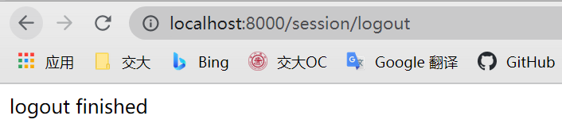

# hw9

#### id: 519021910861

#### name: xuhuidong

------

<font color=red> 以下是 pdf-20 内容 </font>

### 要求
1. 参照课程样例，构建 E-Book 的集群，至少包含 1 个 nginx 实例（负载均衡）+ 1 个 Redis 实例（存储 session）+ 2 个 Tomcat 实例。
2. 参照上课演示案例，将上述系统实现容器化部署，即负载均衡器、缓存、注册中心和服务集群都在容器内部署。

### 设计原理
#### Nginx 负载均衡

1. 正向代理
正向代理即客户端非常明确要访问的服务器地址，它代理客户端替客户端发出请求。一次正向代理过程即，客户端将请求发给代理服务器，由代理服务器代理它请求目标网址，最终再将响应返回给客户端，该过程中服务器并不知道真正发出请求的是谁。

2. 反向代理
反向代理隐藏了服务器的信息，它代理的是服务器端，代其接受请求，即客户端并不知道具体是哪台服务器处理了自己的请求，这样即提高了访问速度，又为安全性提供了保证。

3. Nginx
Nginx 作为一个基于 C 实现的高性能 Web 服务器，可以通过系列算法解决上述的负载均衡问题。并且由于它具有高并发、高可靠性、高拓展性和开源等特点，成为开发人员常用的反向代理工具。

#### 负载均衡常用算法

1. 轮询
轮询为负载均衡中较为基础也较为简单的算法，它不需要配置额外参数。假设配置文件中共有 $M$ 台服务器，该算法遍历服务器节点列表，并按节点次序每轮选择一台服务器处理请求。当所有节点均被调用过一次后，该算法将从第一个节点开始重新一轮遍历。
特点：由于该算法中每个请求按时间顺序逐一分配到不同的服务器处理，因此适用于服务器性能相近的集群情况，其中每个服务器承载相同的负载。但对于服务器性能不同的集群而言，该算法容易引发资源分配不合理等问题。

2. 加权轮询
为了避免普通轮询带来的弊端，加权轮询应运而生。在加权轮询中，每个服务器会有各自的 weight 。一般情况下，weight 的值越大意味着该服务器的性能越好，可以承载更多的请求。该算法中，客户端的请求按权值比例分配，当一个请求到达时，优先为其分配权值最大的服务器。
特点：加权轮询可以应用于服务器性能不等的集群中，使资源分配更加合理化。

3. IP 哈希
ip_hash 依据发出请求的客户端 IP 的 hash 值来分配服务器，该算法可以保证同 IP 发出的请求映射到同一服务器，或者具有相同 hash 值的不同 IP 映射到同一服务器。
特点：该算法在一定程度上解决了集群部署环境下 Session 不共享的问题。

#### 设计说明
由于在先前的作业中用到了 gateway 将 main module 中的请求从 http 更换成了 https，且使用的是自制证书。经过查阅资料，nginx 代理 https 请求需要证书验证，较为麻烦且课上没有讲述，因此我选择在另一模块 Eureka 上增加 nginx 代理。

### 代码实现
#### 后端 SpringBoot 代码
**[EurekaClientApplication]** 中增加 addSession 函数。

```Java
@GetMapping(value = "/book/session/getInfo")
public Map<String, String> addSession (HttpServletRequest request){
    HttpSession session = request.getSession();
    String sessionId = session.getId();
    String username = (String) session.getAttribute("username");
    String requestURI = request.getRequestURI();

    Map<String, String> sessionInfoMap = new HashMap<>();
    sessionInfoMap.put("sessionId", sessionId);
    sessionInfoMap.put("username", username);
    sessionInfoMap.put("requestURI", requestURI);
    sessionInfoMap.put("port", port);
	return sessionInfoMap;
}
```

将样例中 RedisConfig、RedisSessionConfig、RedisSessionInterceptor 和 WebSecurityConfig 加入项目文件。

将 EurekaClientApplication 复制一份并指定另外一个端口号，这样形成两个 tomcat 实例。


#### Nginx 配置

设置 Nginx 代理端口为 8000，分别分发到 8181 和 8182 端口上，且权重因子使用默认 1。
```
upstream tomcats {
    server 127.0.0.1:8181;
    server 127.0.0.1:8182;
}

server {
    listen       8000;
    server_name  localhost;

    location / {
        root   html;
        proxy_pass  http://tomcats;
        index  index.html index.htm;
    }

    error_page   500 502 503 504  /50x.html;
    location = /50x.html {
        root   html;
    }
}
```

### 代码运行结果

直接访问服务端口 8181，没有登录则返回 401。



直接访问服务端口 8181，并进行登录。



直接访问服务端口 8181，登录后可获得 session 信息。



直接访问服务端口 8181，并退出登录。



通过 Nginx 端口 8000 访问，由于没有登录则返回 401。


通过 Nginx 端口 8000 访问，并进行登录。



通过 Nginx 端口 8000 访问，登录后可获得 session 信息。
**两次访问分别分发到不同端口 8181 和 8182**。





通过 Nginx 端口 8000 访问，退出登录。




### 项目关联文件

[application.properties](./application.properties)
[EurekaClientApplication.java](./EurekaClientApplication.java)
[pom.xml](./pom.xml)
[RedisConfig.java](./RedisConfig.java)
[RedisSessionConfig.java](./RedisSessionConfig.java)
[RedisSessionInterceptor.java](./RedisSessionInterceptor.java)
[WebSecurityConfig.java](./WebSecurityConfig.java)

### 参考

[21-clustering .pdf](./21-clustering .pdf)
[22-virtualization.pdf](./22-virtualization.pdf)
https://www.zoo.team/article/nginx
https://segmentfault.com/a/1190000037594169
https://blog.csdn.net/chali1314/article/details/113310981
https://database.51cto.com/art/202103/650044.htm
https://blog.csdn.net/bj_chengrong/article/details/103814720

