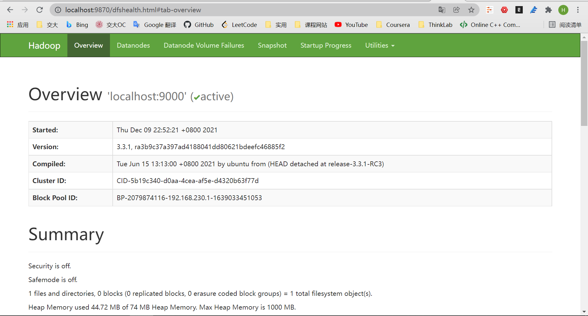
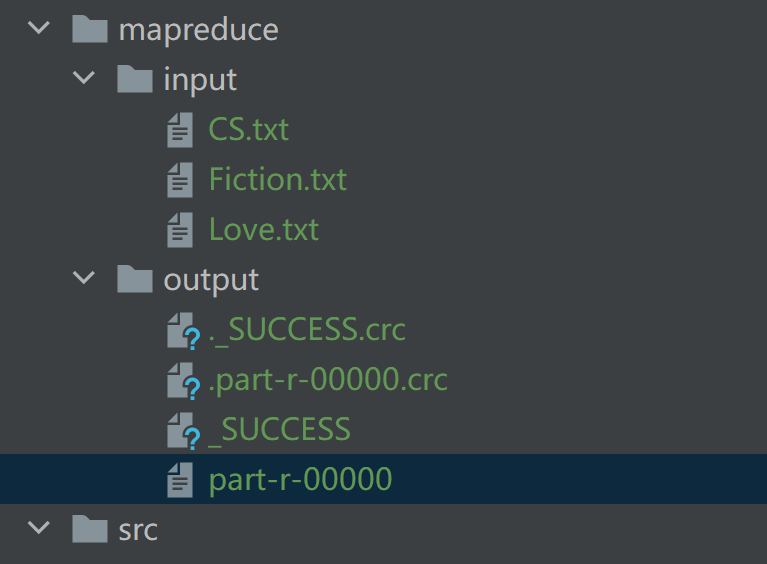
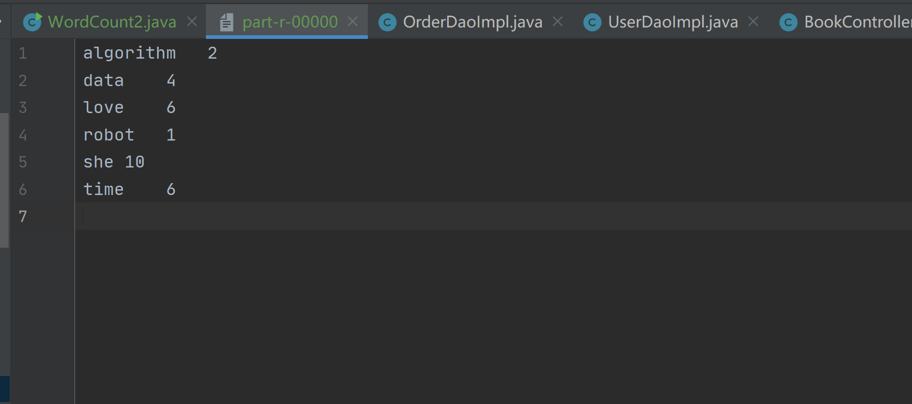
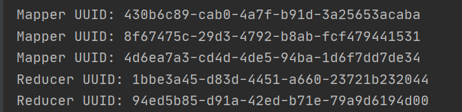

# hw11
#### id: 519021910861
#### name: xuhuidong
------
<font color=red> 以下是 pdf-25 内容 </font>

### 要求

1. 将你的系统中所有图书的简介按照图书类型分别存储到多个文本文件中，例如，所有计算机类图书的简介存储在 CS.txt 中，科幻小说的简介存储在 Fiction.txt 中。请你构建多个这样的文件，作为 MR 作业的对象。
2. 编写一个关键词列表，包含若干单词，例如，["Java", "JavaScript", "C++", "Pogramming", "Star", "Robot"] 等。
3. 编写一个 MR 作业，统计所有图书简介中上述每个关键词出现的次数。

### 设计原理

#### MapReduce 

首先，对大数据采取分而治之的思想。对相互间不具有计算以来关系的大数据实现并行处理，最自然的办法就是采取分而治之的策略。其次，把分而治之的思想上升到抽象模型。为了克服 MPI 等并行计算方法缺少高层并行编程模型这一缺陷，MapReduce 借鉴了 Lisp 函数式语言中的思想，用 Map 和 Reduce 两个函数提供了高层的并行编程抽象模型。最后，把分而治之的思想上升到架构层面，统一架构为程序员隐藏系统层的实现细节。

#### Hadoop

1. 简介
Hadoop 是一个用 Java 编写的 Apache 开源框架，允许使用简单的编程模型跨计算机集群分布式处理大型数据集。Hadoop 框架工作的应用程序在跨计算机集群提供分布式存储和计算的环境中工作。Hadoop 旨在从单个服务器扩展到数千个机器，每个都提供本地计算和存储。
2. 架构
* Hadoop Common：其他 Hadoop 模块所需的 Java 库和实用程序。这些库提供文件系统和操作系统级抽象，并包含启动 Hadoop 所需的 Java 文件和脚本。
* Hadoop Yarn：用作作业调度和集群资源管理的框架。
* Hadoop Distributed File System（HDFS）：分布式文件系统，提供对应用程序数据的高吞吐量访问。
* Hadoop MapReduce：基于 Yarn 的用于并行处理大数据集的系统。

3. 工作方式
	1. 用户/应用程序通过制定以下项目来向 Hadoop 提交作业以获取所需的进程：
		* 分布式文件系统输入和输出文件的位置。
		* Java 类以 Jar 文件的形式包含 map 和 reduce 函数的实现。
		* 通过设置作业的不同参数来配置作业。
	2. Hadoop 作业客户端将作业和配置提交给 JobTracker，JobTracker 然后承担将软件/配置分发给从属的责任，Hadoop 作业客户端然后将作业（jar/可执行文件等）和配置提交给 JobTracker，JobTracker 然后承担将软件/配置分发给从属的责任。
	3. 不同节点上的 TaskTracker 根据 MapReduce 实现执行任务，reduce 函数的输出存储在文件系统上的输出文件中。

4. 优势
	* Hadoop 框架允许用户快速编写和测试分布式系统。它是高效的，它自动分配数据和工作在整个机器，反过来，利用 CPU 核心的底层并行性。
	* Hadoop 不依赖硬件来提供容错和高可用性（FTHA），相反 Hadoop 库本身设计用于检测和处理应用程序层的故障。
	* 服务器可以动态添加或从集群中删除，Hadoop 继续运行而不中断。
	* 开源且在所有平台上兼容。

#### 后端 SpringBoot 代码

借鉴老师所给样例 `WordCount2` 代码，进行一些修改完善。

直接指定输入输出文件夹，而不是将其作为参数传递。

```Java
public static void main(...) throws Exception {
	/* 设置输入文件夹和输出文件夹 */
	String input_path = "backend\\mapreduce\\input";
	String output_path = "backend\\mapreduce\\output";
	Path in = new Path(input_path), out = new Path(output_path);
	...
	
	/* 如果输出文件夹已经存在则删除 */
	FileSystem fileSystem = FileSystem.get(new URI(in.toString()), new Configuration());
	if (fileSystem.exists(out))
		fileSystem.delete(out, true);
	FileOutputFormat.setOutputPath(job, new Path(output_path));
	
	/* 读取输入文件夹中所有文件并作为输入 */
	File file = new File(input_path);
	String[] input_files = file.list();
	for (String input_file : input_files) {
		FileInputFormat.addInputPath(job, new Path(input_path + "\\" + input_file));
	};
	
	...
}
```

构造关键词列表，且仅仅统计包含于内的关键词。

```Java
@Override
public void map(Object key, Text value, Context context) throws IOException, InterruptedException {
	...
	
	/* 关键词列表 */
	List<String> key_list = new ArrayList<>(Arrays.asList(
		"Java", "Python", "C++", "data", "algorithm", "Robot", "Love", "time", "she"
	));
	StringTokenizer itr = new StringTokenizer(line);
    while (itr.hasMoreTokens()) {
        ...
        /* 仅当包含在关键词列表才统计 */
        if (key_list.contains(word.toString()))
            context.write(word, one);
        ...
    }
	
}

```

### Hadoop 配置

参考 [这篇文章](https://zhuanlan.zhihu.com/p/111844817)

### 运行方式

以管理员身份打开 cmd。
```bash
> cd C:\hadoop\sbin
> start-all.cmd
```
浏览器 `http://localhost:9870` 查看是否成功初始化 Hadoop 。



在与 src 创建同级文件夹 "mapreduce"，并在其中分别创建对应 "input" 和 "output" 文件夹，如图（output 文件夹中内容是代码运行生成的，无需手动创建）。



点击文件 `/mapreduce/WordCount2` 中的 main 函数前的运行按钮，即无参数运行 main 函数即可。

### 代码运行结果

正确统计出三个输入文件中在关键词列表中的关键词的数量。



### 相关参数说明

原程序给出的是向 main 函数传递输入文件和输出文件的路径，这种方式仅支持单个输入文件。
根据现在的需求，需要统计多个输入文件并汇总生成一个输出文件，且输入文件夹已知，因此我将 main 函数的参数移除，直接在程序中定义输入文件目录路径和输出文件目录路径，即：
```Java
String input_path = "backend\\mapreduce\\input", output_path = "backend\\mapreduce\\output";
```
并且每次都扫描输入文件目录下的所有文件，添加至输入文件中，这样就可以实现多文件输入的需求。

### Mapper 和 Reducer 数量。

Question：在我的程序运行时，Mapper 和 Reducer 各有多少个？以及为什么会有这样的数量？

Answer：
1. Mapper 的数量由输入文件的数量和大小共同决定，每个文件都至少对应一个 Mapper，而如果单个文件大小超过 128M 则需要每 128M 分一个 Mapper，目前 Mapper 已经不能手动指定精确值，而是由框架确定。在我的 E-Book 中，总共有 3 个文件，且每个文件数量远小于 128M，因此按照计算来说应该有 3 个 Mapper。
2. Reducer 的数量可以由自己确定，有多少个 Reducer 就会有多少个输出统计文件，我指定的 Reducer 的数量是 2，因此总共应该有 2 个 Reducer。
```Java
job.setNumReduceTasks(2);
```

经过观察，验证了上述说法。



### 项目关联文件

[25-hadoop](./25-hadoop.pdf)
[WordCount2.java](./WordCount2.java)
[input](./input)

### 参考
https://zhuanlan.zhihu.com/p/111844817
http://c.biancheng.net/view/3604.html
https://hadoop.apache.org/docs/r1.0.4/cn/mapred_tutorial.html#%E4%BD%9C%E4%B8%9A%E9%85%8D%E7%BD%AE