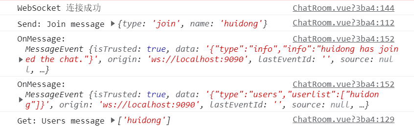

# hw2
#### id: 519021910861
#### name: 徐惠东
#### [项目 GitHub 网址](https://github.com/WilliamX1/bookstore.git/)
#### [项目后端源代码](./backend_src)
#### [项目前端源代码](./frontend_src)
------
<font color="#dd0000"> 以下是 pdf-03 内容 </font>

### 要求
**编写一个 WebSocket 聊天室，用于用户在线聊天。**

### 设计原理
#### WebSocket简介
1. **WebSocket定义**：WebSocket 是一种网络通讯协议，一个 TCP 连接的两端，可以同时给对方发送消息，即支持全双工通信。相对于轮询，WebSocket 减少了宽带资源浪费，实时性更强。
2. **WebSocket使用**：在 WebSocket 中，浏览器和服务器需要完成一次握手，两者之间便建立了持久性连接，可以进行双向数据传输。
3. **WebSocket特点**
	* 协议标识符是 ws，如果采用加密则是 wss。
	* 没有同源限制，客户端可以与任意服务器通信。
	* 建立在 TCP 协议上，可以发送文本或二进制数据。
	* 与 HTTP 协议有着良好的兼容性。默认端口也是 80 和 443，并且握手阶段采用 HTTP 协议，因此握手时不容易屏蔽，能通过各种 HTTP 代理服务器。
#### 其他通信方式
1. 短轮询（traditional Polling）
短轮询是指客户端每隔一段时间就询问一次服务器是否有新的消息，如果有就接收消息。
* 优点：短连接，服务器处理简单，支持跨域、浏览器兼容性较好。
* 缺陷：有一定延迟，服务器压力较大，浪费带宽流量，大部分是无效请求。
2. 长轮询（Long Polling）
长轮询是短轮询的改进，客户端执行 HTTP 请求发送消息到服务器后，等待服务器回应，如果没有新的消息就一直等待，知道服务器有新消息传回或者超时。
* 优点：减少轮询次数，低延迟，浏览器兼容性较好。
* 缺陷：服务器需要保持大量连接。
3. 服务器发送事件（Server-Sent Event）
服务器发送事件是一种服务器向浏览器客户端发起数据传输的技术。一旦创建了初始连接，事件流将保持打开状态，直到客户端关闭。
* 优点：适用于更新频繁、低延迟并且数据都是从服务端发送到客户端。
* 缺陷：浏览器兼容难度高。
### 代码实现
#### 后端 SpringBoot 代码
**[BotEndpoint] 主要用于处理 WebSocket 请求**

```JAVA
/* Websocket endpoint */
@ServerEndpoint(
        value = "/websocketbot",
        decoders = {MessageDecoder.class},
        encoders = {ChatMessageEncoder.class, InfoMessageEncoder.class, JoinMessageEncoder.class, UsersMessageEncoder.class}
)
@Component
/* This is a BotEndpoint instance per connection */
public class BotEndpoint {
    private static Queue<Session> mySession = new ConcurrentLinkedDeque<>();

    @OnOpen /* 新的 session 加入 */
    public void openConnection(Session session) {
		mySession.add(session);
    }

    @OnMessage /* 通信通道 */
    public void message(final Session session, Message msg) {
        if (msg instanceof JoinMessage) {
            /* Add the new user and notify everybody */
			JoinMessage joinMessage = (JoinMessage) msg;
			session.getUserProperties().put("name", joinMessage.getName());
            session.getUserProperties().put("active", true);
            sendAll(session, new InfoMessage(joinMessage.getName() + " has joined the chat."));
            sendAll(session, new UsersMessage(this.getUserList(session)));
        }
        else if (msg instanceof ChatMessage) {
			......
		}
    }

    @OnClose /* 断开连接时 */
    public void closedConnection(Session session) {
        /* Notify everybody */
        session.getUserProperties().put("active", false);
        if (session.getUserProperties().containsKey("name")) {
            String name = session.getUserProperties().get("name").toString();
            sendAll(session, new InfoMessage(name + " has left the chat"));
            sendAll(session, new UsersMessage(this.getUserList(session)));
        }
        logger.log(Level.INFO, "Connection closed.");
    }

    @OnError /* 发生错误时如何处理 */
    public void error(Session session, Throwable throwable) {
		......
    }

    /* Forward a message to all connected clients
    * The endpoint figures what encoder to use based on the message type */
    public synchronized void sendAll(Session session, Object msg) {
        try {
            for (Session s : mySession) {
                if (s.isOpen()) {
                    s.getBasicRemote().sendObject(msg);
                    logger.log(Level.INFO, "Sent {0}", msg.toString());
                }
            }
        } catch (IOException | EncodeException e) {
            logger.log(Level.INFO, e.toString());
        }
    }

    /* Returns the list of users from the properties of all open sessions */
    public List<String> getUserList(Session session) {
        List<String> users = new ArrayList<>();
        for (Session s : mySession) {
            if (s.isOpen() && (boolean) s.getUserProperties().get("active")
                    && !users.contains(s.getUserProperties().get("name").toString())) // 防止重复添加
                users.add(s.getUserProperties().get("name").toString());
        }
        return users;
    }
}
```
**[MessageDecoder] 解码传输的请求消息**
```Java
public class MessageDecoder implements Decoder.Text<Message> {
    /* Store the name-value pairs from a JSON message as a Map */
    private Map<String, String> messageMap;

    @Override
    public void init(EndpointConfig endpointConfig) {}

    @Override
    public void destroy() {}

    /* Create a new Message object if the message can be decoded */
    @Override
    public Message decode(String string) throws DecodeException {
        System.out.println(string);
        Message msg = null;
        if (willDecode(string)) {
            switch (messageMap.get("type")) {
                case "chat":
                    msg = new ChatMessage(messageMap.get("name"),
                            messageMap.get("target"),
                            messageMap.get("message"));
                    break;
                case "info":
                    msg = new InfoMessage(messageMap.get("info"));
                    break;
                case "join":
                    msg = new JoinMessage(messageMap.get("name"));
                    break;
                case "users":
                    msg = new UsersMessage(Collections.singletonList(messageMap.get("userlist")));
                    System.out.println(msg);
                    break;
            }
        } else {
            throw new DecodeException(string, "[Message] can't decode");
        }
        return msg;
    }

    /* Decode a JSON message into a Map and check if it contains
    * all the required fields according to its type */
    @Override
    public boolean willDecode(String string) {
        boolean decodes = false;
        /* Convert the mesage into a map */
        messageMap = new HashMap<>();
        JsonParser jsonParser = Json.createParser(new StringReader(string));
        while (jsonParser.hasNext()) {
            if (jsonParser.next() == JsonParser.Event.KEY_NAME) {
                String key = jsonParser.getString();
                jsonParser.next();
                String value = jsonParser.getString();
                messageMap.put(key, value);
            }
        }
        /* Check the kind of message and if all fields are included */
        Set keys = messageMap.keySet();
        if (keys.contains("type")) {
            switch (messageMap.get("type")) {
                case "chat":
                    String[] charMsgKeys = {"name", "target", "message"};
                    if (keys.containsAll(Arrays.asList(charMsgKeys))) decodes = true;
                    break;
                case "info":
                    if (keys.contains("info")) decodes = true;
                    break;
                case "join":
                    if (keys.contains("name")) decodes = true;
                    break;
                case "users":
                    if (keys.contains("userlist")) decodes = true;
                    break;
            }
        }
        return decodes;
    }
}
```
**[JoinMessageEncoder] 将用户加入连接时请求编码**

```Java
public class JoinMessageEncoder implements Encoder.Text<JoinMessage> {
    @Override
    public void init(EndpointConfig endpointConfig) {}

    @Override
    public void destroy() {}

    @Override
    public String encode(JoinMessage joinMessage) throws EncodeException {
        StringWriter stringWriter = new StringWriter();
        try (JsonGenerator jsonGenerator = Json.createGenerator(stringWriter)) {
            jsonGenerator.writeStartObject()
                    .write("type", "join")
                    .write("name", joinMessage.getName())
                    .writeEnd();
        }
        return stringWriter.toString();
    }
}
```
**[ChatMessageEncoder] 将用户聊天消息请求编码**
```Java
public class ChatMessageEncoder implements Encoder.Text<ChatMessage> {
    @Override
    public void init(EndpointConfig endpointConfig) {}

    @Override
    public void destroy() {}

    @Override
    public String encode(ChatMessage chatMessage) throws EncodeException {
        StringWriter stringWriter = new StringWriter();
        try (JsonGenerator jsonGenerator = Json.createGenerator(stringWriter)) {
            jsonGenerator.writeStartObject()
                    .write("type", "chat")
                    .write("name", chatMessage.getName())
                    .write("target", chatMessage.getTarget())
                    .write("message", chatMessage.getMessage())
                    .writeEnd();
        }
        return stringWriter.toString();
    }
}
```
**[InfoMessageEncoder] 将通知请求编码**
```Java
public class ChatMessageEncoder implements Encoder.Text<ChatMessage> {
    @Override
    public void init(EndpointConfig endpointConfig) {}

    @Override
    public void destroy() {}

    @Override
    public String encode(ChatMessage chatMessage) throws EncodeException {
        StringWriter stringWriter = new StringWriter();
        try (JsonGenerator jsonGenerator = Json.createGenerator(stringWriter)) {
            jsonGenerator.writeStartObject()
                    .write("type", "chat")
                    .write("name", chatMessage.getName())
                    .write("target", chatMessage.getTarget())
                    .write("message", chatMessage.getMessage())
                    .writeEnd();
        }
        return stringWriter.toString();
    }
}
```
**[UsersMessageEncoder] 将用户列表显示请求编码**
```Java
public class InfoMessageEncoder implements Encoder.Text<InfoMessage> {
    @Override
    public void init(EndpointConfig endpointConfig) {}

    @Override
    public void destroy() {}

    @Override
    public String encode(InfoMessage infoMessage) throws EncodeException {
        StringWriter stringWriter = new StringWriter();
        try (JsonGenerator jsonGenerator = Json.createGenerator(stringWriter)) {
            jsonGenerator.writeStartObject()
                    .write("type", "info")
                    .write("info", infoMessage.getInfo())
                    .writeEnd();
        }
        return stringWriter.toString();
    }
}
```
#### 前端 Vue 代码
```JavaScript
export default {
	data() {
		return {
			websock: null,
		}
	},
	created(){
		//页面刚进入时开启长连接
		this.initWebSocket()
	},
	destroyed: function() {
		//页面销毁时关闭长连接
		this.websocketclose();
	},
	methods: { 
		initWebSocket(){ //初始化weosocket 
		const wsuri = 127.0.0.1:8080 + "/websocket/threadsocket";//ws地址
		this.websock = new WebSocket(wsuri); 
		this.websocket.onopen = this.websocketonopen;
		this.websocket.onerror = this.websocketonerror;
		this.websock.onmessage = this.websocketonmessage; 
		this.websock.onclose = this.websocketclose;
　　　　   }, 
		websocketonopen() {
			console.log("WebSocket连接成功");
		},
		websocketonerror(e) { // 错误
			console.log("WebSocket连接发生错误");
		},
		websocketonmessage(e){ // 数据接收 
			const redata = JSON.parse(e.data);
			// 接收数据
			console.log(redata.value); 
		}, 
		websocketsend(agentData){ // 数据发送 
　　　　　　　　this.websock.send(agentData); 
　　　　　　}, 
		websocketclose(e){ // 关闭 
			console.log("connection closed (" + e.code + ")"); 
		},
	}, 
}
```
### 代码运行结果
**用户 'huidong' 进入聊天室**

**用户 '青铜' 进入聊天室**

**用户 'huidong' 发送聊天消息 '你好' 给所有用户**

**用户 'huidong' 和 用户 '青铜' 均接收到聊天消息 '你好'**


**用户 '青铜' 发送聊天消息 '哈喽呀~' 给所有用户**

**用户 'huidong' 和 用户 '青铜' 均接收到聊天消息 '哈喽呀~'**

**聊天界面**


### 项目关联文件
[BotEndpoint.java](./BotEndpoint.java)
[MessageDecoder.java](./MessageDecoder.java)
[ChatMessageEncoder.java](./ChatMessageEncoder.java)
[InfoMessageEncoder.java](./InfoMessageEncoder.java)
[JoinMessageEncoder.java](./JoinMessageEncoder.java)
[UsersMessageEncoder.java](./UsersMessageEncoder.java)
### 参考
[03-websocket.pdf](./03-websocket.pdf)
https://zhuanlan.zhihu.com/p/80971113
http://www.mydlq.club/article/86/#%E4%B8%80websocket-%E7%AE%80%E4%BB%8B

------
<font color="#dd0000"> 以下是 pdf-04 的内容 </font>
### 要求
**在系统中增加对下订单服务的事务控制功能，至少使用 3 种不同的事务属性来观察他们之间的差异，正确分析下订单服务的事务属性的不同所表示出来的不同效果。**

### 设计原理
#### 什么是事务
在 Java 企业版中，一个事务就是一系列操作，且这些操作要么全部执行成功要么全部执行失败。事务总是以提交或撤回所有操作为终止。
#### 事务传播行为
* **Required**: 函数必须在一个事务中执行，如果上文环境中已经有一个事务则加入，否则就开启一个新的事务。
* **RequiresNew**: 函数总会开启一个新的事务执行，原有的事务暂时挂起。
* **Mandatory**: 函数必须在一个事务中执行，如果上文环境中已经有一个事务则加入，否则就抛出异常。
* **NotSupported**: 函数不支持在事务中执行，如果上文环境已经有一个事务则暂停该事务直到函数执行完毕，否则函数正常执行。
* **Support"**: 函数支持在事务中执行，如果上文环境已经有一个事务则加入该事务，否则函数正常执行。
* **Never**: 函数必须不在一个事务中执行，如果上文环境已经有一个事务则抛出异常，否则函数正常执行。
| Transaction Attribute | Client's Transaction | Business Method's Transaction | TransactionAttributeType Constant |
| :--: | :--: | :--: | :--: |
| Required | None | T2 | TransactionAttributeType.REQUIRED |
| Required | T1 | T1 | TransactionAttributeType.REQUIRED |
| RequiresNew | None | T2 | TransactionAttributeType.REQUIRES_NEW |
| RequiresNew | T1 | T2 | TransactionAttributeType.REQUIRES_NEW |
| Mandatory | None | Error | TransactionAttributeType.MANDATORY |
| Mandatory | T1 | T1 | TransactionAttributeType.MANDATORY |
| NotSupported | None | None | TransactionAttributeType.NOT_SUPPORTED |
| NotSupported | T1 | None | TransactionAttributeType.NOT_SUPPORTED |
| Supports | None | None | TransactionAttributeType.SUPPORTS |
| Supports | T1 | T1 | TransactionAttributeType.SUPPORTS |
| Never | None | None | TransactionAttributeType.NEVER |
| Never | T1 | Error | TransactionAttributeType.NEVER |

#### 事务隔离级别
| 注解 | 说明 |
| :--: | :--: |
| @Transactional(isolation = Isolation.READ_UNCOMMITED) | 读取未提交数据（会出现脏读，不可重复读），基本不使用）|
| @Transactional(isolation = Isolation.READ_COMMITED) | 读取已提交数据（会出现不可重复读和幻读）|
| @Transactional(isolation = Isolation.REPEATABLE_READ) | 可重复读（会出现幻读）|
| @Transactional(isolation = Isolation.SERIALIZABLE) | 串行化 |

#### 读写锁
* **Read locks**: Read locks prevent other transactions from **changing data read during a transaction until the transaction ends**, thus preventing **nonrepeatable** reads. Other transactions can read the data but not write to it. The current transaction is **also** prohibited from making changes.
* **Write locks**: Write locks are used for updates. A write lock prevents other transactions from **changing the data until the current transaction is complete but allows dirty reads by other transactions and by the current transaction itself**. In other words, the transaction can read its own **uncommited** changes.
* **Exclusive write locks**: Exclusive write locks are used for updates. An exclusive write lock prevents other transactions from **reading or changing the data until the current transaction is comlete**. It also prevents dirty reads by other transactions.
* **Snapshots**: A snapshot is a frozen view of the data that is taken when a transaction begins. Som databases get around locking by providing every transaction with its own snapshot. **Snapshots can prevent dirty reads, nonrepeatable reads and phantom reads**.
* **Read Uncommitted**: The transaction can read uncommitted data, so dirty reads, nonrepeatable reads and phantom reads can occur.
* **Read Committed**: The transaction cannot read uncommitted data, data that is being changed by a different transaction cannot be read. Dirty reads are prevented, but nonrepeatable reads and phantom reads can occur.
* **Repeatable Read**: The transaction cannot change data that is being read by a different transaction. Dirty reads and nonrepeatable reads are prevented, phantom reads can occur.
* **Serializable**: The transaction has exclusive read and update privileges, different transactions can neither read nor write to the same data. Dirty reads, nonrepeatable reads and phantom reads are prevented.

### 代码实现

**OrderConsumer.java**

之前试图在该文件中添加事务处理机制，然而发现无法将该事务传递给调用的 _Service_ 函数，不断试错后发现，在 _SpringBoot_ 里可能只能从 _Service_ 层开始开启新的事务。

```JAVA
/* OrderConsumer.java */
/* 消费者队列中处理订单请求的函数 */
private ResponseEntity<Integer> execute(JSONObject order) throws Exception {
        try {
            return new ResponseEntity<>(bookService.makeOrder(order), HttpStatus.OK);
        } catch (Exception e) {
            log.error("" + e);
            return new ResponseEntity<>(-1, HttpStatus.NOT_ACCEPTABLE);
        }
}
```

**BookServiceImpl**
**UserServiceImpl**

```JAVA
/* Service 层 */
/* 处理消息队列中下订单逻辑 */
/* 总是开启新的事务 */
@Transactional(propagation = Propagation.REQUIRES_NEW)
public Integer makeOrder(JSONObject order) {
	...
	for (int i = 0; i < len; i++) {
        try {
            changeBookInventory(bookid.get(i), -bookcount.get(i), true);
            userService.changeBookCount(userid, bookid.get(i), -bookcount.get(i), true);
        } catch (Exception e) {
            throw new RuntimeException("" + e);
        }
	}
}
/* 当上下文环境是在一个事务中则加入该事务，否则新建一个事务执行 */
/* 由于该 Service 函数在其他非 makeOrder 中也有调用，所以不宜使用 Propagation.MANDATORY */
@Transactional(propagation = Propagation.REQUIRED)
public Integer changeBookInventory (Integer bookid, Integer changeinventory, Boolean isadd) throws Exception {
    try {
        return bookRepository.changeBookInventory(bookid, changeinventory, isadd);
    } catch (Exception e) {
        throw new RuntimeException("图书数量不够");
    }
}
/* 修改用户购物车书籍数量 */
/* 由于该 Service 函数在其他非 makeOrder 中也有调用，所以不宜使用 Propagation.MANDATORY */
@Transactional(propagation = Propagation.REQUIRED)
public Integer changeBookCount (Integer userid, Integer bookid, Integer bookcount, Boolean isadd) throws Exception {
    try {
        return userRepository.changeBookCount(userid, bookid, bookcount, isadd);
    } catch (Exception e) {
        throw new RuntimeException("购物车修改失败");
    }
}
```

**BookRepositoryImpl**
**UserRepositoryImpl**
```JAVA
/* Repository 层 */
/* 序列化执行，且事务传播行为是 Required，理由同 Service 函数 */
/* 修改书籍库存 */
@Transactional(propagation = Propagation.REQUIRED, isolation = Isolation.SERIALIZABLE)
public Integer changeBookInventory (Integer bookid, Integer changeinventory, Boolean isadd) throws Exception {
	...
	try {
		Assert.state(book.getInventory() >= 0, "图书数量不够");
	} catch (IllegalArgumentException e) {
		throw new RuntimeException("图书数量不够");
	};
	...
}
/* 序列化执行，且事务传播行为是 Required，理由同 Service 函数 */
/* 修改购物车书籍数量 */ 
@Transactional(propagation = Propagation.REQUIRED, isolation = Isolation.SERIALIZABLE)
public Integer changeBookCount (Integer userid, Integer bookid, Integer bookcount, Boolean isadd) throws Exception {
	...
    try {
    	book = bookDao.findById(bookid);
    	Assert.notNull(book, "book is not found");
    } catch (IllegalArgumentException e) {
    	throw new RuntimeException("" + e);
    }
	...
}
```
### 代码运行结果
|'Service' makeOrder function | 'Service' other functions | 'Repository' functions | 效果 |
| :--: | :--: | :--: | :--: |
| REQUIRES_NEW | REQUIRED | REQUIRED | 成功实现下订单动作一体化，如果所购买书籍中有某本书籍库存不够，则撤回所有之前下订单数据库操作并不再往下执行 |
| REQUIRES_NEW | REQUIRES_NEW | REQUIRED | Service 层函数会开启新的事务，因此这样下订单时每一本书的购买操作都是独立的事务，如果遇到某本书籍库存不够，则只会撤回关于该本书的数据库操作，不会撤回之前书籍的操作 |
| REQUIRES_NEW | MANDATORY | MANDATORY | 就下订单这个操作来说，也能够成功实现下订单动作的一体化。但由于存在其他 Service 层函数调用注解为 MANDATORY 的 Service 函数和 Repository 函数，此时由于这些函数并没有开启事务，而 MANDATORY 要求上下文环境必须有事务，此时这些函数则会报错而不执行。|
| REQUIRES_NEW | NOT_SUPPORT | NOT_SUPPORT | 由于 Service 层函数 和 Repository 层函数不支持事务，所以会将 makeOrder 函数的事务挂起，所以也无法实现下订单操作的一体化。|

### 项目关联文件
[OrderConsumer.java](./OrderConsumer.java)
[BookServiceImpl.java](./BookServiceImpl.java)
[UserServiceImpl.java](./UserServiceImpl.java)
[BookRepositoryImpl.java](./BookRepositoryImpl.java)
[UserRepositoryImpl.java](./UserRepositoryImpl.java)

### 参考
[04-transaction.pdf](./04-transaction.pdf)
https://blog.csdn.net/m0_37583655/article/details/119280272
https://docs.spring.io/spring-framework/docs/4.2.x/spring-framework-reference/html/transaction.html