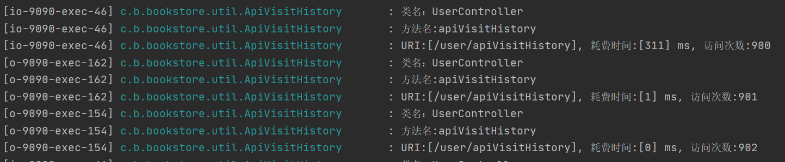
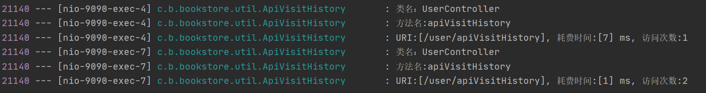

# hw3
#### id: 519021910861
#### name: xuhuidong
#### [项目 GitHub 网址](https://github.com/WilliamX1/bookstore.git/)
#### [项目后端源代码](./backend_src)
#### [项目前端源代码](./frontend_src)
------
<font color=red> 以下是 pdf-05 内容 </font>

### 要求
**仿照课件中给出的例子，在E-Book的首页上增加一个访问量统计功能，通过多线程控制，确保计数值准确，不会出现因多用户同时访问而统计不准确的情况。**

### 设计原理
#### 访问量
1. 定义
访问量即 Page View，简称 PV 。 即页面浏览量，用户每1次对网站中的每个网页访问均被记录1次。用户对同一页面的多次访问，访问量累计。
2. 衡量标准
网站访问量的衡量标准一个是独立 IP ，另一个是 PV ，常以日为标准，即日独立 IP 和日 PV 来计算。一台电脑上网即为一个独立 IP 。 PV 即 Page View 的缩写，即页面浏览量，一个独立IP可以产生多个 PV ，所以 PV 个数 $\geq$ 独立 IP 个数。网站每日访问量 IP 越多，PV 越多，即访问量越大。
### AOP
1. 定义
AOP 是 Aspect Oriented Programming 的缩写，即面向切面编程。
2. 原理
可以通过预编译方式和运行期动态代理实现在不修改源代码的情况下给程序动态统一添加功能的一种技术
3. 作用
* 统计接口访问次数
* 增强功能：在不改动代码的情况下，为接口增加一些额外的功能
#### AtomicCounter
* Atomic Counter是一个缓存对象，存储着一个或者多个unsigned int的变量值。在GLSL着色器有着特定的原子操作（单一的，不可再分的操作）。
* Atomic Counter可以用来控制片元的执行，避免对同一块内存区域同时操作。原子计数器表明当前片元在执行任务时，不能被其他任务打断，保证内存中数据修改的正确性。

### 代码实现
#### 后端 SpringBoot 代码
**[AtomicCounter] 用于计数**

```JAVA
public class AtomicCounter {
	private static final AtomicCounter atomicCounter = new AtomicCounter();
	/* 单例，不允许外界主动实例化 */
	private AtomicCounter() {};
	public static AtomicCounter getInstance() {
		return atomicCounter;
	};
	private static AtomicInteger counter = new AtomicInteger();
	public int getValue() {
		return counter.get();
	};
	public int increase() {
		return counter.incrementAndGet();
	};
	public int decrease() {
		return counter.decrementAndGet();
	};
	/* 清零 */
	public void toZero() {
		counter.set(0);
	};
}
```
**[ApiVisitHistory] 用于规范访问特定接口时统计**

```Java
@Component
@Aspect
@Slf4j
public class ApiVisitHistory {

    ThreadLocal<Long> startTime = new ThreadLocal<>();

    /**
     * 定义切面
     */
    @Pointcut("execution(* com.bookstore.bookstore.controller.UserController.apiVisitHistory())")
    public void pointCut() {};
    /**
     * 在接口原有的方法执行前，将会首先执行此处的代码
     */
    @Before("pointCut()")
    public void doBefore(JoinPoint joinPoint) throws Throwable {
        startTime.set(System.currentTimeMillis());
        //获取传入目标方法的参数
        Object[] args = joinPoint.getArgs();
        log.info("类名：{}", joinPoint.getSignature().getDeclaringType().getSimpleName());
        log.info("方法名:{}", joinPoint.getSignature().getName() );
    }

    /**
     * 只有正常返回才会执行此方法
     * 如果程序执行失败，则不执行此方法
     */
    @AfterReturning(returning = "returnVal", pointcut = "pointCut()")
    public void doAfterReturning(JoinPoint joinPoint, Object returnVal) {
        HttpServletRequest request = ((ServletRequestAttributes) RequestContextHolder.getRequestAttributes()).getRequest();
        // 执行成功则计数加一
        AtomicCounter.getInstance().increase();
        log.info("URI:[{}], 耗费时间:[{}] ms, 访问次数:{}", request.getRequestURI(), System.currentTimeMillis() - startTime.get(), AtomicCounter.getInstance().getValue());
    }

    /**
     * 当接口报错时执行此方法
     */
    @AfterThrowing(pointcut = "pointCut()")
    public void doAfterThrowing(JoinPoint joinPoint) {
        HttpServletRequest request = ((ServletRequestAttributes) RequestContextHolder.getRequestAttributes()).getRequest();
        log.info("接口访问失败，URI:[{}], 耗费时间:[{}] ms", request.getRequestURI(), System.currentTimeMillis() - startTime.get());
    }
}
```
**[UserController] 增加访问首页函数**
```Java
public class UserController {
	@GetMapping("/user/apiVisitHistory")
	public void apiVisitHistory() {};
}
```
#### 前端 Vue 代码
**[Home.vue] 首页**
```JavaScript
export default {
	created() {
		/* 统计首页访问量 */
		this.apiVisitHistory()
	}
}
```

### 代码运行结果
**使用 Jmeter 对接口进行大量 api 访问**

**开启前端使用不同账户进行首页访问**


### 项目关联文件
[ApiVisitHistory.java](./ApiVisitHistory.java)
[AtomicCounter.java](./AtomicCounter.java)
[UserController.java](./UserController.java)
[test.jmx](test.jmx)

### 参考
[05-multithreading.pdf](./05-multithreading.pdf)
https://baike.baidu.com/item/%E8%AE%BF%E9%97%AE%E9%87%8F/392852
https://blog.csdn.net/qq_43194650/article/details/111682049
https://www.jianshu.com/p/3d1c79ad68b4
https://blog.csdn.net/LuQiaoYa/article/details/88233846

------
<font color=red> 以下是 pdf-06 内容 </font>

### 要求

### 参考
https://blog.csdn.net/weixin_41134409/article/details/84190423
https://segmentfault.com/a/1190000025216273

