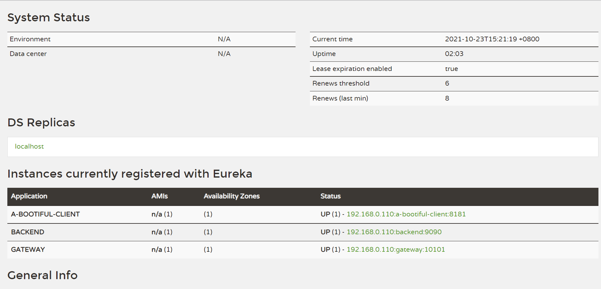
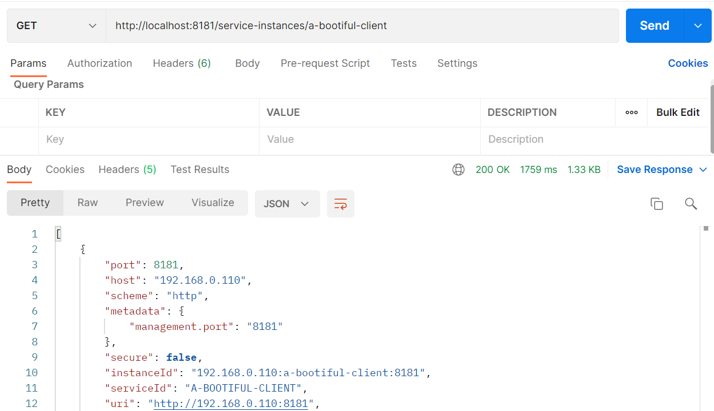
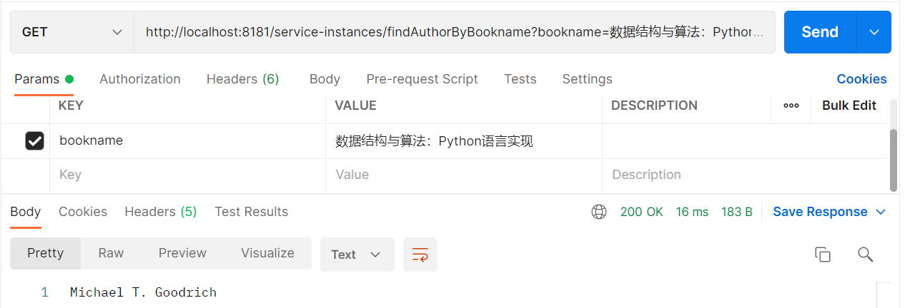
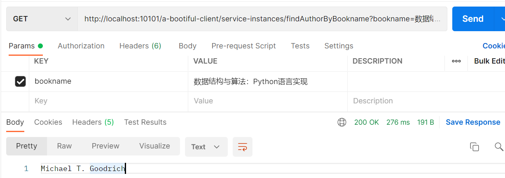

# hw5
#### id: 519021910861
#### name: xuhuidong
#### [项目 GitHub 网址](https://github.com/WilliamX1/bookstore.git/)
#### [项目后端源代码 - eureka-client](./eureka-client/src)
#### [项目后端源代码 - eureka-service](./eureka-service/src)
#### [项目后端源代码 - gateway](./gateway/src)
#### [项目前端源代码](./frontend_src)
------
<font color=red> 以下是 pdf-09 内容 </font>

### 要求
开发一个微服务，输入为书名，输出为书的作者。将此微服务单独部署，并使用 netflix-zuul 进行路由，在 E-Book 系统中使用该服务来完成作者搜索功能。

### 设计原理
#### 微服务简介
微服务架构（Microservice Architecture）是一种架构概念，旨在通过将功能分解到各个离散的服务中以实现对解决方案的解耦。
#### 微服务特性
* 每个服务为独立的业务开发，单独部署，跑在自己的进程中。
* 自动化测试、部署和运维（DevOps）。
* 快速演化、快速迭代。
* 整个业务由一系列的独立的服务共同组成系统。
* 高度容错性、高可用、高并发。
#### 微服务能力
* 注册中心：应用启动自动注册，调用方自动发现上线应用。服务异常自动隔离。
* 配置中心：多环境配置管理，支持在线管理配置信息，客户端实时生效。支持版本管理，快速回滚。
* 消息中心：服务间异步通信的总线。
* 负载均衡：服务调用服务会采用一定的分发策略，一般是客户端分发策略。
* 服务间通信：使用 http 或 rpc 协议进行服务调用，REST、gRPC、Thrift、hession等。
* 服务降级、熔断、重试：降级，服务或依赖服务异常时，返回保底数据。熔断，若依赖服务多次失效，则断开，不再尝试调用，直接返回降级值。重试，熔断后，定期探测依赖服务可用性，若恢复则恢复调用。
* 服务发布与回滚：红绿部署、灰度、AB Test等发布策略，可快速回滚应用。
* 服务动态伸缩、容器化：根据服务负载情况，可快速手动或自动进行节点增加和减少。
* 服务监控与告警：服务定期健康检察、指标统计、异常告警通知运维。
* 请求缓存与合并：服务间调用相同请求缓存，类似请求合并成批量请求，减少服务间通信，提高性能。
* 服务网关：用户请求过载时进行限流、排队，过载保护，黑白名单、异常用户过滤拦截等。
* 服务依赖、文档、Mock Server、版本管理：自动生成接口文档，接口版本化管理，Mock接口等。
* 日志收集、追踪、分析：集中收集各服务日志汇总，方便排障、问题调查、应用日志分析等。
* 性能监测APM：对各服务性能进行监测与分析，为服务优化提供数据支持。
#### Zuul 简介
Zuul 是所有从设备和 web 站点到 Netflix 流媒体应用程序后端请求的前门。作为一个边缘服务应用程序，Zuul 被构建来支持动态路由、监视、弹性和安全性。它还可以根据需要将请求路由到多个 Amazon 自动伸缩组。
#### Zuul 功能
* 身份验证和安全性：识别每个资源的身份验证需求，并拒绝不满足它们的请求。
* 监控：在边缘跟踪有意义的数据和统计数据，以便给我们一个准确的生产视图。
* 动态路由：动态路由请求到不同的后端集群。
* 压力测试：逐渐增加集群的流量，以评估性能。
* 限流：为每种请求类型分配容量，以丢弃超过限制的请求。
* 静态响应处理：直接在边缘构件一些响应，而不是将它们转发到内部集群。
#### Eureka 简介
Eureka 是 Netflix 开发的服务发现框架，本身是一个基于 REST 的服务，主要用于定位运行在 AWS 域中的中间层服务，以达到负载均衡和中间层服务故障转移的目的。Eureka 采用 CS 的设计架构，Eureka 作为服务注册功能的服务器，是服务注册中心。而系统中的其他微服务，使用 Eureka 的客户端（Client）连接到 Eureka Server 并维持心跳连接。
#### Eureka Server
提供服务注册服务，各个微服务节点通过配置启动后，会在 Eureka Server 中进行注册。这样 Eureka Server 中的服务注册表中将存储所有可用服务节点的信息，服务节点的信息可以在界面中直观看到。
#### Eureka Client
通过注册中心进行访问，用于简化 Eureka Server 的交互，客户端同时也具备一个内置的、使用轮询负载算法的负载均衡器。在应用启动后，将会向 Eureka Server 发送心跳（默认周期 30 s）。如果Eureka Server在多个心跳周期内没有接收到某个节点的心跳，Eureka Server将会从服务注册表中把这个服务节点移除（默认90秒）

### 代码实现
#### 后端 SpringBoot 代码
* **Module: Eureka-Service** - 提供服务注册服务
[EurekaServiceApplication] - 启动类
```Java
@EnableEurekaServer
public class EurekaServiceApplication {
	...
}
```
[application.properties] - 配置
```
server.port=8761
eureka.client.register-with-eureka=false
eureka.client.fetch-registry=false
logging.level.com.netflix.eureka=OFF
logging.level.com.netflix.discovery=OFF
```
[pom.xml] - 增加相应的包（版本应和其他模块保持一致）
```xml
<properties>
    <java.version>11</java.version>
    <spring-cloud.version>2020.0.0</spring-cloud.version>
</properties>
<dependencies>
        <dependency>
            <groupId>org.springframework.cloud</groupId>
            <artifactId>spring-cloud-starter-netflix-eureka-server</artifactId>
            <version>2.2.5.RELEASE</version>
        </dependency>
        ...
</dependencies>
<dependencyManagement>
    <dependencies>
        <dependency>
            <groupId>org.springframework.cloud</groupId>
            <artifactId>spring-cloud-dependencies</artifactId>
            <version>${spring-cloud.version}</version>
            <type>pom</type>
            <scope>import</scope>
        </dependency>
    </dependencies>
</dependencyManagement>
```

* **Module: Eureka-Client** - 作为 Eureka 客户端
[EurekaClientApplication] - 启动类，直接在其中实现根据书名找作者的功能。
```Java
@SpringBootApplication
@RestController
public class EurekaClientApplication {
    public static void main(String[] args) {
        SpringApplication.run(EurekaClientApplication.class, args);
    }
}
@RestController
class ServiceInstanceRestController {
	@Autowired
	private JdbcTemplate jdbcTemplate;
	@GetMapping("/service-instances/findAuthorByBookname")
	public String findAuthorByBookname(String bookname) {
		String sql = "SELECT * FROM book WHERE bookname = ?";
        Map map = jdbcTemplate.queryForMap(sql, bookname);
        return map.get("author").toString();
	}
}
```
[application.properties] - 配置数据库信息
```
spring.application.name=a-bootiful-client
server.port=8181
# 配置 JDBC 数据库
# 3306是mysql用的端口, 和spring boot后端端口要错开, e_book是mysql中的表格名
spring.datasource.url=jdbc:mysql://localhost:3306/e_book?useUnicode=true&characterEncoding=UTF-8&serverTimezone=Asia/Shanghai
# mysql用户名
spring.datasource.username=root
# mysql密码
spring.datasource.password=200176
spring.datasource.driver-class-name = com.mysql.cj.jdbc.Driver
```
* **Module: Gateway** 网关，用于反向代理访问网页，几乎复用老师所给样例。
[application.properties] - 配置反向代理信息
```
zuul.routes.backend.url = http://localhost:9090
zuul.routes.a-bootiful-client.url = http://localhost:8181
ribbon.eureka.enabled = false
server.port = 10101
```
* **Project: microservice** 项目根目录，下属几个微服务
[pom.xml] - 将微服务模块加入项目文件中
```xml
...
<modules>
    <module>eureka-client</module>
    <module>eureka-service</module>
    <module>backend</module>
    <module>gateway</module>
</modules>
...
```

### 代码运行结果
* 访问 Eureka Service 所在端口，看到有原本的后端和新加入的微服务模块已经成功注册。


* 使用 Postman 验证 Eureka Client 运行正常，即根据书名查作者微服务单独部署成功。


* 使用 Postman 验证 作者搜索 功能完成，此处为不经过 netflix-zuul 路由。


* 使用 Postman 验证 作者搜索 功能完成，此处为经过 netflix-zuul 路由。


### 项目关联文件
[Module - gateway](./gateway)
[Module - eureka-client](./eureka-client)
[Module - eureka-service](./eureka-service)

### 参考
[09-microservices.pdf](./09-microservices)
https://segmentfault.com/a/1190000015798054
https://www.cnblogs.com/cjsblog/p/9525720.html
https://juejin.cn/post/6844903940312530957
https://juejin.cn/post/6844903646375706637
https://blog.csdn.net/Arthur_Holmes/article/details/106730720
https://blog.csdn.net/qq_34046046/article/details/109853508
https://stackoverflow.com/questions/63693570/cannot-resolve-org-springframework-cloudspring-cloud-starter-netflix-eureka-cli
https://juejin.cn/post/6844903895030824973


