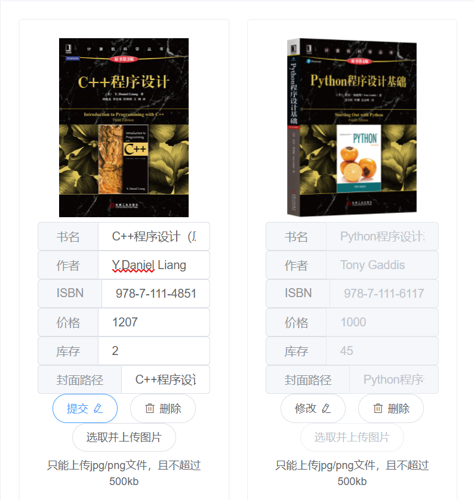
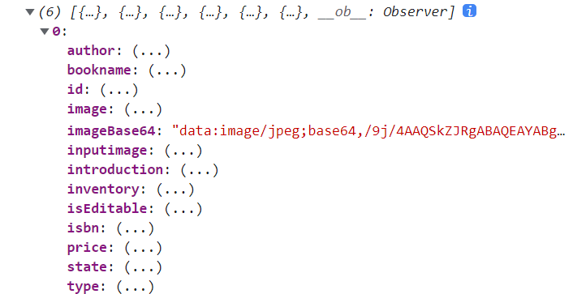

# hw8
#### id: 519021910861
#### name: xuhuidong
#### [项目后端源代码](./backend_src)
#### [项目前端源代码](./frontend_src)
------
<font color=red> 以下是 pdf-15 内容 </font>

### 要求
将合适的内容改造为在 MongoDB 中存储，例如书的产品评价或书评。可以参照课程样例将数据分别存储在 MySQL 和 MongoDB 中。

### 设计原理

#### MongoDB 简介
MongoDB 是一款开源的文档类型数据库，使用 C++ 编写而成，是 NoSQL 类型数据库的典型。

* MongoDB 特点
1. 面向文档进行存储。Document-Oriented Storage
2. 支持索引。Full Index Support
3. 可备份，高可用。Replication & High Availablity
4. 自动分区。Auto-Sharding
5. 支持条件查询。Querying
6. 快速原地更新。Fast In-Place Updates
7. 运用 Map/Reduce 加速。
8. GridFS
9. 商业版本。Commercial Support

* MongoDB 操作
1. `Create`：创建或插入操作会将新的 documents 添加到 collection 。如果该集合当前不存在，则插入操作将创建该集合。
```sql
db.collection.insertOne({key1: value1, key2: value2, ...})
db.collection.insertMany([{key1: value1, ...}, {key2: key2, ...}, ...])
```
2. `Read`：读取操作从 collection 检索 documents。即查询集合中的文档。
```sql
db.collection.find({ /* collection */
	{ age: { $gt: 18 } }, /* query criteria */
	{ name: 1, address: 1 } /* projection */
}).limit(5) /* cursor modifier */
```
3. `Update`：更新操作会修改 collection 中的现有 documents。
```sql
db.collection.updateOne(...)
db.collection.updateMany({ /* collection */
	{ age: { $lt: 18 } },	/* update filter */
	{ $set: { status: "reject" } } /* update action */
})
db.collection.replaceOne(...)
```
4. `Delete`：删除操作从集合中删除文档。
```sql
db.collection.deleteOne(...)
db.collection.deleteMant({ /* collection */
	{ status: "reject" } /* delete filter */
})
```

#### 设计思路
由于上学期我的书籍图片是放在项目中某个单独文件夹里，前端直接根据本地文件路径来引用书籍图片的，这样不具有可移植性。
因此，借助本次使用 MongoDB 数据库的机会，我决定将书籍图片放在 MongoDB 中，将书籍文本信息与图片信息分别在 MySQL 和 MongoDB 数据库中查找并返回给前端显示。
```sql
database: e_book
collection: bookimage
field: 
	int bookId primary key
	String imageBase64
```
每次根据 $bookId$ 来查找对应的图片，且我们假设每本书只有一张图片，因此将其作为 mongo 数据库中的主键，加快查询速度。

### 代码实现
#### 后端 SpringBoot 代码

**[pom.xml]** 引入 MongoDB 依赖

```xml
<dependency>
	<groupId>org.springframework.data</groupId>
	<artifactId>spring-data-mongodb</artifactId>
</dependency>

<dependency>
	<groupId>org.springframework.boot</groupId>
	<artifactId>spring-boot-starter-data-mongodb</artifactId>
</dependency>
```

**[BookImage]** 书籍图片类

```JAVA
@Document("bookimage")
public class BookImage {
	@Field("imageBase64")
	private String imageBase64;
	
	@Id
	private int bookId;
	
	...
}
```

**[BookImageRepository]** 继承 MongoReposiory，实现 MongoDB 数据库增删改查操作。

```JAVA
public interface BookImageRepository extends MongoRepository<BookImage, Integer> {
	BookImage findByBookId(Integer bookId);
}
```

**[BookDaoImpl]** 直接和两个数据库打交道并融合的一层，在 editBookInfo 函数中新增对书籍图片的修改操作。

```JAVA
/* 修改图片信息 */

@Autowired
private BookImageRepository bookImageRepository;
    
public Integer editBookInfo(Book book, String bookImageBase64) {
	BookImage bookImage = bookImageRepository.findByBookId(book.getId());
	if (bookImage = null) {
		bookImage = new BookImage();
		bookImage.setBookId(book.getId());
	}
	bookImage.setImageBase64(bookImageBase64);
	bookImageRepository.save(bookImage);
	...
}
```

**[BookController]** 在 Controller 层修改与前端交互的接口，新增图片 base64 形式的参数。

```JAVA
@PostMapping("/book/editBookInfo")
public ResponseEntity<Integer> editBookInfo(String bookstr, String imageBase64)
```

在 Service 层也修改对应接口，不再赘述。

**[application.property]** 配置 MongoDB，由于图片在前端就转换成 base64 形式，所以还需要改变 http 请求头最大容纳大小。

```xml
# mongodb 配置
spring.data.mongodb.uri = mongodb://127.0.0.1:27017/e_book

# 修改 post 请求头大小限制 1 MB
server.max-http-header-size=1000000
```

#### 前端 SpringBoot 代码
**[main.js]** 更改前端 getBooks 函数，新增获取书籍图片部分。

```JavaScript
Vue.prototype.getBooks = function getBooks (username, password) {
	return new Promise((resolve, reject) => {
		...
		this.axios({
			method: 'GET',
			url: 'https://localhost:9090/book/getBookImages',
			params: {
				username: username,
				password: password
			}
		}).then(response => {
			if (response.status === 200) {
				...
				let bookImages = response.data
				for (let i = 0; i < bookImages.length; i++) {
					let index = this.bookid_to_index(bookImages[i].bookId)
					if (index !== -1) books[index].imageBase64 = bookImages[i].imageBase64
				}
				localStorage.setItem('books', JSON.stringify(books))
				resolve(books)
			}
		})
	})
}
```

在显示图片时更改来源。
```vue
el-image :src="book.imageBase64" style="height: 360px;" @click="_route_to_book_details(book.id)"></el-image>
```

### 代码运行结果
前端增加**选取并上传图片**按钮，可以从本地选取图片，并在前端完成图片到base64的转换。



前端控制台打印出从后端获取的书籍信息，已经将书籍图片信息组合进 book 中，作为 **imageBase64** 一列存在。



### 项目关联文件
[application](./application.properties)
[BookController](./BookController.java)
[BookDao](./BookDao.java)
[BookDaoImpl](./BookDaoImpl.java)
[BookImageRepository](./BookImageRepository.java)
[BookService](./BookService.java)
[BookServiceImpl](./BookServiceImpl.java)
[main](./main.js)
[pom](./pom.xml)

### 参考
[15-nosql&mongodb](./15-nosql&mongodb.pdf)
https://www.docs4dev.com/docs/zh/mongodb/v3.6/reference/reference-method-db.collection.insertMany.html
https://stackoverflow.com/questions/39720422/java-tomcat-request-header-is-too-large
https://blog.csdn.net/qq_31754591/article/details/114365834
https://blog.csdn.net/woshidamimi0/article/details/86082428
https://blog.csdn.net/weixin_39214304/article/details/84791953

------
<font color=red> 以下是 pdf-16 内容 </font>

### 要求
1. 为每一本图书都添加一些标签，在 Neo4J 中将这些标签构建成一张图，类似右图。
2. 在系统中增加一项搜索功能，如果用户按照标签搜索，你可以将 Neo4J 中存储的与用户选中的标签以及通过 2 重关系可以关联到的所有标签都选出，作为搜索的依据，在 MySQL 中搜索所有带有这些标签中任意一个或多个的图书，作为图书搜索结果呈现给用户。
