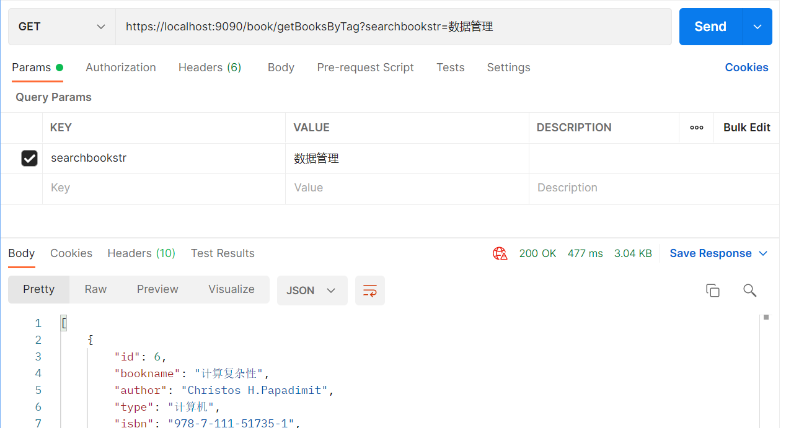
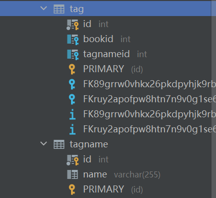

# hw8
#### id: 519021910861
#### name: xuhuidong
#### [项目后端源代码](./backend_src)
#### [项目前端源代码](./frontend_src)
------
<font color=red> 以下是 pdf-15 内容 </font>

### 要求
将合适的内容改造为在 MongoDB 中存储，例如书的产品评价或书评。可以参照课程样例将数据分别存储在 MySQL 和 MongoDB 中。

### 设计原理

#### MongoDB 简介
MongoDB 是一款开源的文档类型数据库，使用 C++ 编写而成，是 NoSQL 类型数据库的典型。

* MongoDB 特点
1. 面向文档进行存储。Document-Oriented Storage
2. 支持索引。Full Index Support
3. 可备份，高可用。Replication & High Availablity
4. 自动分区。Auto-Sharding
5. 支持条件查询。Querying
6. 快速原地更新。Fast In-Place Updates
7. 运用 Map/Reduce 加速。
8. GridFS
9. 商业版本。Commercial Support

* MongoDB 操作
1. `Create`：创建或插入操作会将新的 documents 添加到 collection 。如果该集合当前不存在，则插入操作将创建该集合。
```sql
db.collection.insertOne({key1: value1, key2: value2, ...})
db.collection.insertMany([{key1: value1, ...}, {key2: key2, ...}, ...])
```
2. `Read`：读取操作从 collection 检索 documents。即查询集合中的文档。
```sql
db.collection.find({ /* collection */
	{ age: { $gt: 18 } }, /* query criteria */
	{ name: 1, address: 1 } /* projection */
}).limit(5) /* cursor modifier */
```
3. `Update`：更新操作会修改 collection 中的现有 documents。
```sql
db.collection.updateOne(...)
db.collection.updateMany({ /* collection */
	{ age: { $lt: 18 } },	/* update filter */
	{ $set: { status: "reject" } } /* update action */
})
db.collection.replaceOne(...)
```
4. `Delete`：删除操作从集合中删除文档。
```sql
db.collection.deleteOne(...)
db.collection.deleteMant({ /* collection */
	{ status: "reject" } /* delete filter */
})
```

#### 设计思路
由于上学期我的书籍图片是放在项目中某个单独文件夹里，前端直接根据本地文件路径来引用书籍图片的，这样不具有可移植性。
因此，借助本次使用 MongoDB 数据库的机会，我决定将书籍图片放在 MongoDB 中，将书籍文本信息与图片信息分别在 MySQL 和 MongoDB 数据库中查找并返回给前端显示。
```sql
database: e_book
collection: bookimage
field: 
	int bookId primary key
	String imageBase64
```
每次根据 $bookId$ 来查找对应的图片，且我们假设每本书只有一张图片，因此将其作为 mongo 数据库中的主键，加快查询速度。

### 代码实现
#### 后端 SpringBoot 代码

**[pom.xml]** 引入 MongoDB 依赖

```xml
<dependency>
	<groupId>org.springframework.data</groupId>
	<artifactId>spring-data-mongodb</artifactId>
</dependency>

<dependency>
	<groupId>org.springframework.boot</groupId>
	<artifactId>spring-boot-starter-data-mongodb</artifactId>
</dependency>
```

**[BookImage]** 书籍图片类

```JAVA
@Document("bookimage")
public class BookImage {
	@Field("imageBase64")
	private String imageBase64;
	
	@Id
	private int bookId;
	
	...
}
```

**[BookImageRepository]** 继承 MongoReposiory，实现 MongoDB 数据库增删改查操作。

```JAVA
public interface BookImageRepository extends MongoRepository<BookImage, Integer> {
	BookImage findByBookId(Integer bookId);
}
```

**[BookDaoImpl]** 直接和两个数据库打交道并融合的一层，在 editBookInfo 函数中新增对书籍图片的修改操作。

```JAVA
/* 修改图片信息 */

@Autowired
private BookImageRepository bookImageRepository;
    
public Integer editBookInfo(Book book, String bookImageBase64) {
	BookImage bookImage = bookImageRepository.findByBookId(book.getId());
	if (bookImage = null) {
		bookImage = new BookImage();
		bookImage.setBookId(book.getId());
	}
	bookImage.setImageBase64(bookImageBase64);
	bookImageRepository.save(bookImage);
	...
}
```

**[BookController]** 在 Controller 层修改与前端交互的接口，新增图片 base64 形式的参数。

```JAVA
@PostMapping("/book/editBookInfo")
public ResponseEntity<Integer> editBookInfo(String bookstr, String imageBase64)
```

在 Service 层也修改对应接口，不再赘述。

**[application.property]** 配置 MongoDB，由于图片在前端就转换成 base64 形式，所以还需要改变 http 请求头最大容纳大小。

```xml
# mongodb 配置
spring.data.mongodb.uri = mongodb://127.0.0.1:27017/e_book

# 修改 post 请求头大小限制 1 MB
server.max-http-header-size=1000000
```

#### 前端 SpringBoot 代码
**[main.js]** 更改前端 getBooks 函数，新增获取书籍图片部分。

```JavaScript
Vue.prototype.getBooks = function getBooks (username, password) {
	return new Promise((resolve, reject) => {
		...
		this.axios({
			method: 'GET',
			url: 'https://localhost:9090/book/getBookImages',
			params: {
				username: username,
				password: password
			}
		}).then(response => {
			if (response.status === 200) {
				...
				let bookImages = response.data
				for (let i = 0; i < bookImages.length; i++) {
					let index = this.bookid_to_index(bookImages[i].bookId)
					if (index !== -1) books[index].imageBase64 = bookImages[i].imageBase64
				}
				localStorage.setItem('books', JSON.stringify(books))
				resolve(books)
			}
		})
	})
}
```

在显示图片时更改来源。
```vue
el-image :src="book.imageBase64" style="height: 360px;" @click="_route_to_book_details(book.id)"></el-image>
```

### 代码运行结果
前端增加**选取并上传图片**按钮，可以从本地选取图片，并在前端完成图片到base64的转换。


前端控制台打印出从后端获取的书籍信息，已经将书籍图片信息组合进 book 中，作为 **imageBase64** 一列存在。


### 项目关联文件
[application](./application.properties)
[BookController](./BookController.java)
[BookDao](./BookDao.java)
[BookDaoImpl](./BookDaoImpl.java)
[BookImageRepository](./BookImageRepository.java)
[BookService](./BookService.java)
[BookServiceImpl](./BookServiceImpl.java)
[main](./main.js)
[pom](./pom.xml)

### 参考
[15-nosql&mongodb](./15-nosql&mongodb.pdf)
https://www.docs4dev.com/docs/zh/mongodb/v3.6/reference/reference-method-db.collection.insertMany.html
https://stackoverflow.com/questions/39720422/java-tomcat-request-header-is-too-large
https://blog.csdn.net/qq_31754591/article/details/114365834
https://blog.csdn.net/woshidamimi0/article/details/86082428
https://blog.csdn.net/weixin_39214304/article/details/84791953

------
<font color=red> 以下是 pdf-16 内容 </font>

### 要求
1. 为每一本图书都添加一些标签，在 Neo4J 中将这些标签构建成一张图，类似右图。
2. 在系统中增加一项搜索功能，如果用户按照标签搜索，你可以将 Neo4J 中存储的与用户选中的标签以及通过 2 重关系可以关联到的所有标签都选出，作为搜索的依据，在 MySQL 中搜索所有带有这些标签中任意一个或多个的图书，作为图书搜索结果呈现给用户。

### 设计原理
#### Neo4j 简介
Neo4j 是一个高性能的 NoSQL 图形数据库，它将结构化数据存储在网络上而不是表中。它是一个嵌入式、基于磁盘的、具备完全的事务特性的 JAVA 持久化引擎。

Neo4j 也可以被看做是一个高性能的图引擎，该引擎具有成熟数据库的所有特性。程序员工作在一个面向对象的、灵活的网络结构下而不是严格的、静态的表中，但又可以享受到具备完全的事务特性。

#### 设计思路
运用 Neo4j 查找邻近的标签名，在 MySQL 中查找到对应的标签 ID，并依次来查找所有拥有这些标签的书籍。

### 代码实现
#### SpringBoot 后端代码

**[pom.xml]** 导入 Neo4j 包。

```xml
<dependency>
    <groupId>org.springframework.boot</groupId>
	<artifactId>spring-boot-starter-data-neo4j</artifactId>
</dependency>
```

**[application.properties]** 配置 Neo4j 数据库。

```xml
# neo4j 图数据库配置
spring.neo4j.uri=bolt://localhost:7687
spring.neo4j.authentication.username=neo4j
spring.neo4j.authentication.password=200176
```

**[BookstoreApplication]** 运用 Neo4j 随机构建标签关系。

```Java
@SpringBootApplication
@EnableNeo4jRepositories
public class BookstoreApplication {
	@Bean
    CommandLineRunner createTagNodeAndConnect(TagNodeRepository tagNodeRepository, TagNameRepository tagNameRepository) {
        return args -> {

            tagNodeRepository.deleteAll();

            List<TagName> tagNameList = tagNameRepository.findAll();

            List<TagNode> tagNodeList = new ArrayList<>();

            for (TagName tagName : tagNameList) {
                TagNode tagNode = new TagNode(tagName.getName());
                tagNodeRepository.save(tagNode);
                tagNodeList.add(tagNode);
            }

            int n = tagNodeList.size();
            Random random = new Random();

            for (int i = 0; i < 2 * n; i++) {
                int start = random.nextInt(n - 1) + 1;
                int end = random.nextInt(n - 1) + 1;

                if (start == end) continue;

                TagNode start_node = tagNodeList.get(start);
                TagNode end_node = tagNodeList.get(end);

                if (start_node != null && end_node != null) {
                    start_node.relatedTo(end_node);
                    tagNodeRepository.save(start_node);
                }

            }
        };
    }
```

**[TagNode]** 用于 Neo4j 的结点类。

```Java
@Node("tagNode")
public class TagNode {
    @Id
    @GeneratedValue
    private Long id;
    private String name;
	...
}
```

**[TagNodeRepository]** 集成 Neo4jRepository，用于进行结点查询和相邻节点查询。

```Java
public interface TagNodeRepository extends Neo4jRepository<TagNode, Long> {
    TagNode findByName(String name);
    List<TagNode> findByRelatedTagNodeName(String name);
}
```

**[TagName]** 用于记录标签的名字。

```Java
@Entity
@Table(name = "tagname")
@JsonIgnoreProperties(value = {"handler", "hibernateLazyInitializer", "fieldHandler"})
@JsonIdentityInfo(generator = ObjectIdGenerators.PropertyGenerator.class, property = "id")
@DynamicUpdate
@DynamicInsert
public class TagName {
    @JsonIgnore
    @OneToMany(cascade = CascadeType.ALL, orphanRemoval = true, mappedBy = "tagName")
    @LazyCollection(LazyCollectionOption.FALSE)
    private List<Tag> tagList = new ArrayList<>();

    @Id
    @GeneratedValue(generator = "increment")
    @GenericGenerator(name = "increment", strategy = "increment")
    @Column(name = "id")
    private Integer id;

    @Column(name = "name")
    private String name;
    
    ...
}
```

**[Tag]** 用于记录书籍的多个标签。

```Java
@Entity
@Table(name = "tag")
@JsonIgnoreProperties(value = {"handler", "hibernateLazyInitializer", "fieldHandler"})
@JsonIdentityInfo(generator = ObjectIdGenerators.PropertyGenerator.class, property = "id")
@DynamicUpdate
@DynamicInsert

public class Tag {
    @Id
    @GeneratedValue(generator = "increment")
    @GenericGenerator(name = "increment", strategy = "increment")
    @Column(name = "id")
    private Integer id;

    @ManyToOne
    @JoinColumn(name = "bookid", referencedColumnName = "id")
    private Book book;

    @ManyToOne
    @JoinColumn(name = "tagnameid", referencedColumnName = "id")
    private TagName tagName;
    
    ...
}
```

**[BookDaoImpl]** 新增按照标签进行模糊搜索。

```Java
public List<Book> getBooksByTag(String tag) {
    List<TagNode> tagNodeList = new ArrayList<>();

    TagNode tagNode = tagNodeRepository.findByName(tag);
    if (tagNode != null) tagNodeList.add(tagNode);
    List<TagNode> relatedTagNodes = tagNodeRepository.findByRelatedTagNodeName(tag);
    if (relatedTagNodes != null) tagNodeList.addAll(relatedTagNodes);

    Set<Book> bookList = new HashSet<>();

    for (TagNode tagNode1 : tagNodeList) {
        String name = tagNode1.getName();
        TagName tagName = tagNameRepository.findByName(name);
        List<Tag> tagList = tagRepository.findByTagName(tagName);

        for (Tag tag1 : tagList)
        	bookList.add(tag1.getBook());
    };

    return new ArrayList<>(bookList);
};
```

**[BookController]** 新增按照标签进行模糊搜索的接口。在 Service 层和 Dao 层也增加对应的接口和实现。

```Java
@GetMapping("/book/getBooksByTag")
public ResponseEntity<List<Book>> getBooksByTag(String searchbookstr) {
	return new ResponseEntity<>	(bookService.getBooksByTag(searchbookstr), HttpStatus.OK);
}
```

#### Vue 前端代码

**[main]** 改变函数接口。

```html
<el-select v-model="searchtype" placeholder="搜索方式">
    <el-option
    v-for="item in options"
    :key="item.value"
    :label="item.label"
    :value="item.value">
    </el-option>
</el-select>
```

```Javascript
...
switch (this.searchtype) {
    case 1: /* 普通搜索 */
        url = 'https://localhost:9090/book/searchBookByBookname'
        break
    case 2: /* 全文搜索 */
        url = 'https://localhost:9090/book/fulltextSearchBook'
        break
    case 3: /* 标签搜索 */
        url = 'https://localhost:9090/book/getBooksByTag'
        break
}
```

### 代码运行结果
在 neo4j 的网址上查看图形化节点。


通过 postman 发送请求得到返回的书籍列表。



在前端通过标签搜索关键词 "数据管理" 得到结果。


后端数据库表格。



### 项目关联文件
[BookController](./BookController.java)
[BookDao](./BookDao.java)
[BookDaoImpl](./BookDaoImpl.java)
[Book](./Book.java)
[Tag](./Tag.java)
[TagName](./TagName.java)
[TagNode](./TagNode.java)
[TagNameRepository](./TagNameRepository.java)
[TagNodeRepository](./TagNodeRespository.java)
[TagRepository](./TagRepository.java)
[BookService](./BookService.java)
[BookstoreApplication](./BookstoreApplication.java)
[application](./application.properties)
[pom.xml](./pom.xml)

### 参考
[16-neo4j](./16-neo4j.pdf)
https://blog.csdn.net/jing_zhong/article/details/112557084
https://spring.io/guides/gs/accessing-data-neo4j/
https://juejin.cn/post/6895338320956653581