# hw9
#### id: 519021910861
#### name: xuhuidong
------
<font color=red> 以下是 pdf-17 内容 </font>

### 要求
能够根据数据特性和数据访问模式，识别适合日志数据库存储的数据，设计并实现其在日志数据库中的存储和访问方案。

### 知识总结
#### KV 数据结构
* 基本操作：
	* GET(K)：查找 key K 对应的 value。
	* PUT(K, V)：插入键值对（K，V）。
	* UPDATE(K, V)：查找 key K 对应的 value，将其更新为 V。 
	* DELETE(K)：删除 key K 对应的条目。
	* SCAN(K1, K2)：得到从 K1 到 K2 范围内的所有 key 和 value。
* 常用数据结构
	* B 树
		1. 查找：从根结点开始，在当前节点通过 **二分查找** 定位到一个最小且 >= key 的 key，若该 key 命中则直接返回，否则加载新的子节点继续查找。时间复杂度为 $O(logMlogN)$。
		2. 更新：先查找，然后修改 value。
		3. 插入：先查找定位再插入，可能导致节点递归分裂。
		4. 删除：先查找再删除，可能导致节点递归替代或合并。
	* B+ 树：和 B 树类似，但只有叶子节点存储 key 和 value。优势是对 scan 操作较多和 value 较大的场景更快。缺点是插入操作慢，空间利用率不高，且会产生大量的随机 IO。
	* LSTM 树：
		* 优点：大幅提高插入（修改、删除）性能。空间放大率降低。访问新数据更快，适合时序、实时存储。数据热度分布和 level 相关。
		* 缺点：牺牲了读性能（一次可能访问多个层）。读写放大率提升。

#### 日志结构数据库
1. LevelDB
2. RocksDB

#### HTAP 混合存储
1. 解决写阻塞问题
	* 采用中心化设计：Master 采用主从备份，监控集群负载，调控负载均衡。
2. 解决读放大问题
	* 在 RocksDB 中增加列式存储
	* 提出混合存储策略：常做事务的数据以行式存储，常做查询的数据以列式存储。
	* 以磁盘读写开销为格式转换的指标：以文件为格式调整粒度，额外记录每个文件的历史操作，计算每个文件在行式存储和列式存储下重做历史操作的磁盘读写次数。
	* 兼容原有的后台逻辑：
		* 新增主动的 conversion 后台过程中，监控所有文件，当满足【原格式读代价 > 新格式读代价 + 新格式写代价】条件，就触发原地格式转换。
		* 结合原有的 compaction 过程中，新文件产生时，根据祖先文件，选取读写代价总和最小的格式。

### 问题
#### 1. 阐述日志结构数据库适合什么样的应用场景。
日志结构化存储系统以日志为基本单位，即仅以 Append 模式附加数据项序列，每当有新数据要写入时，只需要将其添加到日志的末尾，而不需要在磁盘上找到它的位置，大大减少了随机的磁盘 IO 操作，因此大大提升了数据的写操作性能，但也牺牲了部分读性能，所以这种结构通常适用于**写多读少**的场景。
而且，使用日志结构存储，则预写日志就是数据库文件，因此只需要写入一次数据，在恢复情况下，我们只需打开数据库，从最后一个记录的索引头开始，线性地向前搜索，并在执行过程中从数据中重建任何丢失的索引更新，能够高效地保持事务的一致性。因此这种结构也很适用于**需要开启很多事务且需要高容错**的系统。

#### 2. 阐述日志结构数据库中的读放大和写放大分别是什么意思。
读放大：由于不同层级存储着不同版本的数据，因此读取数据时可能需要访问所有可能的数据文件，因此需要逐层查找，增加了大量磁盘 IO 操作，尤其是范围查询操作影响很明显，限制了 AP 查询的性能。
写放大：即实际写入的物理资料量是写入资料量的多倍。例如 LSM-Tree 中当 L0 层满时将阻塞内存到磁盘的 Flush 的过程，因此 L0 层下沉 Compaction 过程无法多任务执行，尤其是异步写写放大严重，导致磁盘容易变成瓶颈，降低了 TP 事务的可用性。

#### 3. 日志结构合并树中，WAL 的作用是什么。
Write Ahead Log 简称 WAL，意思是在将元数据的变更操作写入持久稳定的 DB 之前，先预先写入到一个 log 中，然后再由另外的操作将 log apply 到外部的持久 DB 里去。
1. WAL 能够减少每次的 DB 写入操作，尤其当系统要处理大量的 Transaction 操作的时候，WAL 的方式相比于实时同步更新 DB 的方式有着更高的效率。
2. WAL 可以在系统 crash 后 recovery 过程中起着恢复状态的作用，系统在 load 完元数据 DB 后，再检查 log 文件并逐条比较决定撤销已做操作还是继续完成已做操作还是保持原样，从而恢复到系统的正常状态。

### 参考

[17-log structured db](./17-log structured db.pdf)
https://juejin.cn/post/6898766259584761864
https://cloud.tencent.com/developer/article/1352666
https://zh.wikipedia.org/wiki/%E5%86%99%E5%85%A5%E6%94%BE%E5%A4%A7
https://cloud.tencent.com/developer/article/1663045

------
<font color=red> 以下是 pdf-18 内容 </font>

### 要求

安装 InfluxDB，并监控笔记本电脑的状态，在 Web 界面的 Explore 中截图贴在文档中，并根据截图简要说明一下笔记本电脑的运行状态。

### InfluxDB 安装及使用
#### 安装
安装 InfluxDB

```shell
wget https://dl.influxdata.com/influxdb/releases/influxdb2-2.1.1-windows-amd64.zip -UseBasicParsing -OutFile influxdb2-2.1.1-windows-amd64.zip
Expand-Archive .\influxdb2-2.1.1-windows-amd64.zip -DestinationPath 'C:\InfluxData\influxdb\'
```

在对应文件夹汇总直接执行命令即可安装并运行 influxDB。
```shell
> ./influxdb.exe
```


安装 telegraf
```shell
wget https://dl.influxdata.com/telegraf/releases/telegraf-1.20.4_windows_amd64.zip -UseBasicParsing -OutFile telegraf-1.20.4_windows_amd64.zip
Expand-Archive .\telegraf-1.20.4_windows_amd64.zip -DestinationPath 'C:\Program Files\telegraf'
```

需要修改相关配置。[参考链接](https://www.influxdata.com/blog/using-telegraf-on-windows/)。

#### 启动
```shell
shell > ./D:\InfluxData\influxdb\influxdb2-2.1.1-windows-amd64\influxd.exe
```
在 Chrome 中输入网址 http://localhost:8086/ 进入控制台。

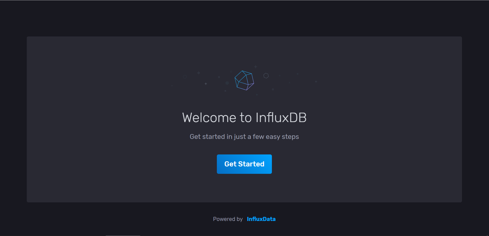

设置基本信息。

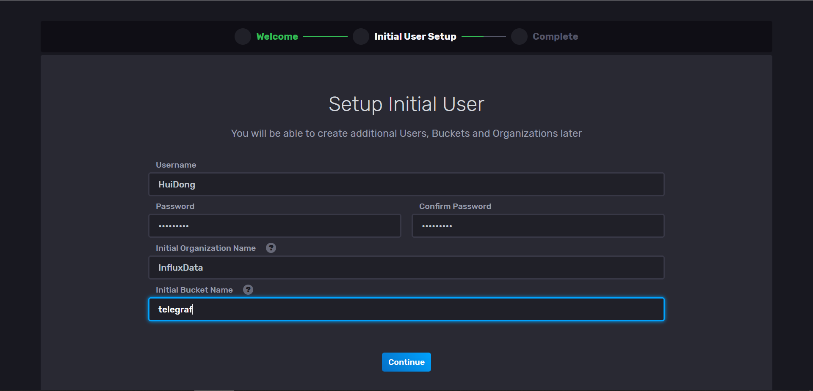

进入主面板。

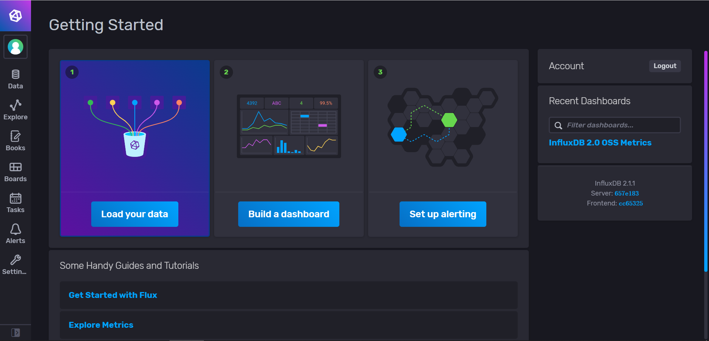

新建 telegraf 接口，并进行初始化。

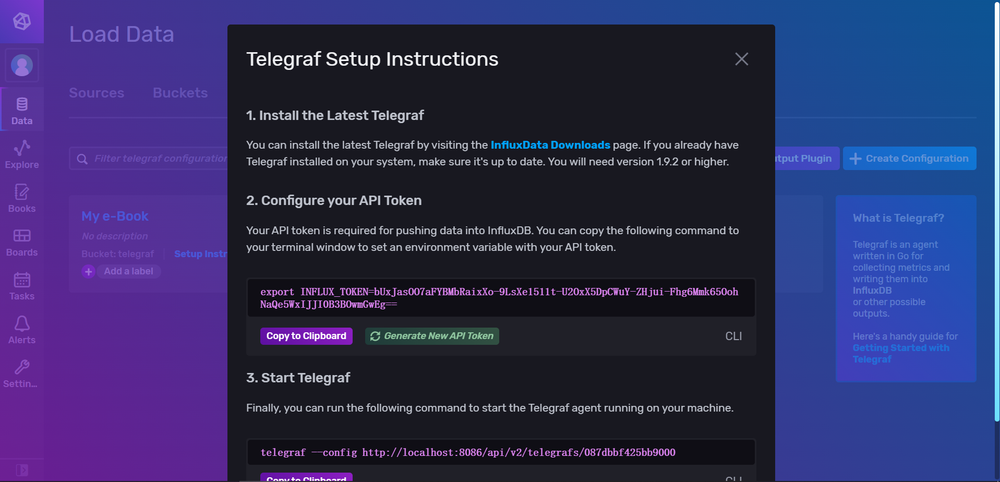

在 Windows 系统本地 Powershell 运行的截图如下。

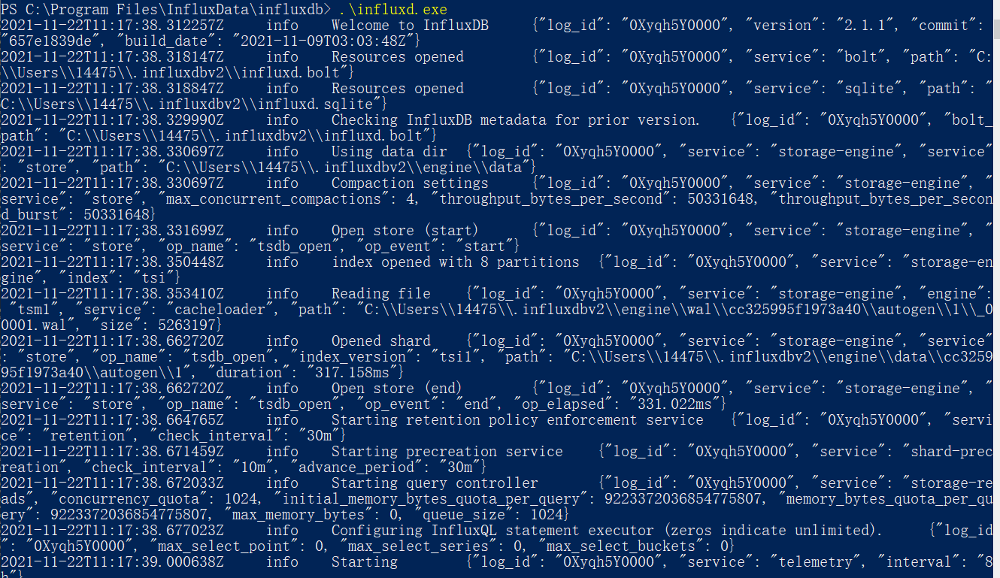

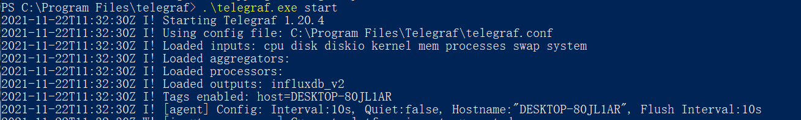

#### 监控电脑

查看电脑 CPU 运行情况，图中不同颜色的线对应电脑不同的 CPU。在 20 点前有较大波动，因为当时在使用这台电脑，后面电脑均处在休眠状态，因此 CPU 使用率较低。

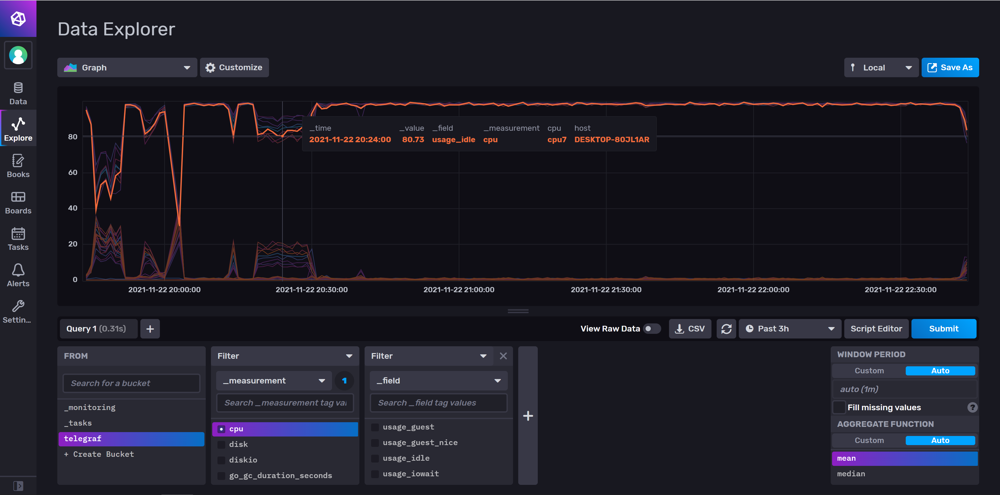

而 idle 对应是 CPU 空闲情况，system 对应是 CPU 工作情况。对应某个 CPU，这两条线的情况相反。

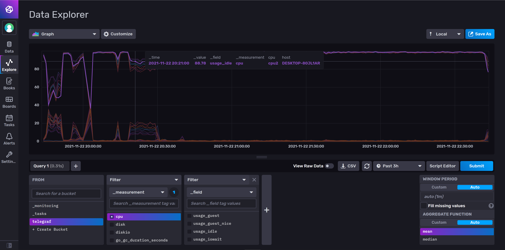

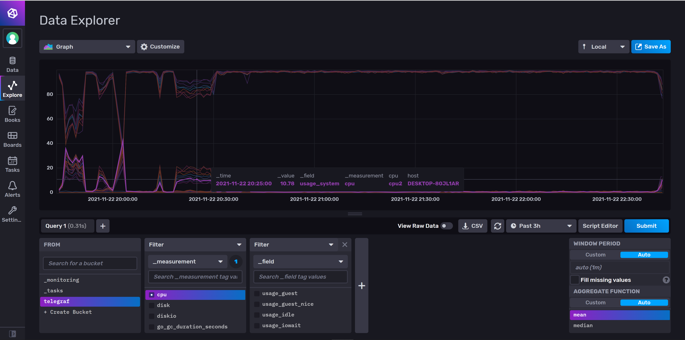

再查看电脑 Disk 使用情况，可以看到磁盘基本大小等信息。

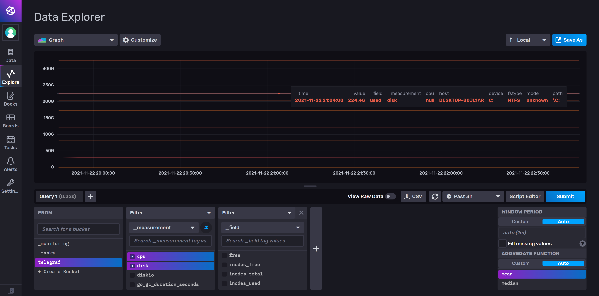

以及可以检查每个点的磁盘 I/O 操作。

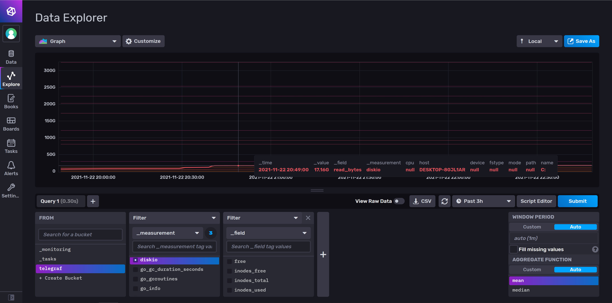

也可以直接查看原始数据（而不是通过图表）。

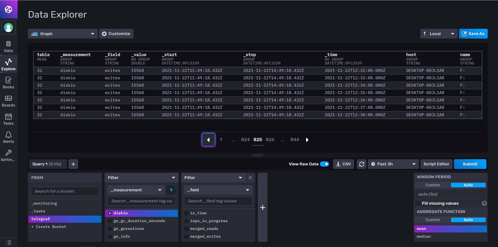

### 参考

[18-timeseries db](./18-timeseries db.pdf)
https://www.codenong.com/cs109842915/
https://www.influxdata.com/blog/using-telegraf-on-windows/

